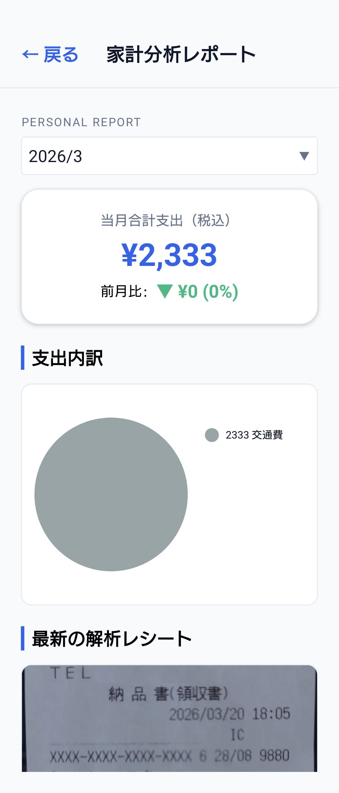
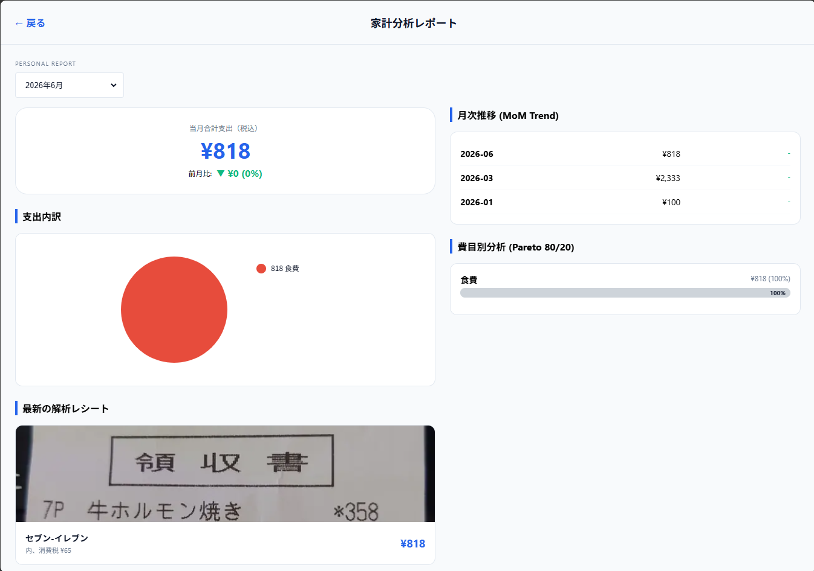
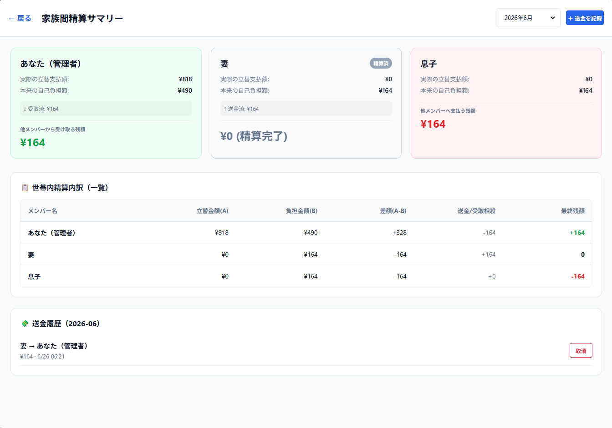
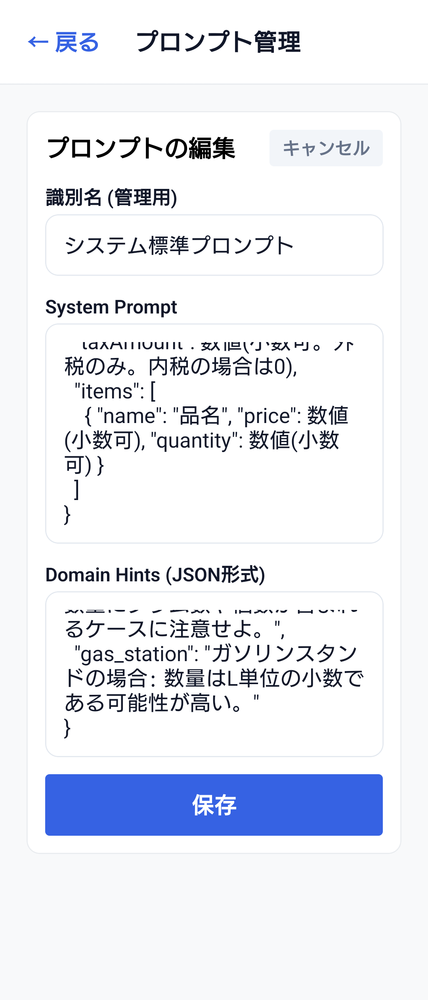
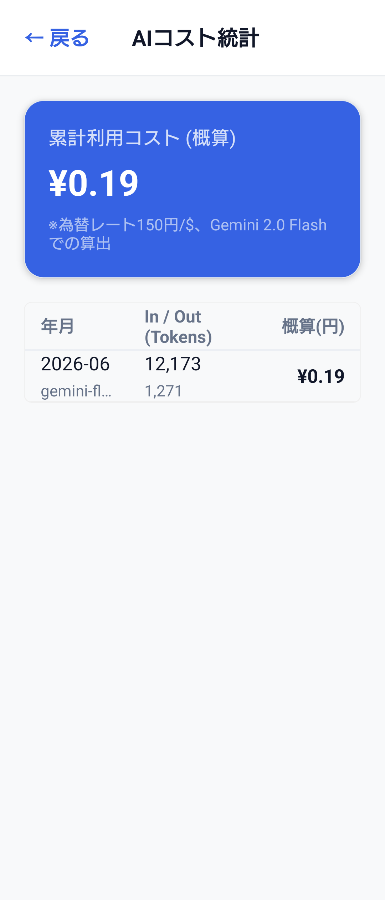

# RecAIpt

AIによるレシート解析と世帯単位の家計管理を実現する個人開発アプリです。

レシートの撮影から支出管理、明細単位の按分、月次精算までを一貫してサポートします。

---

## プロジェクト概要

RecAIptは、家族や同居人との共有支出管理を効率化するために開発したアプリです。

従来の家計簿アプリでは対応が難しい、

* 家族間での支出共有
* 明細単位での按分
* 月次精算
* レシート入力の自動化

を重視して設計しています。

---

## 画面サンプル（Screenshots）

### レシート各種画面（Android/iPhone/web）

<p>
  
  
  
  
  
</p>


### レシート各種画面（web）




### 管理画面（Android/iPhone/web）





### ログイン（Android/iPhone/web）


---

## 主な機能

### AIレシート解析

Google Gemini APIを利用し、レシート画像から以下を自動抽出します。

* 購入日
* 店舗名
* 商品明細
* 金額

### 世帯単位の管理

* FamilyGroup単位でデータを管理
* 招待コードによるメンバー参加
* 世帯ごとのデータ分離

### 按分・精算

* 明細単位での負担割合設定
* 月次精算サマリー生成
* 世帯メンバー間の精算管理

### マスタ学習

* 店舗マスタ管理
* 商品マスタ管理
* AI解析結果の品質向上

---

## 技術スタック

| レイヤー             | 技術                                    |
| ---------------- | ------------------------------------- |
| Frontend         | Expo, React, React Native, TypeScript |
| Backend          | Node.js, Express, TypeScript          |
| Database         | PostgreSQL                            |
| ORM              | Prisma                                |
| Queue            | BullMQ, Redis                         |
| AI               | Google Gemini API                     |
| Authentication   | JWT, bcrypt, TOTP                     |
| Image Processing | sharp, multer                         |
| Infrastructure   | Docker Compose                        |
| CI/CD            | GitHub Actions                        |

---

## アーキテクチャ

```text
React Native (Expo)
        │
        ▼
 Express API
        │
 ┌──────┴──────┐
 ▼             ▼
PostgreSQL   BullMQ
                 │
                 ▼
            Gemini API
```

---

## 品質への取り組み

* TypeScriptによる型安全な実装
* PrismaによるDBスキーマ管理
* 単体テスト
* API結合テスト
* GitHub ActionsによるCI
* 設計書と実装の同期管理

---

## ドキュメント

プロジェクトには以下の設計資料を整備しています。

* アーキテクチャ設計
* ドメインモデル
* DB設計
* API仕様
* AIパイプライン設計
* テスト戦略
* 運用設計

詳細は `docs/` 配下を参照してください。

---

## リポジトリ構成

```text
receipt-ai-app/
├── backend/
├── frontend/
├── docs/
├── scripts/
├── docker-compose.yml
└── setup-env.sh
```

---

## 開発状況

現在も継続開発中です。

機能追加だけでなく、

* 保守性向上
* テスト強化
* ドキュメント整備
* 運用品質向上

を重視して開発を進めています。
