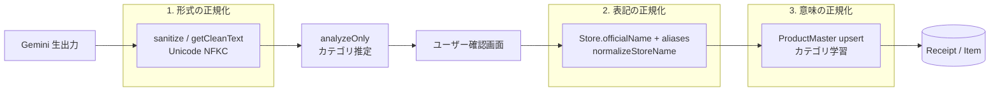
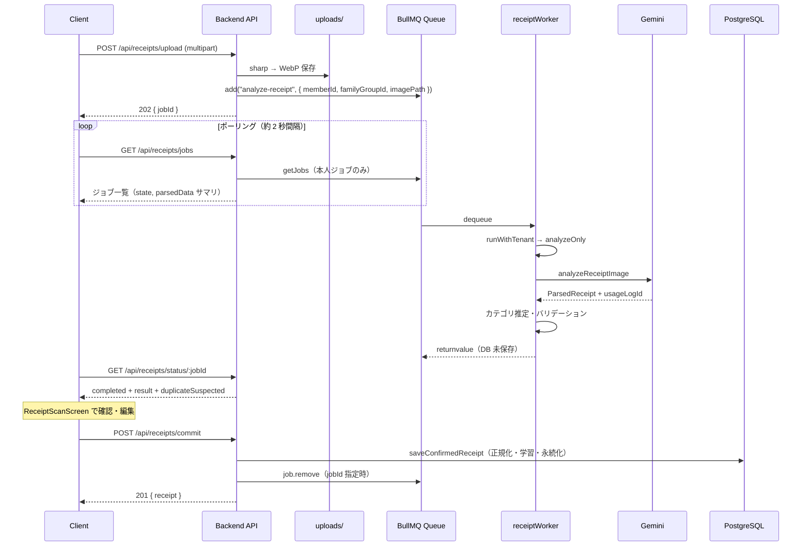
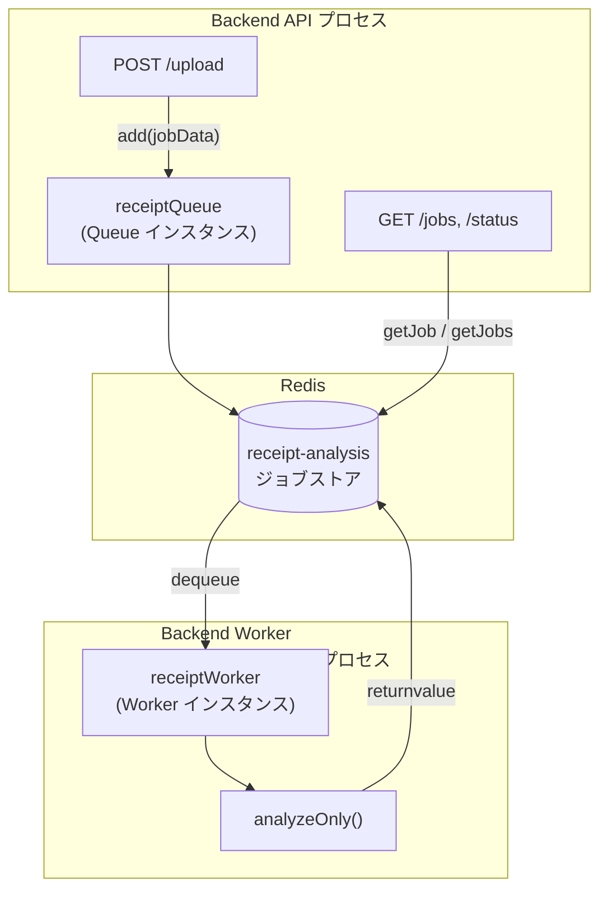

# 3層正規化 & AI パイプライン（As-built）

Epic: [#276 Issue #90](https://github.com/yama180sx/receipt-ai-app/issues/276)  
子 Issue: [#295 Issue #90-4](https://github.com/yama180sx/receipt-ai-app/issues/295)  
計画: [plan.md](./plan.md)

本ドキュメントは **実装準拠（as-built）** で記述する。Gemini 解析・BullMQ 非同期処理・Store / ProductMaster 正規化の挙動を正とし、API 詳細は [api-spec.md](./api-spec.md)（#90-3）、システム構成は [architecture.md](./architecture.md)（#90-1）を参照する。

| 資料 | 内容 |
|------|------|
| [architecture.md](./architecture.md) §5.2 | 非同期解析のシーケンス概要（#90-1） |
| [api-spec.md](./api-spec.md) §5.3, §6 | upload / commit / ジョブ API（#90-3） |
| [domain-model.md](./domain-model.md) §3.4 | Store / ProductMaster の精算との関係（#90-2） |
| [MILESTONE_PHASE1.md](../MILESTONE_PHASE1.md) | 3層正規化の設計起源 |

---

## 1. 概要

RecAIpt の AI パイプラインは、レシート画像を **Google Gemini** で構造化し、ユーザー確認後に **PostgreSQL へ永続化** する。AI の揺らぎを抑える **3層正規化** と、解析と保存の **責務分離**（`analyzeOnly` / `commit`）が中核である。

| コンポーネント | 実装 | 役割 |
|----------------|------|------|
| Gemini API | `backend/src/services/geminiService.ts` | 画像 → JSON（店名・日付・明細・税額） |
| 解析サービス | `backend/src/services/receiptService.ts` | `analyzeOnly` / `saveParsedReceipt` |
| ジョブキュー | `backend/src/queues/receiptQueue.ts` | BullMQ キュー `receipt-analysis` |
| Worker | `backend/src/workers/receiptWorker.ts` | 非同期で `analyzeOnly` を実行 |
| 正規化 | `backend/src/utils/normalizer.ts` | NFKC・店舗名寄せ |
| プロンプト | DB `PromptTemplate` + Admin API | 世帯別プロンプト管理 |

---

## 2. 3層正規化

フェーズ1（[MILESTONE_PHASE1.md](../MILESTONE_PHASE1.md)）で定義した設計思想を、現行実装に沿って整理する。3 層は **適用タイミング** が異なる。



### 2.1 形式の正規化（Automatic）

**目的**: 全角・半角、括弧、大文字小文字の揺れを統一し、マスタ照合のキーを安定させる。

| 項目 | 内容 |
|------|------|
| 実装 | `getCleanText` / `sanitize`（`normalizer.ts`） |
| 処理 | Unicode **NFKC** → 小文字化 → 制御文字除去 → 連続空白を 1 つに |
| 適用タイミング | 解析直後の店名・品名クリーニング、マスタ検索キー、commit 時の ProductMaster キー |

```typescript
// normalizer.ts — 形式正規化の核心
.normalize('NFKC').toLowerCase().replace(/\s+/g, ' ').trim()
```

### 2.2 表記の正規化（Master-driven）

**目的**: OCR が返す表記ゆれ（例: `コストコ` ⇔ `COSTCO`）を、世帯マスタの正式名称に寄せる。

| 項目 | 内容 |
|------|------|
| モデル | `Store`（`officialName`, `aliases: Json`）— 世帯スコープ |
| 実装 | `normalizeStoreName`（`normalizer.ts`） |
| 適用タイミング | **`commit` 時**（`saveParsedReceipt` 内）。解析中は Gemini 生出力をそのまま UI に表示 |
| 照合ロジック | 正規化済み OCR 店名が、正規化済み `officialName` または `aliases` のいずれかを **部分一致** で含む場合、`officialName` を採用 |

> Store マスタの CRUD は商品マスタ画面・管理 API 経由。精算計算には影響しない（[domain-model.md §3.4](./domain-model.md)）。

### 2.3 意味の正規化（Learning）

**目的**: ユーザーが確定・修正したカテゴリを学習し、次回以降の AI 解析結果に反映する。

| 項目 | 内容 |
|------|------|
| モデル | `ProductMaster`（複合ユニーク: `name` + `storeName` + `familyGroupId`） |
| キー | `getCleanText(品名)` + `getCleanText(店舗名)` — いずれも形式正規化済み |
| 適用タイミング | **解析時**（既存マスタがあれば `categoryId` を事前付与）、**commit / 編集時**（`upsert` で学習更新） |

**カテゴリ推定の優先順位**（`categoryService.estimateCategoryId`）:

1. 同一店舗の ProductMaster 一致
2. 店舗問わず ProductMaster 一致
3. Category.keywords による部分一致
4. フォールバック: カテゴリ「その他」

---

## 3. 解析と永続化の責務分離

Issue #49-8 / #71 により、**AI 解析（読み取り）** と **DB 保存（書き込み）** は明確に分離されている。これが本パイプラインの最重要設計判断である。

| フェーズ | 関数 / エンドポイント | DB 書き込み | 説明 |
|----------|----------------------|-------------|------|
| 解析のみ | Worker → `analyzeOnly` | **なし** | Gemini 呼び出し、カテゴリ推定、バリデーション。結果は BullMQ `returnvalue` に保持 |
| 結果参照 | `GET /api/receipts/status/:jobId` 等 | **なし** | 完了ジョブの `parsedData` をフロントへ返却 |
| ユーザー確認 | `ReceiptScanScreen`（フロント） | **なし** | 店名・明細・税額・カテゴリを編集 |
| 確定保存 | `POST /api/receipts/commit` → `saveConfirmedReceipt` | **あり** | 重複チェック、Store 正規化、ProductMaster 学習、Receipt / Item 作成、`ApiUsageLog` 紐付け |

**解析のみで行うこと**（`analyzeOnly`）:

- Gemini API 呼び出し（`analyzeReceiptImage`）
- 明細への初期 `categoryId` 付与（ProductMaster / キーワード推定）
- 閾値ベースの警告生成（`validationService.validateReceiptItems`）
- `ApiUsageLog` レコード作成（トークン記録。`receiptId` は未設定）

**commit で初めて行うこと**（`saveParsedReceipt`）:

- `normalizeStoreName` による店舗名寄せ
- 重複レシート判定（409 `DUPLICATE`）
- `Receipt` / `Item` のトランザクション作成
- `ProductMaster.upsert`（確定カテゴリの学習）
- `ApiUsageLog.receiptId` の紐付け
- 同一 `imagePath` の再 commit は **冪等**（既存 Receipt を返却）

> レガシー関数 `processAndSaveReceipt`（解析＋保存一括）は残存するが、通常フロー（upload → Worker → commit）では **使用しない**。

---

## 4. レシート解析フロー

### 4.1 全体シーケンス



### 4.2 各ステップの詳細

#### アップロード（`POST /api/receipts/upload`）

| 項目 | 内容 |
|------|------|
| 画像処理 | multer 受信 → sharp で回転・リサイズ（最大 1000px）→ WebP（quality 75） |
| 保存先 | `backend/uploads/receipt-{timestamp}-{random}.webp` |
| レスポンス | `202 Accepted` + `{ jobId, status: "queued" }` |
| 実装 | `receiptRoutes.ts`（ルート定義）/ `receiptController.uploadReceipt` |

#### ジョブ監視（フロント）

| 項目 | 内容 |
|------|------|
| ポーリング | `useReceiptJobs` — `GET /api/receipts/jobs` を定期取得 |
| 確認トレイ | `ReceiptTrayContext` — 完了ジョブを一覧表示し、`ReceiptScanScreen` へ遷移 |
| 重複警告 | 完了ジョブに `duplicateSuspected` / `existingReceiptId` を enrich |
| 破棄 | `DELETE /api/receipts/jobs/:jobId` — キュー除去 + 未保存画像削除 |

#### 確認画面（`ReceiptScanScreen`）

ユーザーが保存前に以下を編集できる:

- 店名、購入日時、外税（`taxAmount`）、明細（品名・単価・数量・カテゴリ）
- 確定時に `parsedData`（`usageLogId` 含む）、`imagePath`、`validation`、`jobId` を `commit` へ POST

#### 確定保存（`POST /api/receipts/commit`）

[api-spec.md §5.3](./api-spec.md) 参照。409 時は `{ message: "DUPLICATE", existingId }`。

---

## 5. BullMQ Queue / Worker

Redis 上の BullMQ が **API プロセスと Gemini 呼び出しを非同期化** する。Queue（投入側）と Worker（実行側）の役割分担は以下のとおり。



### 5.1 Queue（`receiptQueue.ts`）

| 項目 | 値 |
|------|-----|
| キュー名 | `receipt-analysis` |
| ジョブ名 | `analyze-receipt` |
| ジョブデータ | `{ memberId, familyGroupId, imagePath }` |
| リトライ | `attempts: 3`, exponential backoff 5s |
| 完了保持 | `removeOnComplete: { age: 1800 }`（30 分 — ポーリング用） |
| 失敗保持 | `removeOnFail: false` |

**責務**: ジョブの enqueue のみ。Gemini は呼ばない。

### 5.2 Worker（`receiptWorker.ts`）

| 項目 | 値 |
|------|-----|
| 起動 | `server.ts` の `import './workers/receiptWorker'`（本番・開発サーバーのみ） |
| concurrency | 5 |
| テナント | `runWithTenant({ familyGroupId, memberId })` で AsyncLocalStorage 設定 |
| 処理 | `analyzeOnly(memberId, imagePath)` → 戻り値を `job.returnvalue` に格納 |
| テスト | `createApp()` 経路では **import しない**（Redis 未接続回避 — #91-3） |

**責務**: Gemini 解析とカテゴリ推定。**Receipt テーブルへの書き込みは行わない**。

### 5.3 ジョブ所有権

| ルール | 内容 |
|--------|------|
| 一覧・参照 | `familyGroupId` + `memberId` が一致するジョブのみ |
| 404 秘匿 | 他世帯・他メンバーのジョブ ID は 404（存在を漏らさない） |
| commit 後 | `removeReceiptJobAfterCommit` — キューから除去（画像は Receipt に紐づくため残す） |
| 破棄 | `discardReceiptJobForMember` — キュー除去 + 未保存画像ファイル削除 |

---

## 6. Gemini 連携

### 6.1 設定

| 環境変数 | デフォルト | 用途 |
|----------|------------|------|
| `GEMINI_API_KEY` | — | API キー（必須） |
| `GEMINI_MODEL` | `gemini-2.0-flash` | 使用モデル |
| `GEMINI_RETRY_COUNT` | `3` | 429 / 5xx リトライ回数 |
| `GEMINI_RETRY_DELAY` | `2000` | 初回リトライ待機 ms（指数バックオフ） |

### 6.2 解析処理（`analyzeReceiptImage`）

1. **プロンプト構築** — DB から `PromptTemplate`（`key=RECEIPT_ANALYSIS`, `isActive=true`）を取得。`domainHints` があれば業態別指示を追記
2. **JSON モード** — `responseMimeType: "application/json"` で構造化出力
3. **算術整合性チェック** — `(Σ price×quantity) + taxAmount = totalAmount`（許容誤差 1 円）
4. **自己修復リトライ** — 不整合時、前回 JSON をプロンプトに含めて 1 回再解析。トークンは同一 `ApiUsageLog` に累積
5. **API リトライ** — 429 / 5xx は `withRetry` で最大 3 回

### 6.3 出力スキーマ（`ParsedReceipt`）

```json
{
  "storeName": "店舗名",
  "purchaseDate": "YYYY-MM-DD HH:mm",
  "totalAmount": 1500,
  "taxAmount": 0,
  "items": [
    { "name": "品名", "price": 300, "quantity": 1 }
  ],
  "usageLogId": 99
}
```

| フィールド | 備考 |
|------------|------|
| `taxAmount` | 外税のみ。内税レシートは `0`（プロンプトで指示） |
| `price` / `quantity` | 小数可（ガソリンスタンド等） |
| `usageLogId` | サーバー側で付与。commit 時に `Receipt` へ紐付け |

### 6.4 トークン使用量（`ApiUsageLog`）

| タイミング | 操作 |
|------------|------|
| 初回解析 | `ApiUsageLog.create`（`familyMemberId`, トークン数, `modelId`） |
| 自己修復リトライ | 同一レコードへ `increment` で累積 |
| commit 成功 | `ApiUsageLog.receiptId` を更新（1 対 1 紐付け） |
| 手動登録 | `usageLogId` なし（AI コスト対象外） |

管理者は `GET /api/admin/stats/cost` で世帯別トークン使用量・概算コストを参照できる（[api-spec.md §4.7](./api-spec.md)）。

---

## 7. プロンプトテンプレート（Admin）

Gemini へ渡すシステムプロンプトは **ハードコードではなく DB 管理** である。管理者が `PromptEditorScreen` から編集し、次回解析から反映される。

### 7.1 データモデル（`PromptTemplate`）

| フィールド | 説明 |
|------------|------|
| `key` | 用途識別子。レシート解析は `RECEIPT_ANALYSIS` |
| `name` / `description` | 管理用ラベル |
| `systemPrompt` | Gemini へ渡す本体（Chain-of-Thought 指示・JSON スキーマ含む） |
| `domainHints` | 業態別追加指示（JSON。例: `gas_station`, `pharmacy`） |
| `isActive` | 同一 `key` で 1 件のみ `true`（activate API で切替） |
| `familyGroupId` | 世帯スコープ（#93-4） |

初期 seed: `backend/prisma/seed-prompts.ts`, `prisma/seeds/prompt_templates.json`

### 7.2 取得ロジック

`geminiService.buildPrompt()` が解析直前に DB を参照する。

- 条件: `key = "RECEIPT_ANALYSIS"` AND `isActive = true`
- 世帯フィルタ: Worker 内 `runWithTenant` により Prisma 拡張が `familyGroupId` を自動注入
- `domainHints` がある場合、`systemPrompt` 末尾に `### 業態別特別指示:` として結合

### 7.3 管理 API

| メソッド | パス | 説明 |
|----------|------|------|
| GET | `/api/admin/prompts` | 一覧 |
| POST | `/api/admin/prompts` | 新規作成（`isActive=true` 時は同 key を非アクティブ化） |
| PATCH | `/api/admin/prompts/:id` | 更新 |
| PATCH | `/api/admin/prompts/:id/activate` | アクティブ切替 |
| DELETE | `/api/admin/prompts/:id` | 削除 |

保護: JWT + tenant + `ADMIN` + TOTP（[api-spec.md §4.7](./api-spec.md)）

変更時は `prisma/seeds/prompt_templates.json` へ同期ダンプされる（`adminController.syncPromptsToJson`）。

---

## 8. バリデーションと重複検知

### 8.1 解析後バリデーション（`validationService`）

`analyzeOnly` 完了時に閾値チェックを行い、`validation.isSuspicious` / `validation.warnings` を返す。DB には保存しない。

| チェック | 内容 |
|----------|------|
| 単価上限 | カテゴリ別 `VALIDATION_THRESHOLDS.maxUnitPrice` |
| 数量上限 | `maxQuantity` |
| 行合計 | `price × quantity` と `amount` の乖離（10 円超） |

フロントは警告を表示するが、ユーザー判断で commit 可能。

### 8.2 重複レシート（`duplicateReceiptService`）

| タイミング | 挙動 |
|------------|------|
| ジョブ一覧 / status | read-only で `duplicateSuspected` を enrich |
| commit | 店名（正規化後）・日付・金額が一致する別 Receipt があれば **409** |
| 同一 imagePath | 冪等 — 既存 Receipt を返却（409 ではない） |

---

## 9. テスト時のモック方針（#91-7）

Gemini API と BullMQ Worker は **非決定論・外部依存** のため、自動テストではモックする。

| 対象 | 方針 | 根拠 |
|------|------|------|
| Gemini | 結合テストで `vi.mock('../services/geminiService')` 等 | [testing/plan.md §4](../testing/plan.md) |
| BullMQ Worker | テスト時は `receiptWorker` を import しない | `app.ts` / `server.ts` 分離（#91-3） |
| Redis / Queue | Supertest 結合テストは Worker なしで API のみ検証 | `app.integration.test.ts` |

詳細なモック戦略は Should 優先の [#91-7 / Issue #284](https://github.com/yama180sx/receipt-ai-app/issues/284) で拡充予定。本パイプラインの E2E（実 OCR）は [testing/plan.md §3](../testing/plan.md) のスコープ外とする。

---

## 10. 実装ファイル索引

| パス | 内容 |
|------|------|
| `backend/src/services/geminiService.ts` | Gemini 呼び出し・プロンプト・算術チェック |
| `backend/src/services/receiptService.ts` | `analyzeOnly`, `saveParsedReceipt`, `saveConfirmedReceipt` |
| `backend/src/workers/receiptWorker.ts` | BullMQ Worker |
| `backend/src/queues/receiptQueue.ts` | キュー定義 |
| `backend/src/services/receiptJobService.ts` | ジョブ一覧・enrich・破棄 |
| `backend/src/utils/normalizer.ts` | 3層正規化（形式・表記） |
| `backend/src/services/categoryService.ts` | カテゴリ推定 |
| `backend/src/controllers/adminController.ts` | プロンプト CRUD |
| `frontend/src/contexts/ReceiptTrayContext.tsx` | 確認トレイ |
| `frontend/src/screens/ReceiptScanScreen.tsx` | 確認・編集画面 |

---

## 11. 関連資料

- [architecture.md](./architecture.md) — Docker / Redis / Worker 起動
- [api-spec.md](./api-spec.md) — upload / commit / jobs API
- [domain-model.md](./domain-model.md) — Store / ProductMaster / ApiUsageLog
- [MILESTONE_PHASE1.md](../MILESTONE_PHASE1.md) — 3層正規化の起源
- [testing/plan.md](../testing/plan.md) — テスト計画・モック方針（#91）