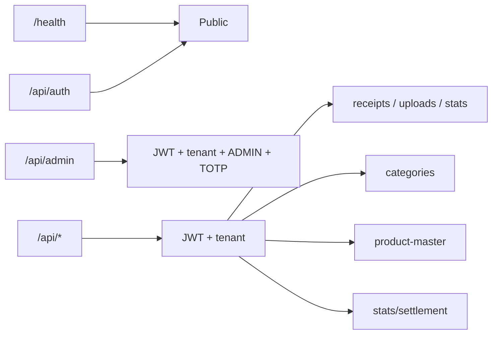
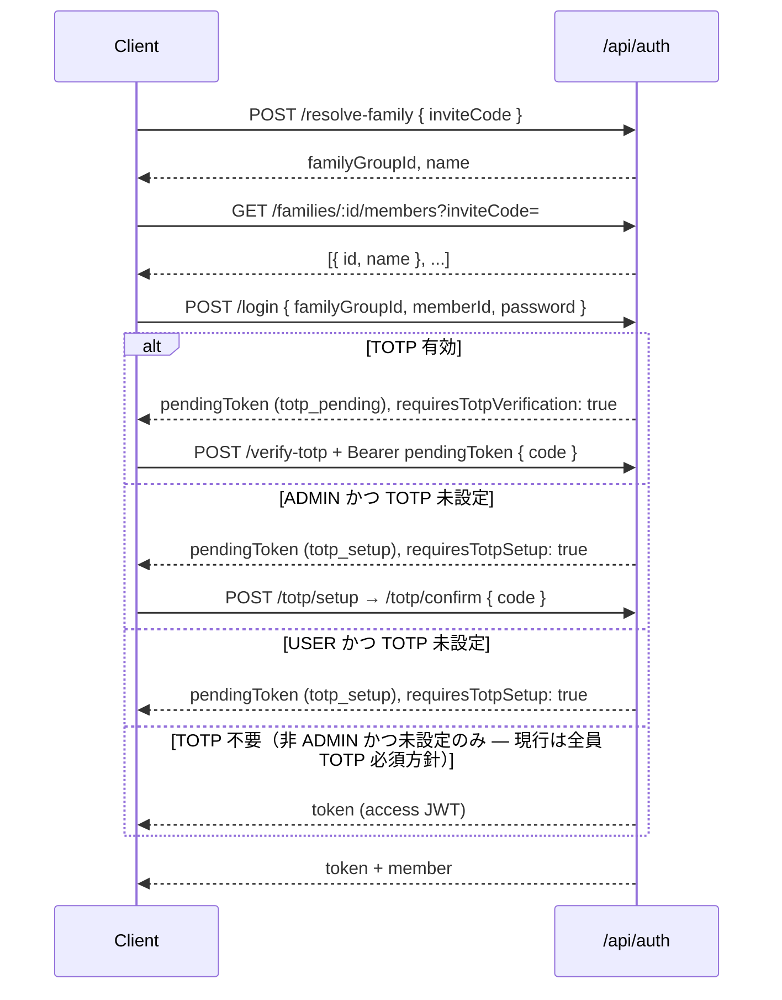
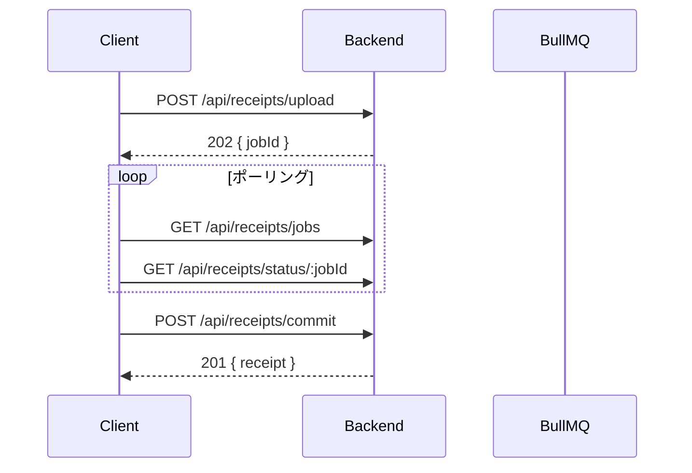

# API 仕様書（As-built）

Epic: [#276 Issue #90](https://github.com/yama180sx/receipt-ai-app/issues/276)  
子 Issue: [#294 Issue #90-3](https://github.com/yama180sx/receipt-ai-app/issues/294) / [#474 Issue #102-4](https://github.com/yama180sx/receipt-ai-app/issues/474)  
計画: [plan.md](../refactor/plan.md) §9

本ドキュメントは **実装準拠（as-built）** で記述する。Express ルート・ミドルウェア・コントローラの挙動を正とし、ドメインルールは [domain-model.md](./domain-model.md)（#90-2）を参照する。

> **OpenAPI 正本（Phase 2 #98-8-9 / #98-8-10）**: 公開 API 全体の FE 型生成用 YAML は [../openapi/openapi.yaml](../openapi/openapi.yaml)。詳細説明は本書、機械可読スキーマは OpenAPI を正とする。

| 資料 | 内容 |
|------|------|
| [architecture.md](./architecture.md) | システム構成・ミドルウェア概要（#90-1） |
| [domain-model.md](./domain-model.md) | 按分・精算の業務ルール（#90-2） |
| [plan.md](../refactor/plan.md) §9 | Epic #102 API 契約型 SSOT |

---

## 1. 概要

| 項目 | 内容 |
|------|------|
| ベース URL | 開発: `http://localhost:3000` / 本番: Nginx 経由の `/api` |
| 形式 | JSON（画像アップロード・配信を除く） |
| 認証 | JWT Bearer（`purpose: access`、有効期限 30 日） |
| テナント | `FamilyGroup` 単位。`tenantMiddleware` が `AsyncLocalStorage` にコンテキストを設定 |
| 実装入口 | `backend/src/app.ts` — `createApp()` |

### 1.1 ルートマウント



| マウント | ミドルウェア | ルーター |
|----------|-------------|----------|
| `/health` | なし | インライン |
| `/api/auth` | なし（個別ルートで pending JWT / auth） | `authRoutes` |
| `/api/admin` | `authMiddleware` → `tenantMiddleware` → `isAdmin` | `adminRoutes` |
| `/api` | `authMiddleware` → `tenantMiddleware` | `receiptRoutes`（`/`）、`categoryRoutes`（`/categories`）、`productMasterRoutes`（`/product-master`）、`statsRoutes`（`/stats`） |

> **plan.md §8 との対応**: 認証・テナント保護の区分は plan.md の表と一致する。本書では全 40 エンドポイントを網羅する。

---

## 2. 共通規約

### 2.1 リクエストヘッダ

| ヘッダ | 必須 | 用途 |
|--------|------|------|
| `Authorization: Bearer <token>` | 保護 API で必須 | アクセス JWT または pending JWT |
| `Content-Type: application/json` | JSON ボディ時 | — |
| `x-member-id` | 任意（移行期フォールバック） | JWT 未設定時の memberId 指定。通常は JWT の `id` が優先される |

CORS 許可ヘッダ: `Content-Type`, `Authorization`, `x-member-id`（`app.ts`）

### 2.2 成功レスポンス（envelope）

コントローラ経由の標準形式:

```json
{
  "success": true,
  "data": { }
}
```

メッセージのみの場合:

```json
{
  "success": true,
  "message": "Deleted"
}
```

| HTTP | 例 | 備考 |
|------|-----|------|
| 200 | `{ "success": true, "data": [...] }` | 取得・更新 |
| 201 | `{ "success": true, "data": { ... } }` | 作成 |
| 202 | `{ "success": true, "data": { "jobId": "...", "status": "queued" } }` | 非同期ジョブ投入 |

**例外（JSON envelope なし）**

| エンドポイント | レスポンス |
|---------------|-----------|
| `GET /health` | `{ "status": "ok", "env": "...", "timestamp": "..." }`（`success` キーなし） |
| `GET /api/uploads/:filename` | 画像ファイル（`sendFile`） |

### 2.3 エラーレスポンス

#### errorHandler 経由（AppError / 未処理例外）

`backend/src/middleware/errorHandler.ts` が一括処理する。

**本番（`NODE_ENV !== 'development'`）**

```json
{
  "success": false,
  "message": "エラーメッセージ"
}
```

- 5xx はメッセージをマスク: `サーバー内部でエラーが発生しました。時間をおいて再度お試しください。`
- Zod バリデーション失敗時は `details` 配列を付与:

```json
{
  "success": false,
  "message": "入力内容に不備があります",
  "details": [
    { "field": "memberId", "message": "..." }
  ]
}
```

**開発環境** — 上記に加え `stack`, `internal` を含む。

#### ミドルウェア直返し（errorHandler 非経由）

| 条件 | HTTP | ボディ例 |
|------|------|----------|
| Authorization 欠落 | 401 | `{ "success": false, "code": "UNAUTHORIZED", "message": "認証が必要です" }` |
| JWT 無効・期限切れ | 401 | `{ "success": false, "code": "TOKEN_INVALID_OR_EXPIRED", "message": "..." }` |
| memberId 特定不可 | 401 | `{ "success": false, "code": "MEMBER_ID_REQUIRED", "message": "..." }` |
| JWT と DB の世帯不一致 | 403 | `{ "success": false, "message": "所属グループの検証に失敗しました" }` |
| 非 ADMIN が Admin API | 403 | `{ "success": false, "code": "FORBIDDEN", "message": "..." }` |
| ADMIN だが TOTP 未設定 | 403 | `{ "success": false, "code": "TOTP_REQUIRED", "message": "..." }` |

#### 特殊ケース

| 条件 | HTTP | ボディ |
|------|------|--------|
| 重複レシート（`commit` / 手動登録） | 409 | `{ "success": false, "message": "DUPLICATE", "existingId": 123 }` |
| Admin コントローラ一部 | 4xx/5xx | `{ "success": false, "error": "..." }`（`message` ではなく `error` キー） |
| テナント外リソース | 404 | `AppError` 経由（存在を秘匿） |

> **T-ref（findings.md）**: API エラーレスポンス形式は本節に集約。Supertest（#91-3）では `success: false` と 401/404 を検証している。

### 2.4 AppError

```typescript
// backend/src/utils/appError.ts
class AppError extends Error {
  statusCode: number;
  isOperational: boolean; // 常に true
  details?: any;
}
```

コントローラは `next(error)` で errorHandler に委譲する。Zod 検証は `validate` ミドルウェアが `AppError('入力内容に不備があります', 400, details)` を生成する。

### 2.5 テナント分離

全保護 API は **ログインメンバーの `familyGroupId` でスコープ** される。

- 他世帯の ID を指定しても **404**（存在秘匿）— Supertest `#93-1`, `#93-4` で検証
- Prisma 拡張（`prismaClient`）が `familyGroupId` フィルタを自動適用するルートあり
- 画像 `GET /api/uploads/:filename` も同一世帯の Receipt / 未保存ジョブに紐づくファイルのみ 200

---

## 3. 認証・テナント

### 3.1 JWT 種別

| purpose | 用途 | 有効期限 | 検証ミドルウェア |
|---------|------|----------|-----------------|
| `access` | 通常 API | 30 日 | `authMiddleware` |
| `totp_setup` | TOTP 初回セットアップ | 10 分 | `pendingAuthMiddleware('totp_setup', 'access')` |
| `totp_pending` | ログイン後 TOTP 検証 | 10 分 | `pendingAuthMiddleware('totp_pending')` |

JWT ペイロード（access）: `{ id, name, familyGroupId, role, purpose: 'access' }`

### 3.2 ログインフロー



| ロール | TOTP 未設定時 | TOTP 有効時 |
|--------|--------------|------------|
| `ADMIN` | ログイン → `requiresTotpSetup` → セットアップ必須。Admin API は `TOTP_REQUIRED` | ログイン → `requiresTotpVerification` → 検証後 token |
| `USER` | ログイン → `requiresTotpSetup`（token は null） | ログイン → TOTP 検証 |

### 3.3 tenantMiddleware の挙動

1. `memberId` = JWT `user.id` **優先**。なければ `x-member-id` ヘッダ
2. DB から `FamilyMember` を取得し `familyGroupId` を解決
3. JWT の `familyGroupId` と DB が不一致 → **403**
4. `runWithTenant({ familyGroupId, memberId }, next)` — 以降 `getFamilyGroupId()` / `getMemberId()` が利用可能

### 3.4 isAdmin（Admin API 追加要件）

- `authMiddleware` + `tenantMiddleware` の**後**に配置
- DB で `role === 'ADMIN'` を確認
- `totpEnabled === false` → **403** `TOTP_REQUIRED`

---

## 4. エンドポイント一覧

### 4.1 Health

| Method | Path | 認証 | 説明 |
|--------|------|------|------|
| GET | `/health` | なし | 死活監視 |

### 4.2 Auth — `/api/auth`

| Method | Path | 認証 | 説明 |
|--------|------|------|------|
| POST | `/resolve-family` | なし | 招待コード → 世帯 ID・名称 |
| GET | `/families/:familyGroupId/members` | なし（`inviteCode` クエリ必須） | ログイン前メンバー一覧 |
| POST | `/login` | なし | パスワード認証 |
| POST | `/totp/setup` | pending JWT（`totp_setup` / `access`） | TOTP シークレット発行 |
| POST | `/totp/confirm` | pending JWT（`totp_setup` / `access`） | TOTP 有効化 + access token（setup フロー時） |
| POST | `/verify-totp` | pending JWT（`totp_pending`） | ログイン時 TOTP 検証 |
| POST | `/totp/disable` | access JWT | TOTP 無効化（必須ロールは 403） |

### 4.3 Receipts & 画像 & 家計統計 — `/api`

| Method | Path | 認証 | 説明 |
|--------|------|------|------|
| POST | `/receipts/upload` | JWT + tenant | 画像アップロード → WebP → BullMQ ジョブ（202） |
| GET | `/family-groups/members` | JWT + tenant | 認証済み世帯のメンバー一覧 |
| GET | `/uploads/:filename` | JWT + tenant | レシート画像配信（JSON なし） |
| GET | `/receipts` | JWT + tenant | レシート一覧 |
| GET | `/receipts/jobs` | JWT + tenant | ログインメンバー本人の解析ジョブ一覧 |
| DELETE | `/receipts/jobs/:jobId` | JWT + tenant | 未取り込みジョブ破棄 |
| GET | `/receipts/latest` | JWT + tenant | 最新レシート 1 件 |
| GET | `/receipts/status/:jobId` | JWT + tenant | 解析ジョブ状態 |
| GET | `/stats/monthly` | JWT + tenant | 月別家計統計（カテゴリ別・最新レシート） |
| GET | `/stats/advanced` | JWT + tenant | トレンド・パレート分析 |
| POST | `/receipts` | JWT + tenant | 手動レシート登録 |
| DELETE | `/receipts/:id` | JWT + tenant | レシート削除 |
| PATCH | `/receipts/:id` | JWT + tenant | レシート全体編集 |
| PATCH | `/receipts/items/:id` | JWT + tenant | 明細カテゴリ更新 + 学習マスタ反映 |
| POST | `/receipts/items/:itemId/splits` | JWT + tenant | 明細按分（ItemSplit）保存 |
| POST | `/receipts/commit` | JWT + tenant | AI 解析結果の確定保存 |

**クエリパラメータ**

| エンドポイント | パラメータ | 説明 |
|---------------|-----------|------|
| `GET /receipts` | `month` | `YYYY-MM` フィルタ（任意） |
| `GET /receipts` | `memberId` | 支払者フィルタ。空文字 `""` = 世帯全体 |
| `GET /stats/monthly` | `month` | 対象月（省略時は当月 UTC 基準の `YYYY-MM`） |

### 4.4 Stats（精算）— `/api/stats`

| Method | Path | 認証 | 説明 |
|--------|------|------|------|
| GET | `/settlement` | JWT + tenant | 月間精算ステータス |
| POST | `/settlement/transfers` | JWT + tenant | 送金履歴追加 |
| DELETE | `/settlement/transfers/:id` | JWT + tenant | 送金履歴削除（物理削除） |

**クエリ / ボディ**

| エンドポイント | パラメータ | 説明 |
|---------------|-----------|------|
| `GET /settlement` | `month` | `YYYY-MM`（省略時はローカルタイムゾーン当月） |
| `POST /settlement/transfers` | body | `{ month, fromMemberId, toMemberId, amount }` |

精算ロジック詳細: [domain-model.md §5](./domain-model.md)

### 4.5 Categories — `/api/categories`

| Method | Path | 認証 | 説明 |
|--------|------|------|------|
| GET | `/` | JWT + tenant | カテゴリ一覧 |
| POST | `/` | JWT + tenant | カテゴリ新規作成 |
| DELETE | `/:id` | JWT + tenant | カテゴリ削除 |
| POST | `/optimize` | JWT + tenant | ProductMaster からキーワード最適化 |

### 4.6 Product Master — `/api/product-master`

| Method | Path | 認証 | 説明 |
|--------|------|------|------|
| GET | `/` | JWT + tenant | 学習マスタ一覧 |
| PATCH | `/:id` | JWT + tenant | マスタ個別更新 |
| DELETE | `/:id` | JWT + tenant | マスタ削除 |
| POST | `/merge-stores` | JWT + tenant | 店舗名統合 |

**クエリ / ボディ**

| エンドポイント | パラメータ | 説明 |
|---------------|-----------|------|
| `GET /` | `q` | 品名部分一致（case insensitive） |
| `GET /` | `store` | 店舗名部分一致 |
| `PATCH /:id` | body | `{ name?, storeName?, categoryId? }` |
| `POST /merge-stores` | body | `{ sourceStoreName, targetStoreName }` |

### 4.7 Admin — `/api/admin`

| Method | Path | 認証 | 説明 |
|--------|------|------|------|
| GET | `/stats` | JWT + tenant + ADMIN + TOTP | AI コスト統計 |
| GET | `/prompts` | 同上 | プロンプトテンプレート一覧 |
| POST | `/prompts` | 同上 | プロンプト新規作成 |
| PATCH | `/prompts/:id` | 同上 | プロンプト更新 |
| PATCH | `/prompts/:id/activate` | 同上 | デフォルトプロンプト切替 |
| DELETE | `/prompts/:id` | 同上 | プロンプト削除 |

未マッチ Admin ルートは **404** `AppError`（`app.ts` 専用ハンドラ）。

---

## 5. 代表リクエスト / レスポンス

### 5.1 認証

**POST `/api/auth/resolve-family`**

```http
POST /api/auth/resolve-family
Content-Type: application/json

{ "inviteCode": "YAMAMOTO-2026" }
```

```json
{
  "success": true,
  "data": { "familyGroupId": 1, "name": "山本家" }
}
```

**POST `/api/auth/login`**（TOTP 検証が必要な場合）

```json
{
  "success": true,
  "data": {
    "token": null,
    "pendingToken": "eyJ...",
    "member": {
      "id": 1,
      "name": "太郎",
      "familyGroupId": 1,
      "role": "ADMIN",
      "totpEnabled": true
    },
    "requiresTotpVerification": true,
    "requiresTotpSetup": false
  }
}
```

**POST `/api/auth/verify-totp`**

```http
Authorization: Bearer <pendingToken>
Content-Type: application/json

{ "code": "123456" }
```

```json
{
  "success": true,
  "data": {
    "token": "eyJ...",
    "pendingToken": null,
    "member": { "id": 1, "name": "太郎", "familyGroupId": 1, "role": "ADMIN", "totpEnabled": true },
    "requiresTotpVerification": false,
    "requiresTotpSetup": false
  }
}
```

### 5.2 レシート取得

**GET `/api/receipts`**

```http
GET /api/receipts?month=2026-01&memberId=
Authorization: Bearer <token>
```

```json
{
  "success": true,
  "data": [
    {
      "id": 1,
      "storeName": "スーパーA",
      "date": "2026-01-15T00:00:00.000Z",
      "totalAmount": 1500,
      "memberId": 1,
      "familyGroupId": 1,
      "items": [
        {
          "id": 10,
          "name": "牛乳",
          "price": 300,
          "quantity": 1,
          "categoryId": 2,
          "category": { "id": 2, "name": "食費", "color": "#..." },
          "splits": []
        }
      ]
    }
  ]
}
```

### 5.3 画像アップロード & 確定

**POST `/api/receipts/upload`**

```http
POST /api/receipts/upload
Authorization: Bearer <token>
Content-Type: multipart/form-data

image=<binary>
memberId=1
```

```json
{
  "success": true,
  "data": { "jobId": "42", "status": "queued" }
}
```

**POST `/api/receipts/commit`**

```json
{
  "parsedData": {
    "storeName": "スーパーA",
    "purchaseDate": "2026-01-15",
    "totalAmount": 1500,
    "items": [
      { "name": "牛乳", "price": 300, "quantity": 1, "categoryId": 2 }
    ],
    "usageLogId": 99
  },
  "imagePath": "uploads/receipt-123.webp",
  "validation": { "isSuspicious": false, "warnings": [] },
  "jobId": "42"
}
```

```json
{
  "success": true,
  "data": { "id": 1, "storeName": "スーパーA", "...": "..." }
}
```

重複時（409）:

```json
{
  "success": false,
  "message": "DUPLICATE",
  "existingId": 5
}
```

### 5.4 按分保存

**POST `/api/receipts/items/:itemId/splits`**

按分ルール（端数は配列末尾）: [domain-model.md §4.3](./domain-model.md)

```json
{
  "splits": [
    { "familyMemberId": 1, "ratio": 0.5 },
    { "familyMemberId": 2, "amount": 300 },
    { "familyMemberId": 3 }
  ]
}
```

- 末尾メンバー: `totalAmount − それ以前の合計` を自動算出
- 空配列 `[]`: 既存 Split 全削除（暗黙デフォルト = 支払者全額負担）

```json
{
  "success": true,
  "data": [
    { "id": 1, "itemId": 10, "familyMemberId": 1, "amount": 500 },
    { "id": 2, "itemId": 10, "familyMemberId": 2, "amount": 300 },
    { "id": 3, "itemId": 10, "familyMemberId": 3, "amount": 200 }
  ]
}
```

> **T-ref-01**（[findings.md](../testing/findings.md)）: 按分端数は配列末尾メンバーに残額。本 API の仕様として domain-model §4.3 と一致。

### 5.5 精算

**GET `/api/stats/settlement?month=2026-01`**

```json
{
  "success": true,
  "data": {
    "month": "2026-01",
    "members": [
      {
        "memberId": 1,
        "name": "太郎",
        "totalPaid": 5000,
        "totalOwed": 3500,
        "baseBalance": 1500,
        "transferredOut": 500,
        "transferredIn": 0,
        "balance": 2000
      }
    ],
    "transfers": [
      {
        "id": 1,
        "fromMemberId": 1,
        "toMemberId": 2,
        "amount": 500,
        "month": "2026-01",
        "settledAt": "2026-01-20T12:00:00.000Z"
      }
    ]
  }
}
```

**POST `/api/stats/settlement/transfers`**

```json
{
  "month": "2026-01",
  "fromMemberId": 1,
  "toMemberId": 2,
  "amount": 500
}
```

### 5.6 カテゴリ

**POST `/api/categories`**

```json
{ "name": "日用品", "color": "#FF5733" }
```

```json
{
  "success": true,
  "data": {
    "id": 11,
    "name": "日用品",
    "color": "#FF5733",
    "familyGroupId": 1,
    "keywords": []
  }
}
```

---

## 6. 非同期レシート解析フロー

解析と DB 永続化は分離されている（Issue #49-8 / #71）。



| 項目 | 内容 |
|------|------|
| ジョブ一覧 | ログインメンバー**本人**のジョブのみ（`memberId` 一致） |
| 完了ジョブ | `duplicateSuspected`, `existingReceiptId`, `parsedData` を enrich |
| 破棄 | `DELETE /api/receipts/jobs/:jobId` — 本人ジョブのみ |
| commit 後 | `jobId` 指定時、キューからジョブ削除を試行 |

---

## 7. テストとの整合（#91-3）

Supertest 結合テスト: `backend/src/app.integration.test.ts`

```bash
# DB 結合テスト（DATABASE_URL + JWT_SECRET 必須）
npm run test:integration
# = RUN_API_INTEGRATION=1 vitest run src/app.integration.test.ts
```

| テストスイート | 検証内容 | 本書との対応 |
|---------------|----------|-------------|
| `API integration (no DB)` | `/health`, 401, login 400, 公開 `/uploads` 廃止 | §4.1, §2.3, §4.3 |
| `API integration (DATABASE_URL)` | 認証フロー, TOTP, receipts/categories envelope | §3.2, §2.2, §5 |
| `Tenant isolation (#93-1)` | クロステナント 404, ジョブ・画像 | §2.5 |
| `Master tenant isolation (#93-4)` | categories / admin prompts 世帯分離 | §4.5, §4.7 |

ヘルパー: `backend/src/test/integrationHelpers.ts`

---

## 8. 実装ファイル索引

| 領域 | ファイル |
|------|----------|
| アプリ構成 | `backend/src/app.ts` |
| ルート | `backend/src/routes/*.ts` |
| コントローラ | `backend/src/controllers/*.ts` |
| 認証 | `backend/src/middleware/authMiddleware.ts`, `pendingAuthMiddleware.ts` |
| テナント | `backend/src/middleware/tenantMiddleware.ts`, `utils/context.ts` |
| エラー | `backend/src/utils/appError.ts`, `middleware/errorHandler.ts` |
| 按分 | `backend/src/utils/itemSplitAllocation.ts` |
| 精算 | `backend/src/controllers/statsController.ts` |

---

## 9. 新 API 追加手順（Epic #102 / #102-4）

新規エンドポイント追加時は **OpenAPI を先に更新** し、FE/BE の型分散を防ぐ。契約の正本は [../openapi/openapi.yaml](../openapi/openapi.yaml)（[plan.md](../refactor/plan.md) §9）。

### 9.1 原則

| ルール | 内容 |
|--------|------|
| OpenAPI first | `docs/openapi/openapi.yaml` に path・request/response schema を先に書く |
| DTO は generated | FE は `frontend/src/api/generated` を正とする（手動 interface で API レスポンスを再定義しない） |
| BE は契約に追随 | Controller の JSON 形は OpenAPI schema と一致させる（ドメイン内部型は `backend/src/types/` に残してよい） |
| drift 検知 | PR で `check:api` と `check:openapi` がグリーンであること |

### 9.2 実装チェックリスト（人間・AI 共通）

```
1. [ ] docs/openapi/openapi.yaml に paths / components/schemas を追加・更新
2. [ ] frontend で npm run generate:api を実行し schema.ts を更新
3. [ ] 必要なら frontend/src/api/generated/index.ts にドメイン別エイリアスを追加
4. [ ] backend: routes → controller → service を実装（レスポンス envelope は §2.2 準拠）
5. [ ] frontend: src/api/* ラッパー → features/*/hooks から呼び出し
6. [ ] ViewModel が必要なら frontend/src/types/ に追加（DTO 重複禁止）
7. [ ] Mapper が必要なら frontend/src/mappers/ に追加
8. [ ] 本書（api-spec.md）にエンドポイント説明を as-built 追記
9. [ ] npm run check:api（frontend）がパス
10. [ ] npm run check:openapi（backend）がパス
11. [ ] npm test（frontend / backend）がパス
```

### 9.3 CI コマンド

| コマンド | 実行場所 | 検証内容 |
|----------|----------|----------|
| `npm run generate:api` | `frontend/` | OpenAPI → `api/generated/schema.ts` 再生成 |
| `npm run check:api` | `frontend/` | 生成物がコミット済みか（OpenAPI 変更の未反映を検知） |
| `npm run check:openapi` | `backend/` | Express ルートと OpenAPI paths の突合（#102-1） |

いずれも `.github/workflows/test.yml` の PR チェックに含まれる。

### 9.4 型の置き場所（FE / BE）

| 種別 | 正本 | 配置 |
|------|------|------|
| API 契約（DTO） | OpenAPI | `docs/openapi/openapi.yaml` → FE `api/generated/` |
| FE ViewModel | 画面・フロー固有 | `frontend/src/types/`（generated の re-export + 拡張のみ） |
| BE ドメイン型 | Gemini / commit 内部 | `backend/src/types/`（HTTP レスポンス型の二重定義は禁止） |

詳細は [frontend-conventions.md](./frontend-conventions.md) §4.3、[architecture.md](./architecture.md) §4.5 を参照。

### 9.5 AI プロンプト用チェックリスト

```markdown
## タスク
{新 API / 既存 API 拡張の概要}

## 契約（必須・OpenAPI first）
- [ ] docs/openapi/openapi.yaml を先に更新した
- [ ] npm run generate:api で FE 型を再生成した
- [ ] FE DTO は api/generated のみ（types/ に API レスポンスの手動 interface を書いていない）
- [ ] BE レスポンス JSON が OpenAPI schema と一致する

## 実装
- [ ] backend: routes → controller → service（envelope: success + data）
- [ ] frontend: api/* ラッパー → features/*/hooks（Screen から api 直 import 禁止）
- [ ] エラーは showApiErrorAlert / getApiErrorMessage（[frontend-conventions.md](docs/design/frontend-conventions.md)）

## 完了条件
- [ ] npm run check:api && npm run check:openapi がパス
- [ ] npm test（frontend / backend）がパス
- [ ] docs/design/api-spec.md に as-built 追記
```

### 9.6 手書き `*Api.ts` → openapi-fetch 移行（#105-5 PoC）

Epic #105-5 以降、ドメイン単位で `axios` 手書きラッパーを **OpenAPI paths 型付きクライアント**（`openapi-fetch`）へ段階移行する。PoC 完了: **`categoryApi.ts`**。

#### 前提

| 項目 | 内容 |
|------|------|
| 契約 SSOT | `docs/openapi/openapi.yaml`（変更なし） |
| 型生成 | 既存 `npm run generate:api` → `api/generated/schema.ts` |
| 認証 | `utils/apiAuth.ts` — JWT / `x-member-id`（axios / openapi 共通） |
| 外部 API | Hook は引き続き `api/index.ts` 経由（`categoryApi` 等の export 名は維持） |

#### 移行チェックリスト（1 ドメインあたり）

```
1. [ ] openapi.yaml に path / operation が定義済みであることを確認
2. [ ] categoryApi と同様、openapiClient.GET/POST/... で path を呼ぶ
3. [ ] 戻り値は unwrapOpenApiResponse() で envelope を unwrap（失敗時 OpenApiHttpError）
4. [ ] Hook / Screen の import パスは変更しない（api/index.ts 経由）
5. [ ] apiError.ts が OpenApiHttpError を解釈することを確認（getApiErrorMessage 等）
6. [ ] npm test（frontend）がパス
7. [ ] 残り *Api.ts は axios のまま（一括移行しない）
```

#### 配置（as-built）

| ファイル | 役割 |
|----------|------|
| `frontend/src/api/openapiClient.ts` | `createClient<paths>` + 認証 middleware |
| `frontend/src/api/openapiHttpError.ts` | `unwrapOpenApiResponse`, `OpenApiHttpError` |
| `frontend/src/utils/apiAuth.ts` | 認証ヘッダ構築（`apiClient` / `openapiClient` 共通） |
| `frontend/src/api/categoryApi.ts` | **移行済 PoC** — generated paths 経由 |
| `frontend/src/api/receiptApi.ts` 等 | 未移行 — 従来 axios `apiClient` |

データフロー詳細: [architecture.md](./architecture.md) §6.3。

---

## 10. 関連資料

- [domain-model.md](./domain-model.md) — 按分・精算ドメイン（#90-2）
- [architecture.md](./architecture.md) — ミドルウェア・リクエストフロー（#90-1）
- [plan.md](./plan.md) §8 — API スコープ抜粋
- [docs/testing/findings.md](../testing/findings.md) — T-ref-01 等
- [docs/reviews/issue-87/README.md](../reviews/issue-87/README.md) — 精算レビュー
