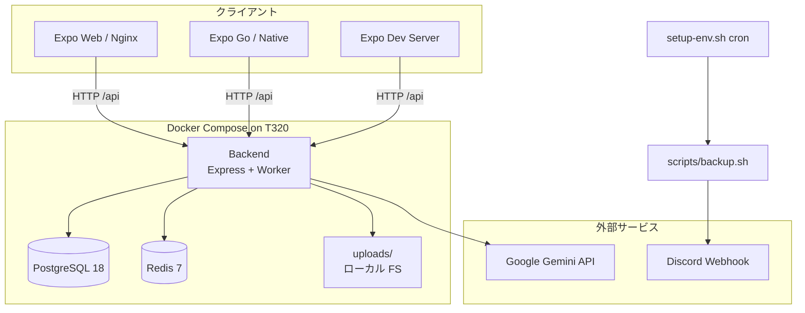
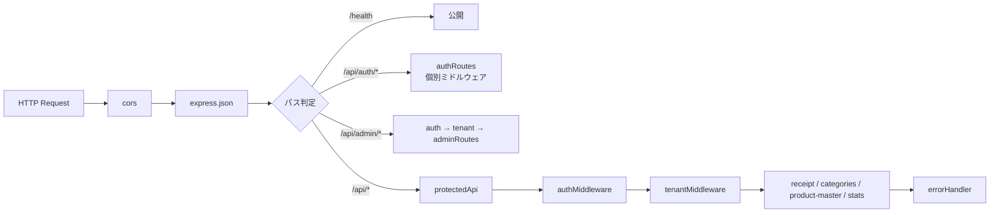
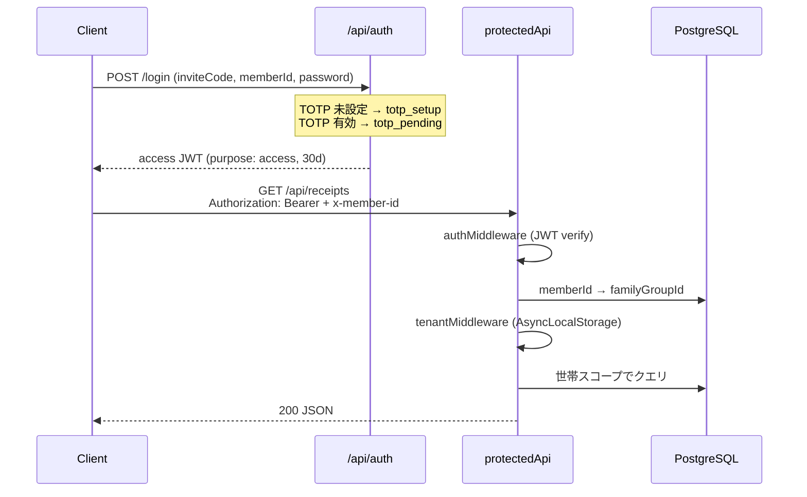
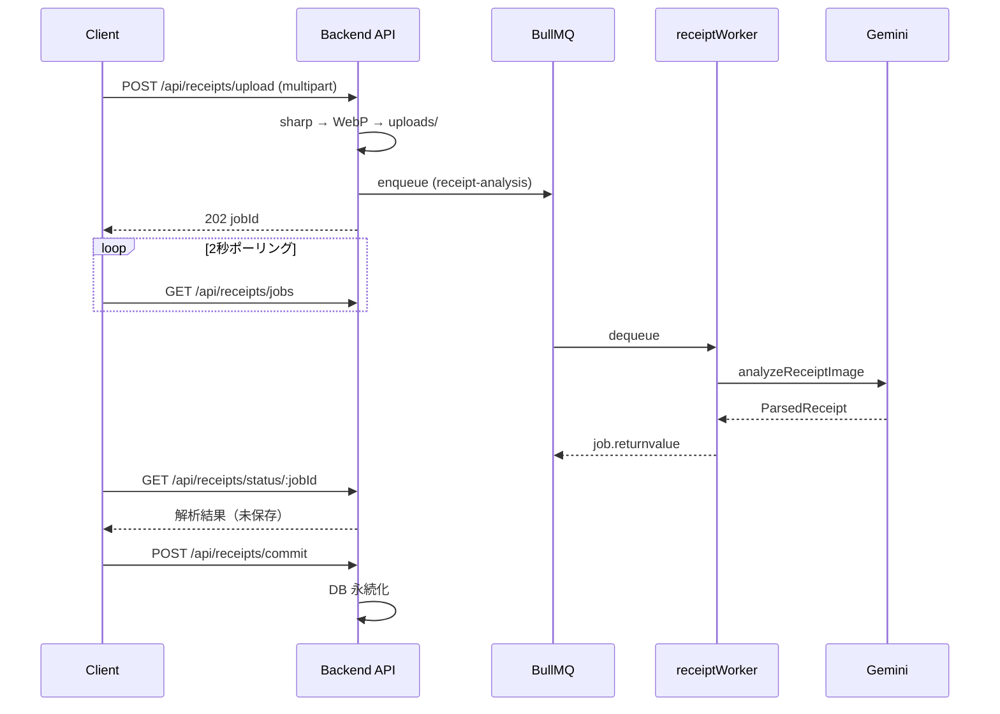

# アーキテクチャ概要（As-built）

Epic: [#276 Issue #90](https://github.com/yama180sx/receipt-ai-app/issues/276) / [#423 Issue #100](https://github.com/yama180sx/receipt-ai-app/issues/423)  
子 Issue: [#292 Issue #90-1](https://github.com/yama180sx/receipt-ai-app/issues/292) / [#439 Issue #100-15](https://github.com/yama180sx/receipt-ai-app/issues/439)  
計画: [plan.md](../refactor/plan.md)

本ドキュメントは **実装準拠（as-built）** で記述する。コード・テスト済み挙動を正とし、詳細なドメイン・API・画面仕様は後続の設計資料を参照する。

| 資料 | 内容 |
|------|------|
| [database-schema.md](./database-schema.md) | DB 列定義・制約 |
| [domain-model.md](./domain-model.md) | ドメインモデル・業務ルール（#90-2） |
| [api-spec.md](./api-spec.md) | API 仕様（#90-3） |
| [ai-pipeline.md](./ai-pipeline.md) | 3層正規化・AI パイプライン（#90-4） |
| [frontend-screens.md](./frontend-screens.md) | 画面遷移・フロント（#90-5） |
| [operations.md](./operations.md) | 運用・障害対応（#90-6） |

---

## 1. システム概要

**RecAIpt**（receipt-ai-app）は、世帯単位のレシート管理・AI 解析・月次精算を行う Web / モバイルアプリである。

- **テナント**: `FamilyGroup`（世帯）。招待コードで参加し、データは世帯 ID で分離する。
- **ホスティング**: 自宅サーバー（Dell PowerEdge T320 / Ubuntu）上の Docker Compose。
- **AI**: Google Gemini API によるレシート OCR・構造化。
- **非同期処理**: BullMQ + Redis でレシート画像解析をキューイングする。

---

## 2. コンポーネント図



### 2.1 技術スタック（実装ベース）

| レイヤー | 技術 |
|----------|------|
| Frontend | Expo ~54, React 19, React Native 0.81, TypeScript, Axios |
| Backend | Node.js 20, Express 5, TypeScript, Prisma 6 |
| DB | PostgreSQL 18 |
| Queue | BullMQ 5 + Redis 7 |
| AI | `@google/generative-ai`（Gemini） |
| 画像 | sharp（WebP 変換）, multer（アップロード） |
| 認証 | JWT, bcrypt, otplib（TOTP）, AES-256-GCM |
| コンテナ | Docker Compose |
| CI | GitHub Actions（`test.yml` / `deploy.yml`） |

---

## 3. リポジトリ構成

```
receipt-ai-app/
├── backend/                 # Express API + BullMQ Worker
│   ├── prisma/              # スキーマ・マイグレーション・seed
│   ├── src/
│   │   ├── app.ts           # Express アプリファクトリ（テスト共有可能）
│   │   ├── server.ts        # 起動エントリ + Worker import
│   │   ├── controllers/     # HTTP ハンドラ（Service 呼び出しのみ）
│   │   ├── middleware/      # auth, tenant, validate, error
│   │   ├── routes/          # ルート定義
│   │   ├── services/        # ビジネスロジック（Application 層）
│   │   ├── repositories/    # Prisma 永続化（#100-2 / #98-8）
│   │   ├── queues/          # BullMQ キュー定義
│   │   ├── workers/         # BullMQ Worker
│   │   └── __tests__/integration/  # Supertest 結合テスト（ドメイン別 #100-16）
│   └── uploads/             # レシート画像（ローカル FS）
├── frontend/                # Expo アプリ
│   ├── app/                 # Expo Router ルート（#98-8 Phase 2）
│   └── src/
│       ├── screens/         # 薄型 Screen（UI + Hook 接続）
│       ├── features/        # ドメイン別 Hook / コンポーネント / スタイル
│       ├── api/             # HTTP クライアント（axios ラッパー）
│       ├── mappers/         # API レスポンス → ViewModel（#100-4）
│       ├── components/      # 共有 UI・レイアウト
│       ├── contexts/        # ReceiptTray, DisplayMode
│       ├── services/        # auth, login, biometric（端末永続化）
│       ├── theme/           # screenLayout, cardStyles 等
│       └── utils/           # apiClient, showAlert 等
├── scripts/                 # backup.sh, notify.sh
├── docs/                    # 設計・運用ドキュメント
├── docker-compose.yml
└── setup-env.sh             # dev / stable 環境生成
```

---

## 4. バックエンドレイヤー

### 4.1 `app.ts` と `server.ts` の分離（#91-3）

テスト計画 [#91-3](https://github.com/yama180sx/receipt-ai-app/issues/280) に基づき、起動責務とアプリ定義を分離している。

| ファイル | 責務 |
|----------|------|
| `app.ts` | `createApp()` — Express ミドルウェア・ルート定義のみ。Supertest 結合テストから import 可能 |
| `server.ts` | `dotenv` 読込 → `receiptWorker` import → `createApp()` → `listen()` |

**分離の理由**: 旧来の単一 `server.ts` では Worker 起動が import 時に走り、Redis 未接続環境（Vitest / Supertest）でエラーになる。テスト時は `createApp()` のみを import し、Worker は起動しない。

```typescript
// app.ts — Worker は起動しない
export function createApp() { /* Express 定義 */ }

// server.ts — 本番・開発サーバー起動時のみ Worker を import
import './workers/receiptWorker';
const app = createApp();
app.listen(port, host);
```

### 4.2 ミドルウェアチェーン



| ミドルウェア | 役割 |
|--------------|------|
| `authMiddleware` | Bearer JWT 検証（`purpose: access`）、`req.user` 設定 |
| `tenantMiddleware` | `memberId` → DB で `familyGroupId` 取得、`AsyncLocalStorage` にテナントコンテキスト設定 |
| `pendingAuthMiddleware` | TOTP セットアップ・検証用短期トークン（10 分） |
| `validate` | Zod スキーマ検証 |
| `isAdmin` | `role=ADMIN` かつ `totpEnabled=true`（管理者 API） |
| `errorHandler` | グローバルエラー処理 |

### 4.3 API ルートマウント（概要）

| マウント | 保護 | 内容 |
|----------|------|------|
| `/api/auth` | 公開（個別ルートで pending JWT） | ログイン・TOTP |
| `/api/admin` | JWT + tenant + ADMIN + TOTP | プロンプト・コスト統計 |
| `/api` | JWT + tenant | レシート・カテゴリ・商品マスタ・精算 |

詳細なエンドポイント一覧は [api-spec.md](./api-spec.md)（#90-3）で記述する。plan.md §8 に抜粋あり。

### 4.4 Repository 層（#100-2 / #98-8）

Prisma への直接アクセスは **Repository に集約** する。Service は Repository 経由でのみ DB を操作し、Controller は Prisma を import しない（#100-3 完了時点で Controller 直叩き 0 件）。

| リポジトリ | 主な責務 |
|------------|----------|
| `repositories/receipt/` | レシート・明細・按分の CRUD・検索（read / write / stats に分割） |
| `repositories/categoryRepository.ts` | カテゴリ CRUD・最適化 |
| `repositories/memberRepository.ts` | メンバー・認証関連 |
| `repositories/settlementRepository.ts` | 精算・送金 |
| `repositories/productMasterRepository.ts` | 商品マスタ |
| `repositories/promptRepository.ts` | プロンプトテンプレート |
| `repositories/apiUsageLogRepository.ts` | AI 利用ログ |

テナントスコープは Prisma Client Extension（`$extends`）で Repository 内部から適用する。UseCase 物理層（`usecases/` フォルダ）は設けず、**Service メソッド = Application 操作** とする（[plan.md](../refactor/plan.md) §7）。

---

## 5. リクエストフロー

### 5.1 認証 → テナント → 業務 API



**認証の要点**

- テナント = `FamilyGroup`。メンバーは招待コードで世帯を解決してログインする。
- 全メンバーに TOTP セットアップが必須（初回ログイン時）。
- 管理者 API は `ADMIN` ロール + TOTP 有効が追加要件。
- フロントエンドは毎リクエストに `Authorization: Bearer` と `x-member-id` を付与する。

### 5.2 レシート解析（非同期）

解析と永続化は **分離** されている（Issue #49-8 / #71）。Worker は解析のみ行い、DB 保存はユーザー確認後の `commit` で行う。



| 要素 | 設定・挙動 |
|------|------------|
| キュー名 | `receipt-analysis` |
| Worker 起動 | `server.ts` import 時、backend コンテナと同一プロセス |
| concurrency | 5 |
| 完了ジョブ保持 | 30 分（ポーリング用） |
| リトライ | attempts: 3, exponential backoff 5s |

Worker の実装: `backend/src/workers/receiptWorker.ts`  
キュー定義: `backend/src/queues/receiptQueue.ts`

---

## 6. フロントエンド概要

Expo Router（`frontend/app/`）によるファイルベースルーティング。**Screen は UI の薄型ラッパー** とし、API 呼び出し・画面状態は `features/*/hooks` に集約する（#98-8 Phase 2 / #100-7〜#100-14）。

| 区分 | ルート例 | Screen / features |
|------|----------|-------------------|
| 認証 | `/login` | `LoginScreen` → `features/auth` |
| ホーム | `/` | `HomeScreen` → `features/home` |
| レシート | `/history`, `/tray`, `/scan/[jobId]` | `HistoryScreen`, `ReceiptTrayScreen`, `ReceiptScanScreen` → `features/history`, `features/receipt` |
| 精算・統計 | `/settlement`, `/stats`, `/history/[receiptId]/split` | `SettlementSummaryScreen`, `StatisticsScreen`, `SplitEditorScreen` → `features/settlement`, `features/stats` |
| 管理（ADMIN） | `/admin/*` | `AdminMenuScreen` 他 → 各 Screen + `features/category` 等 |
| 設定 | `/settings/totp` | `TotpSettingsScreen` |

**状態管理**: `AppSessionProvider`（`features/app`）+ `ReceiptTrayProvider` + 各 Hook のローカル state。Redux / Zustand は未使用。

**API 接続**: `frontend/src/api/*`（型付きラッパー）→ `apiClient.ts`（認証ヘッダ注入・403 通知）。Screen / Hook から `categoryApi` / `receiptApi` / `statsApi` を直接 import しない（#100-14）。

**Mapper**: API 生レスポンスの画面向け整形は `frontend/src/mappers/`（例: `statsMapper.ts`）。

詳細は [frontend-screens.md](./frontend-screens.md)（#90-5 / #100-15）を参照。

### 6.1 features/ 構成（as-built）

| モジュール | Hook（代表） | 役割 |
|------------|--------------|------|
| `features/app` | `useAppSession`, `useAppNavigation` | セッション・ルーター・シェル |
| `features/auth` | `useLoginFlow` | ログイン step フロー |
| `features/home` | `useHomeDashboard`, `useReceiptUpload` | ダッシュボード・撮影アップロード |
| `features/history` | `useReceiptHistory` | 履歴一覧・フィルタ・カテゴリ更新 |
| `features/receipt` | `useReceiptDetail`, `useReceiptScan` | 詳細編集・解析結果 commit |
| `features/stats` | `useStatistics` | 月次統計・グラフ |
| `features/settlement` | `useSettlementSummary`, `useSplitEditor` | 精算・按分 |
| `features/category` | `useCategoryManagement` | カテゴリ CRUD |

各 feature は `hooks/`, `components/`, `styles/`（任意）, `index.ts`（バレル）で構成する。

### 6.2 レイヤールール（AI プロンプト転用用）

以下は **新規実装・レビュー時の必須ルール**（[plan.md](../refactor/plan.md) Epic #100 方針）。

| 層 | 場所 | 許可 | 禁止 |
|----|------|------|------|
| Presentation | `screens/`, `features/*/components` | JSX・スタイル・Hook 呼び出し | `prisma` / `categoryApi` 等の直 import（Screen） |
| Application | `features/*/hooks`, `services/` | 複数 API の編成・UI 向け state | Prisma 直叩き（FE） |
| API Client | `src/api/*`, `apiClient.ts` | HTTP・認証ヘッダ | ビジネスロジック |
| Mapper | `src/mappers/*` | DTO → ViewModel 変換 | API 呼び出し |
| Controller | `backend/controllers` | Service 1 呼び出し + レスポンス整形 | Prisma 直叩き |
| Service | `backend/services` | Repository 経由の業務ロジック | — |
| Repository | `backend/repositories` | Prisma クエリ | HTTP レスポンス生成 |

**粒度ルール**

1. **1 エンドポイント = 1 Service メソッド**（Controller は薄く保つ）
2. **1 画面の主要操作 = 1 Hook**（fetch・保存・フィルタ変更などを Screen 内に直書きしない）
3. **ユーザー通知**は `showAlert` / `showConfirmDialog` に統一（Web 対応 #100-13）

---

## 7. データストア

### 7.1 PostgreSQL（Prisma）

世帯（`FamilyGroup`）を最上位テナントとし、レシート・カテゴリ・店舗マスタ等は `familyGroupId` で分離する。

| モデル | 役割 |
|--------|------|
| `FamilyGroup` / `FamilyMember` | 世帯・メンバー・権限・TOTP |
| `Receipt` / `Item` / `ItemSplit` | レシート本体・明細・按分 |
| `Category` / `Store` / `ProductMaster` | 世帯別マスタ・学習データ |
| `SettlementTransfer` | 月次精算の送金記録 |
| `PromptTemplate` / `ApiUsageLog` | AI プロンプト・トークン使用量 |

ER 詳細は [domain-model.md](./domain-model.md)（#90-2）。

### 7.2 画像ストレージ

クラウドストレージは未使用。`backend/uploads/` に WebP 変換後の画像を保存し、認証付き `GET /api/uploads/:filename` で配信する（世帯スコープ検証あり）。

### 7.3 Redis

BullMQ のジョブキュー専用。`redisdata/` ボリュームで永続化。

---

## 8. 環境とデプロイ

### 8.1 dev / stable 二重環境

`setup-env.sh [dev|stable]` で同一 T320 上に独立した Compose プロジェクトを起動する。

| 項目 | dev | stable |
|------|-----|--------|
| `ENV_NAME` | dev | stable |
| `NODE_ENV` | development | production |
| Backend ポート | 3001 | 3000 |
| Web ポート | 8080 | 80 |
| Expo Dev ポート | 8081 | 8082 |
| DB ポート | 5433 | 5432 |
| Redis ポート | 6380 | 6379 |
| Backend コマンド | `npm run dev` | `npm run start` |
| バックアップ cron | 毎日 3:00 | 毎日 4:00 |

秘密情報（`JWT_SECRET`, `GEMINI_API_KEY`, `DB_PASS` 等）は `.env.secret`（git 管理外）から読み込む。

### 8.2 Docker Compose サービス

| サービス | 役割 |
|----------|------|
| `backend` | Express API + BullMQ Worker |
| `frontend` | Nginx + Expo Web 静的ビルド |
| `frontend-dev` | Expo 開発サーバー |
| `db` | PostgreSQL 18 |
| `redis` | Redis 7 |

### 8.3 CI/CD

**テスト（`test.yml`）** — PR to `develop`:

1. Backend unit（Vitest）
2. Frontend unit（Vitest）
3. Backend integration（Postgres service + `prisma migrate deploy` + seed）— `src/__tests__/integration/*.integration.test.ts`（#100-16、直列実行）

`createApp()` 分離により、結合テストは Worker なしで Supertest 実行可能。

**デプロイ（`deploy.yml`）** — push to `main`:

1. self-hosted runner（`t320`）で checkout
2. `rsync` → `~/stable/receipt-ai-app/`（`pgdata`, `uploads` 等は除外）
3. GitHub Secrets / Vars から `.env` 生成
4. `prisma migrate deploy`
5. `docker compose up -d --build`

運用詳細（バックアップ・Discord 通知・リストア・DB マスタ運用）は [operations.md](./operations.md)（#90-6）を参照。コマンド全文は [db-operations.md](../db-operations.md), [restore-manual.md](../restore-manual.md) にも維持。

---

## 9. 外部連携

| 連携先 | 用途 | 実装 |
|--------|------|------|
| Google Gemini | レシート画像解析 | `backend/src/services/geminiService.ts` |
| Discord Webhook | バックアップ失敗・障害通知 | `scripts/backup.sh`, `scripts/notify.sh` |

Gemini のプロンプトは DB の `PromptTemplate`（key=`RECEIPT_ANALYSIS`）から動的取得する。3層正規化の詳細は [ai-pipeline.md](./ai-pipeline.md)（#90-4）。

---

## 10. セキュリティ要点

- **マルチテナンシー**: JWT の `familyGroupId` と DB 照合 + `AsyncLocalStorage` でサービス層のクエリを世帯スコープに限定。
- **TOTP**: 全メンバー必須。シークレットは AES-256-GCM で暗号化保存。
- **画像アクセス**: 公開静的配信は廃止。認証 + 世帯検証付き API 経由のみ。
- **CORS**: `CORS_ORIGIN` で dev / stable / Expo Go（`exp://`）を環境ごとに許可。

---

## 11. 関連資料

- [plan.md](./plan.md) — Epic #90 全体計画
- [docs/testing/plan.md](../testing/plan.md) — テスト計画（#91）
- [docs/reviews/issue-87/README.md](../reviews/issue-87/README.md) — 精算ドメイン詳細
- [docs/MILESTONE_PHASE1.md](../MILESTONE_PHASE1.md) — 3層正規化の起源
