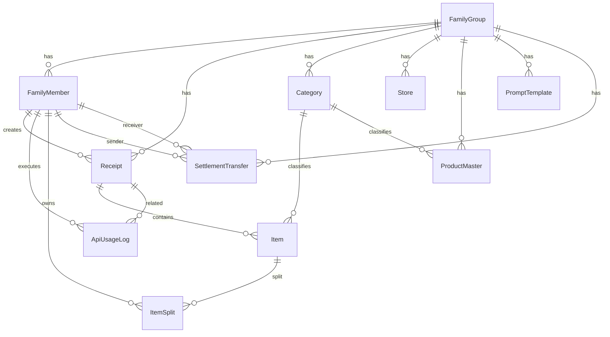

# データベーススキーマ（As-built）

Epic: [#276 Issue #90](https://github.com/yama180sx/receipt-ai-app/issues/276)  
計画: [plan.md](./plan.md)

本ドキュメントは **列レベルの DB リファレンス** である。正本は `backend/prisma/schema.prisma` および `backend/prisma/migrations/`。

| 資料 | 内容 |
|------|------|
| [domain-model.md](./domain-model.md) | ER 図・ドメイン意味・精算・按分の業務ルール |
| [ai-pipeline.md](./ai-pipeline.md) | `PromptTemplate` / `ApiUsageLog` の利用 |
| [../specs/comparison-chatgpt-vs-design.md](../specs/comparison-chatgpt-vs-design.md) | ChatGPT Phase1 との突合記録 |

---

## 1. 概要

| 項目 | 内容 |
|------|------|
| RDBMS | PostgreSQL 18 |
| ORM | Prisma 6 |
| テナントキー | `familyGroupId`（世帯単位の論理分離） |
| モデル数 | 12（Enum `Role` 含む） |

---

## 2. Enum

### Role

| 値 | 用途 |
|----|------|
| `ADMIN` | 管理者（プロンプト編集・コスト統計など） |
| `USER` | 一般ユーザー（レシート登録・閲覧） |

---

## 3. テーブル定義

### FamilyGroup

世帯（テナント）の最上位エンティティ。

| カラム | 型 | Nullable | Default | PK | FK | Unique | Index |
|--------|-----|----------|---------|----|----|--------|-------|
| id | Int | No | autoincrement() | Yes | — | — | — |
| name | String | No | — | — | — | — | — |
| inviteCode | String | No | cuid() | — | — | Yes | — |
| createdAt | DateTime | No | now() | — | — | — | — |

**Unique:** `inviteCode`

---

### FamilyMember

| カラム | 型 | Nullable | Default | PK | FK | Unique | Index |
|--------|-----|----------|---------|----|----|--------|-------|
| id | Int | No | autoincrement() | Yes | — | — | — |
| name | String | No | — | — | — | 複合 | — |
| password_hash | String | Yes | — | — | — | — | — |
| familyGroupId | Int | No | — | — | FamilyGroup.id | 複合 | — |
| role | Role | No | USER | — | — | — | — |
| totpSecret | String | Yes | — | — | — | — | — |
| totpEnabled | Boolean | No | false | — | — | — | — |
| totpVerifiedAt | DateTime | Yes | — | — | — | — | — |

**FK:** `familyGroupId` → `FamilyGroup.id`  
**Unique:** `(name, familyGroupId)`

---

### Category

世帯別費目マスタ。

| カラム | 型 | Nullable | Default | PK | FK | Unique | Index |
|--------|-----|----------|---------|----|----|--------|-------|
| id | Int | No | autoincrement() | Yes | — | — | — |
| name | String | No | — | — | — | 複合 | — |
| familyGroupId | Int | No | — | — | FamilyGroup.id | 複合 | Yes |
| color | String | Yes | — | — | — | — | — |
| keywords | Json | No | `[]` | — | — | — | — |

**FK:** `familyGroupId` → `FamilyGroup.id`  
**Unique:** `(name, familyGroupId)`  
**Index:** `familyGroupId`

---

### Store

世帯別店舗正規化マスタ。

| カラム | 型 | Nullable | Default | PK | FK | Unique | Index |
|--------|-----|----------|---------|----|----|--------|-------|
| id | Int | No | autoincrement() | Yes | — | — | — |
| officialName | String | No | — | — | — | 複合 | — |
| familyGroupId | Int | No | — | — | FamilyGroup.id | 複合 | Yes |
| aliases | Json | No | `[]` | — | — | — | — |

**FK:** `familyGroupId` → `FamilyGroup.id`  
**Unique:** `(officialName, familyGroupId)`  
**Index:** `familyGroupId`

---

### Receipt

| カラム | 型 | Nullable | Default | PK | FK | Unique | Index |
|--------|-----|----------|---------|----|----|--------|-------|
| id | Int | No | autoincrement() | Yes | — | — | — |
| familyGroupId | Int | No | — | — | FamilyGroup.id | — | 複合 |
| memberId | Int | No | — | — | FamilyMember.id | — | — |
| storeName | String | No | — | — | — | — | — |
| date | DateTime | No | — | — | — | — | 複合 |
| totalAmount | Int | No | — | — | — | — | — |
| taxAmount | Float | No | 0.0 | — | — | — | — |
| rawText | Json | Yes | — | — | — | — | — |
| imagePath | String | Yes | — | — | — | — | — |
| createdAt | DateTime | No | now() | — | — | — | — |

**FK:** `familyGroupId` → `FamilyGroup.id`, `memberId` → `FamilyMember.id`  
**Index:** `(familyGroupId, date)`

> `memberId` は立替者（支払者）。業務意味は [domain-model.md §3.2](./domain-model.md)。

---

### Item

| カラム | 型 | Nullable | Default | PK | FK | Unique | Index |
|--------|-----|----------|---------|----|----|--------|-------|
| id | Int | No | autoincrement() | Yes | — | — | — |
| receiptId | Int | No | — | — | Receipt.id | — | — |
| categoryId | Int | Yes | — | — | Category.id | — | — |
| name | String | No | — | — | — | — | — |
| price | Float | No | — | — | — | — | — |
| quantity | Float | No | 1.0 | — | — | — | — |

**FK:** `receiptId` → `Receipt.id` (**onDelete: Cascade**), `categoryId` → `Category.id`

---

### ItemSplit

| カラム | 型 | Nullable | Default | PK | FK | Unique | Index |
|--------|-----|----------|---------|----|----|--------|-------|
| id | Int | No | autoincrement() | Yes | — | — | — |
| itemId | Int | No | — | — | Item.id | — | Yes |
| familyMemberId | Int | No | — | — | FamilyMember.id | — | Yes |
| amount | Int | No | — | — | — | — | — |
| createdAt | DateTime | No | now() | — | — | — | — |

**FK:** `itemId` → `Item.id` (**onDelete: Cascade**), `familyMemberId` → `FamilyMember.id`  
**Index:** `itemId`, `familyMemberId`

> **0 件 = 暗黙デフォルト**（支払者が全額負担）— [domain-model.md §4.2](./domain-model.md)

---

### SettlementTransfer

| カラム | 型 | Nullable | Default | PK | FK | Unique | Index |
|--------|-----|----------|---------|----|----|--------|-------|
| id | Int | No | autoincrement() | Yes | — | — | — |
| familyGroupId | Int | No | — | — | FamilyGroup.id | — | Yes |
| month | String | No | — | — | — | — | Yes |
| fromMemberId | Int | No | — | — | FamilyMember.id | — | Yes |
| toMemberId | Int | No | — | — | FamilyMember.id | — | Yes |
| amount | Int | No | — | — | — | — | — |
| settledAt | DateTime | No | now() | — | — | — | — |

**FK:** `familyGroupId` → `FamilyGroup.id`, `fromMemberId` / `toMemberId` → `FamilyMember.id`  
**Index:** `month`, `fromMemberId`, `toMemberId`, `familyGroupId`

> 取消は物理削除（Issue #88）。精算計算は [domain-model.md §5](./domain-model.md)。

---

### ProductMaster

| カラム | 型 | Nullable | Default | PK | FK | Unique | Index |
|--------|-----|----------|---------|----|----|--------|-------|
| id | Int | No | autoincrement() | Yes | — | — | — |
| name | String | No | — | — | — | 複合 | — |
| storeName | String | No | — | — | — | 複合 | — |
| categoryId | Int | No | — | — | Category.id | — | — |
| familyGroupId | Int | No | — | — | FamilyGroup.id | 複合 | — |

**FK:** `categoryId` → `Category.id`, `familyGroupId` → `FamilyGroup.id`  
**Unique:** `(name, storeName, familyGroupId)` — 制約名 `name_storeName_familyGroupId`

---

### ApiUsageLog

| カラム | 型 | Nullable | Default | PK | FK | Unique | Index |
|--------|-----|----------|---------|----|----|--------|-------|
| id | Int | No | autoincrement() | Yes | — | — | — |
| familyMemberId | Int | Yes | — | — | FamilyMember.id | — | Yes |
| receiptId | Int | Yes | — | — | Receipt.id | — | — |
| modelId | String | No | — | — | — | — | — |
| promptTokens | Int | No | — | — | — | — | — |
| candidatesTokens | Int | No | — | — | — | — | — |
| totalTokens | Int | No | — | — | — | — | — |
| createdAt | DateTime | No | now() | — | — | — | Yes |

**FK:** `familyMemberId` → `FamilyMember.id`, `receiptId` → `Receipt.id`  
**Index:** `familyMemberId`, `createdAt`

---

### PromptTemplate

| カラム | 型 | Nullable | Default | PK | FK | Unique | Index |
|--------|-----|----------|---------|----|----|--------|-------|
| id | Int | No | autoincrement() | Yes | — | — | — |
| familyGroupId | Int | No | — | — | FamilyGroup.id | — | 複合 |
| key | String | No | — | — | — | — | 複合 |
| name | String | No | デフォルトプロンプト | — | — | — | — |
| description | String | Yes | — | — | — | — | — |
| systemPrompt | String (Text) | No | — | — | — | — | — |
| domainHints | Json | Yes | — | — | — | — | — |
| isActive | Boolean | No | false | — | — | — | 複合 |
| version | Int | No | 1 | — | — | — | — |
| createdAt | DateTime | No | now() | — | — | — | — |
| updatedAt | DateTime | No | @updatedAt | — | — | — | — |

**FK:** `familyGroupId` → `FamilyGroup.id`  
**Index:** `(familyGroupId, key, isActive)`

---

## 4. ER 図

リレーションの意味付き ER は [domain-model.md §2](./domain-model.md) を参照。構造のみの図:

---

## 5. マイグレーション

適用順は `backend/prisma/migrations/` のタイムスタンプ順。主要な変遷:

| 時期（migration） | 内容 |
|-------------------|------|
| 20260216〜 | マスタテーブル追加・統合 |
| 20260324〜 | ProductMaster, imagePath |
| 20260406〜 | FamilyGroup 導入（マルチテナンシー） |
| 20260513〜 | taxAmount |
| 20260514〜 | PromptTemplate |
| 20260523〜 | ItemSplit |
| 20260525〜 | SettlementTransfer |
| 20260608〜 | マスタの世帯分離、TOTP |

物理 DDL 名（制約名・シーケンス名）は migration SQL を参照。

---

## 6. 関連資料

- [domain-model.md](./domain-model.md) — 業務ルール・精算
- [api-spec.md](./api-spec.md) — API
- [ai-pipeline.md](./ai-pipeline.md) — AI パイプライン
- [../db-operations.md](../db-operations.md) — マスタ運用
