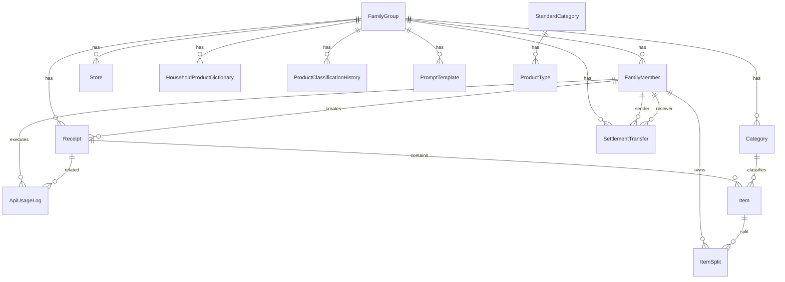

# データベーススキーマ（As-built）

Epic: [#276 Issue #90](https://github.com/yama180sx/receipt-ai-app/issues/276)  
計画: [plan.md](./plan.md)

本ドキュメントは **列レベルの DB リファレンス** である。正本は `backend/prisma/schema.prisma` および `backend/prisma/migrations/`。

| 資料 | 内容 |
|------|------|
| [domain-model.md](./domain-model.md) | ER 図・ドメイン意味・精算・按分の業務ルール |
| [ai-pipeline.md](./ai-pipeline.md) | `PromptTemplate` / `ApiUsageLog` の利用 |
| [../specs/comparison-chatgpt-vs-design.md](../specs/comparison-chatgpt-vs-design.md) | ChatGPT Phase1 との突合記録 |

---

## 1. 概要

| 項目 | 内容 |
|------|------|
| RDBMS | PostgreSQL 18 |
| ORM | Prisma 6 |
| テナントキー | `familyGroupId`（世帯単位の論理分離） |
| モデル数 | 22（分類・監査モデルを含む。正確な定義はPrisma schemaを正とする） |

---

## 2. Enum

### Role

| 値 | 用途 |
|----|------|
| `ADMIN` | 管理者（プロンプト編集・コスト統計など） |
| `USER` | 一般ユーザー（レシート登録・閲覧） |

---

## 3. テーブル定義

### FamilyGroup

世帯（テナント）の最上位エンティティ。

| カラム | 型 | Nullable | Default | PK | FK | Unique | Index |
|--------|-----|----------|---------|----|----|--------|-------|
| id | Int | No | autoincrement() | Yes | — | — | — |
| name | String | No | — | — | — | — | — |
| inviteCode | String | No | cuid() | — | — | Yes | — |
| createdAt | DateTime | No | now() | — | — | — | — |

**Unique:** `inviteCode`

---

### FamilyMember

| カラム | 型 | Nullable | Default | PK | FK | Unique | Index |
|--------|-----|----------|---------|----|----|--------|-------|
| id | Int | No | autoincrement() | Yes | — | — | — |
| name | String | No | — | — | — | 複合 | — |
| password_hash | String | Yes | — | — | — | — | — |
| familyGroupId | Int | No | — | — | FamilyGroup.id | 複合 | — |
| role | Role | No | USER | — | — | — | — |
| totpSecret | String | Yes | — | — | — | — | — |
| totpEnabled | Boolean | No | false | — | — | — | — |
| totpVerifiedAt | DateTime | Yes | — | — | — | — | — |

**FK:** `familyGroupId` → `FamilyGroup.id`  
**Unique:** `(name, familyGroupId)`

---

### Category

世帯別費目マスタ。

| カラム | 型 | Nullable | Default | PK | FK | Unique | Index |
|--------|-----|----------|---------|----|----|--------|-------|
| id | Int | No | autoincrement() | Yes | — | — | — |
| name | String | No | — | — | — | 複合 | — |
| familyGroupId | Int | No | — | — | FamilyGroup.id | 複合 | Yes |
| color | String | Yes | — | — | — | — | — |
| keywords | Json | No | `[]` | — | — | — | — |
| isAdjustment | Boolean | No | false | — | — | — | 複合 |

**FK:** `familyGroupId` → `FamilyGroup.id`  
**Unique:** `(name, familyGroupId)`  
**Index:** `familyGroupId`

`isAdjustment = true` は、値引き・アプリ適用などの調整明細を保存する世帯別Categoryである。統計時だけ同一レシートの通常Categoryへ比例配賦し、配賦対象がなければこのCategoryに残す。`Item`・`ItemSplit`の値は変更しない。

---

### Store

世帯別店舗正規化マスタ。

| カラム | 型 | Nullable | Default | PK | FK | Unique | Index |
|--------|-----|----------|---------|----|----|--------|-------|
| id | Int | No | autoincrement() | Yes | — | — | — |
| officialName | String | No | — | — | — | 複合 | — |
| familyGroupId | Int | No | — | — | FamilyGroup.id | 複合 | Yes |
| aliases | Json | No | `[]` | — | — | — | — |

**FK:** `familyGroupId` → `FamilyGroup.id`  
**Unique:** `(officialName, familyGroupId)`  
**Index:** `familyGroupId`

---

### Receipt

| カラム | 型 | Nullable | Default | PK | FK | Unique | Index |
|--------|-----|----------|---------|----|----|--------|-------|
| id | Int | No | autoincrement() | Yes | — | — | — |
| familyGroupId | Int | No | — | — | FamilyGroup.id | — | 複合 |
| memberId | Int | No | — | — | FamilyMember.id | — | — |
| storeName | String | No | — | — | — | — | — |
| normalizedStoreName | String | No | `""` | — | — | — | GIN（`pg_trgm`） |
| date | DateTime | No | — | — | — | — | 複合 |
| totalAmount | Int | No | — | — | — | — | — |
| taxAmount | Float | No | 0.0 | — | — | — | — |
| rawText | Json | Yes | — | — | — | — | — |
| imagePath | String | Yes | — | — | — | — | — |
| createdAt | DateTime | No | now() | — | — | — | — |

**FK:** `familyGroupId` → `FamilyGroup.id`, `memberId` → `FamilyMember.id`  
**Index:** `(familyGroupId, date)`, `GIN(normalizedStoreName gin_trgm_ops)`

> `memberId` は立替者（支払者）。業務意味は [domain-model.md §3.2](./domain-model.md)。

---

### Item

| カラム | 型 | Nullable | Default | PK | FK | Unique | Index |
|--------|-----|----------|---------|----|----|--------|-------|
| id | Int | No | autoincrement() | Yes | — | — | — |
| receiptId | Int | No | — | — | Receipt.id | — | — |
| categoryId | Int | Yes | — | — | Category.id | — | — |
| name | String | No | — | — | — | — | — |
| normalizedName | String | No | `""` | — | — | — | GIN（`pg_trgm`） |
| price | Float | No | — | — | — | — | — |
| quantity | Float | No | 1.0 | — | — | — | — |

**FK:** `receiptId` → `Receipt.id` (**onDelete: Cascade**), `categoryId` → `Category.id`
**Index:** `GIN(normalizedName gin_trgm_ops)`

`normalizedStoreName` と `normalizedName` は、商品分類の類似候補検索および履歴検索で共有する検索キーである。既存データはmigrationで小文字化・空白整理を行い、新規・更新データはアプリケーションの `getCleanText` で保存する。

`productTypeStatus = not_applicable` は、商品種別を扱わないカテゴリに加え、承認済みの明細名パターンに一致する負額の値引き・アプリ適用行にも用いる。この場合も `Item` の `price`、`quantity`、`categoryId` は保持し、商品種別・候補・AI分類だけを対象外にする。既存の状態値と列で表現できるため、この扱いのためのDB migrationは不要である。

Issue #114-10 では、世帯別 `Category` の旧名称 `交通費` を標準カテゴリ名 `交通・通信` に統一する。通常は `Category.name` の更新だけで `Item.categoryId` は維持される。同一世帯に両方のカテゴリが存在する場合だけ、`交通費` を参照する `Item.categoryId` を既存 `交通・通信` へ更新して旧カテゴリを削除する。

### ProductClassificationCandidate

類似検索で得た商品種別候補を、明細ごとに保持する。候補レコードは商品種別の確定を意味しない。

| カラム | 型 | Nullable | Default | PK | FK | Unique | Index |
|--------|-----|----------|---------|----|----|--------|-------|
| id | Int | No | autoincrement() | Yes | — | — | — |
| itemId | Int | No | — | — | Item.id | 複合 | 複合 |
| productTypeId | Int | No | — | — | ProductType.id | 複合 | Yes |
| source | ProductClassificationCandidateSource | No | — | — | — | — | — |
| matchedNormalizedName | String | No | — | — | — | — | — |
| similarity | Float | No | — | — | — | — | — |
| rank | Int | No | — | — | 複合 | 複合 | — |
| createdAt | DateTime | No | now() | — | — | — | — |

**FK:** `itemId` → `Item.id` (**onDelete: Cascade**), `productTypeId` → `ProductType.id`
**Unique:** `(itemId, productTypeId)`, `(itemId, rank)`
**Index:** `productTypeId`

---

### ProductClassificationLearningDataAudit

世帯辞書を無効化した際の監査証跡。対象レコードへのポリモーフィックな外部キーは持たず、対象名と変更前の商品種別をスナップショットとして保存する。

| カラム | 型 | Nullable | Default | PK | FK | Unique | Index |
|--------|-----|----------|---------|----|----|--------|-------|
| id | Int | No | autoincrement() | Yes | — | — | — |
| familyGroupId | Int | No | — | — | FamilyGroup.id | — | `(familyGroupId, createdAt)` |
| actorMemberId | Int | Yes | — | — | FamilyMember.id | — | — |
| learningDataType | ProductClassificationLearningDataType | No | — | — | — | — | `(learningDataType, learningDataId)` |
| learningDataId | Int | No | — | — | — | — | 複合 |
| normalizedName | String | No | — | — | — | — | — |
| productTypeId | Int | No | — | — | — | — | — |
| productTypeName | String | No | — | — | — | — | — |
| reason | String | No | — | — | — | — | — |
| createdAt | DateTime | No | now() | — | — | — | 複合 |

**FK:** `familyGroupId` → `FamilyGroup.id`（Cascade）、`actorMemberId` → `FamilyMember.id`（SetNull）

---

### ProductClassificationAiRun

商品分類AIの実行結果・評価・障害診断を世帯単位で記録する。`provider_error`、`invalid_response`、`persistence_error` の場合、`failureCode` には `http_429`、`network_etimedout`、`prompt_not_found`、`response_validation` などの固定コードだけを保存する。生の例外文・Gemini応答・認証情報は保存しない。

`modelId` は成功・失敗を問わず呼び出し時の設定モデル名を保存する。これにより、モデル変更後も失敗傾向を比較できる。

**Index:** `(familyGroupId, createdAt)`、`receiptId`

### ProductClassificationReclassificationRun / ProductClassificationReclassificationItemAudit

既存明細の再分類を世帯単位で実行した際の条件・集計結果と、実際に更新または失敗した明細の変更前後を保持する。`unclassified` と `needs_review` だけを対象にするため、手動確定済みの明細は更新対象に含めない。変更がない明細は実行集計にのみ含め、明細監査を重複作成しない。

`ProductClassificationReclassificationRun` は `familyGroupId`、`actorMemberId`、対象状態配列、期間、上限、選択・更新・不変・失敗件数、完了状態を持つ。`ProductClassificationReclassificationItemAudit` は実行と明細に紐づき、更新前後のカテゴリ・標準カテゴリ・商品種別・状態・分類元、および失敗理由をスナップショットとして保存する。

**FK:** Run の `familyGroupId` → `FamilyGroup.id`（Cascade）、`actorMemberId` → `FamilyMember.id`（Restrict）、ItemAudit の `runId` → Run.id（Cascade）、`itemId` → Item.id（Cascade）
**Unique:** ItemAudit `(runId, itemId)`
**Index:** Run `(familyGroupId, createdAt)`、`actorMemberId`、ItemAudit `itemId`、`outcome`

### StandardProductClassificationRule / StandardProductClassificationRuleAudit

全世帯共通の標準分類ルール。`normalizedKeyword` は `getCleanText` 済みで、アクティブなルールのキーワードを明細の正規化名に包含できる場合だけ候補となる。最小の `priority` が一意の商品種別を指す場合のみ自動確定し、異なる商品種別が同順位なら `needs_review` とする。世帯固有の完全一致学習が必ず先行する。

Rule はキーワード、商品種別・標準カテゴリ、優先度、有効状態、登録・最終変更者、最終変更理由と日時を持つ。Audit は追加・編集・無効化ごとに操作人・理由・当時の値を保存する。ルールは全世帯共通のため `familyGroupId` を持たない。プレビュー対象の明細検索だけは、要求者の `familyGroupId` で限定する。

**Unique:** Rule `(normalizedKeyword, productTypeId)`
**Index:** Rule `(isActive, priority)`、`productTypeId`、Audit `(ruleId, createdAt)`、`actorMemberId`

---

### ItemSplit

| カラム | 型 | Nullable | Default | PK | FK | Unique | Index |
|--------|-----|----------|---------|----|----|--------|-------|
| id | Int | No | autoincrement() | Yes | — | — | — |
| itemId | Int | No | — | — | Item.id | — | Yes |
| familyMemberId | Int | No | — | — | FamilyMember.id | — | Yes |
| amount | Int | No | — | — | — | — | — |
| createdAt | DateTime | No | now() | — | — | — | — |

**FK:** `itemId` → `Item.id` (**onDelete: Cascade**), `familyMemberId` → `FamilyMember.id`  
**Index:** `itemId`, `familyMemberId`

> **0 件 = 暗黙デフォルト**（支払者が全額負担）— [domain-model.md §4.2](./domain-model.md)

---

### SettlementTransfer

| カラム | 型 | Nullable | Default | PK | FK | Unique | Index |
|--------|-----|----------|---------|----|----|--------|-------|
| id | Int | No | autoincrement() | Yes | — | — | — |
| familyGroupId | Int | No | — | — | FamilyGroup.id | — | Yes |
| month | String | No | — | — | — | — | Yes |
| fromMemberId | Int | No | — | — | FamilyMember.id | — | Yes |
| toMemberId | Int | No | — | — | FamilyMember.id | — | Yes |
| amount | Int | No | — | — | — | — | — |
| settledAt | DateTime | No | now() | — | — | — | — |

**FK:** `familyGroupId` → `FamilyGroup.id`, `fromMemberId` / `toMemberId` → `FamilyMember.id`  
**Index:** `month`, `fromMemberId`, `toMemberId`, `familyGroupId`

> 取消は物理削除（Issue #88）。精算計算は [domain-model.md §5](./domain-model.md)。

---

### 商品分類・学習データ

`ProductMaster`はADR-003と`20260728095000_remove_product_master` migrationで廃止済みである。現行の役割は次のモデルに分離する。

| モデル | 役割 | 主な制約・スコープ |
|--------|------|-------------------|
| `StandardCategory` | 全世帯共通のカテゴリ階層 | `code`一意、親子関係、表示順 |
| `ProductType` | 標準カテゴリに属する商品種別 | `code`一意、`standardCategoryId + name`一意 |
| `StandardProductClassificationRule` | 全世帯共通のキーワード分類ルール | `normalizedKeyword + productTypeId`一意、優先度・有効状態・変更理由 |
| `HouseholdProductDictionary` | 世帯別の商品名→商品種別辞書 | `familyGroupId + normalizedName`一意 |
| `ProductClassificationHistory` | 世帯内の確定履歴 | `familyGroupId + normalizedName`一意 |
| `ClassificationCorrection` | 明細への手動修正履歴 | 世帯、操作メンバー、修正前後、適用範囲を保存 |
| `ProductClassificationCandidate` | 類似検索候補 | `itemId + productTypeId`、`itemId + rank`が一意 |
| `ProductClassificationLearningDataAudit` | 世帯辞書の無効化監査 | 世帯・対象・操作メンバー・理由を保存 |
| `ProductClassificationAiRun` | 保存後の商品分類AI実行ログ | OCR用`ApiUsageLog`とは分離 |
| `ProductClassificationReclassificationRun` / `ItemAudit` | 管理者による既存明細再分類の監査 | 世帯・実行者・対象・結果を保存 |

---

### ApiUsageLog

| カラム | 型 | Nullable | Default | PK | FK | Unique | Index |
|--------|-----|----------|---------|----|----|--------|-------|
| id | Int | No | autoincrement() | Yes | — | — | — |
| familyMemberId | Int | Yes | — | — | FamilyMember.id | — | Yes |
| receiptId | Int | Yes | — | — | Receipt.id | — | — |
| modelId | String | No | — | — | — | — | — |
| promptTokens | Int | No | — | — | — | — | — |
| candidatesTokens | Int | No | — | — | — | — | — |
| totalTokens | Int | No | — | — | — | — | — |
| selfRepairRetryCount | Int | No | 0 | — | — | — | — |
| durationMs | Int | No | 0 | — | — | — | — |
| createdAt | DateTime | No | now() | — | — | — | Yes |

**FK:** `familyMemberId` → `FamilyMember.id`, `receiptId` → `Receipt.id`  
**Index:** `familyMemberId`, `createdAt`

---

### PromptTemplate

| カラム | 型 | Nullable | Default | PK | FK | Unique | Index |
|--------|-----|----------|---------|----|----|--------|-------|
| id | Int | No | autoincrement() | Yes | — | — | — |
| familyGroupId | Int | No | — | — | FamilyGroup.id | — | 複合 |
| key | String | No | — | — | — | — | 複合 |
| name | String | No | デフォルトプロンプト | — | — | — | — |
| description | String | Yes | — | — | — | — | — |
| systemPrompt | String (Text) | No | — | — | — | — | — |
| domainHints | Json | Yes | — | — | — | — | — |
| isActive | Boolean | No | false | — | — | — | 複合 |
| version | Int | No | 1 | — | — | — | — |
| createdAt | DateTime | No | now() | — | — | — | — |
| updatedAt | DateTime | No | @updatedAt | — | — | — | — |

**FK:** `familyGroupId` → `FamilyGroup.id`  
**Index:** `(familyGroupId, key, isActive)`

---

## 4. ER 図

リレーションの意味付き ER は [domain-model.md §2](./domain-model.md) を参照。構造のみの図:

```mermaid
erDiagram
    FamilyGroup ||--o{ FamilyMember : has
    FamilyGroup ||--o{ Receipt : has
    FamilyGroup ||--o{ Category : has
    FamilyGroup ||--o{ Store : has
    FamilyGroup ||--o{ HouseholdProductDictionary : has
    FamilyGroup ||--o{ ProductClassificationHistory : has
    FamilyGroup ||--o{ PromptTemplate : has
    FamilyGroup ||--o{ SettlementTransfer : has

    FamilyMember ||--o{ Receipt : creates
    FamilyMember ||--o{ ApiUsageLog : executes
    FamilyMember ||--o{ ItemSplit : owns

    Receipt ||--o{ Item : contains
    Receipt ||--o{ ApiUsageLog : related

    Category ||--o{ Item : classifies
    StandardCategory ||--o{ ProductType : has

    Item ||--o{ ItemSplit : split

    FamilyMember ||--o{ SettlementTransfer : sender
    FamilyMember ||--o{ SettlementTransfer : receiver
```

---

## 5. マイグレーション

適用順は `backend/prisma/migrations/` のタイムスタンプ順。主要な変遷:

| 時期（migration） | 内容 |
|-------------------|------|
| 20260216〜 | マスタテーブル追加・統合 |
| 20260324〜 | ProductMaster, imagePath（ProductMasterは後続migrationで廃止） |
| 20260406〜 | FamilyGroup 導入（マルチテナンシー） |
| 20260513〜 | taxAmount |
| 20260514〜 | PromptTemplate |
| 20260728〜 | 商品分類モデル導入・ProductMaster廃止 |
| 20260523〜 | ItemSplit |
| 20260525〜 | SettlementTransfer |
| 20260608〜 | マスタの世帯分離、TOTP |

物理 DDL 名（制約名・シーケンス名）は migration SQL を参照。

---

## 6. 関連資料

- [domain-model.md](./domain-model.md) — 業務ルール・精算
- [api-spec.md](./api-spec.md) — API
- [ai-pipeline.md](./ai-pipeline.md) — AI パイプライン
- [../db-operations.md](../db-operations.md) — マスタ運用
