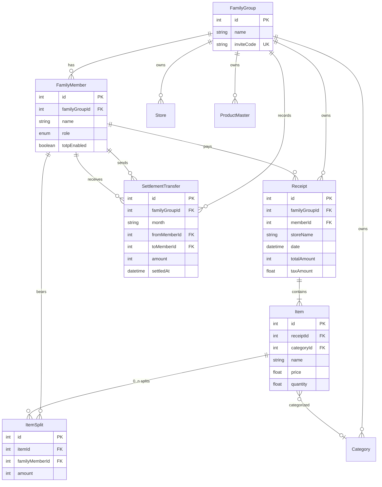
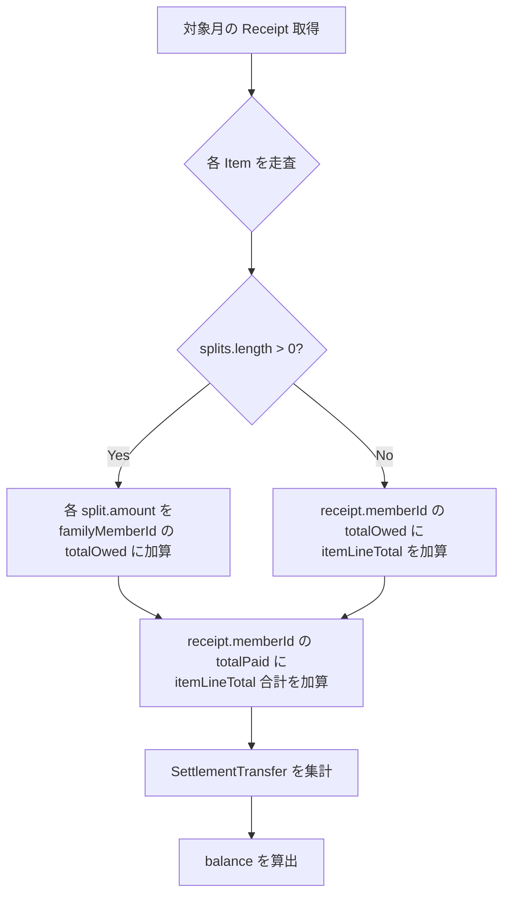

# ドメインモデル & 業務ルール（As-built）

Epic: [#276 Issue #90](https://github.com/yama180sx/receipt-ai-app/issues/276)  
子 Issue: [#293 Issue #90-2](https://github.com/yama180sx/receipt-ai-app/issues/293)  
計画: [plan.md](./plan.md)

本ドキュメントは **実装準拠（as-built）** で記述する。Prisma スキーマと精算・按分の業務ルールを正とし、API 詳細は [api-spec.md](./api-spec.md)（#90-3）、画面仕様は [frontend-screens.md](./frontend-screens.md)（#90-5）を参照する。

| 資料 | 内容 |
|------|------|
| [architecture.md](./architecture.md) | システム構成・レイヤー（#90-1） |
| [api-spec.md](./api-spec.md) | 精算 API エンドポイント（#90-3） |
| [docs/reviews/issue-87/](../reviews/issue-87/README.md) | 精算ドメイン LLM レビュー資材 |

---

## 1. ドメイン概要

RecAIpt のコアドメインは **世帯（FamilyGroup）単位のレシート管理** と **家族間精算** である。

| 概念 | 説明 |
|------|------|
| **テナント** | `FamilyGroup`（世帯）。全データは `familyGroupId` で論理分離する |
| **立替** | メンバーがレジで支払った金額（`Receipt.memberId` が支払者） |
| **負担** | 各メンバーが実際に負うべき金額（`Item` 単位の `ItemSplit`、または暗黙デフォルト） |
| **精算** | 月次で「立替 − 負担」の差額を算出し、家族間送金（`SettlementTransfer`）で調整する |

**家計統計**（カテゴリ別支出など）と **精算** は別ドメインである。前者は `Receipt.totalAmount` / `Item.price` を集計し、後者は `ItemSplit` と暗黙デフォルトに基づく（§6 参照）。

---

## 2. ER 図



> スキーマ正本: `backend/prisma/schema.prisma`  
> AI 関連（`PromptTemplate`, `ApiUsageLog`）は [ai-pipeline.md](./ai-pipeline.md)（#90-4）で扱う。

---

## 3. エンティティ定義

### 3.1 FamilyGroup / FamilyMember

| モデル | 役割 | 主要制約 |
|--------|------|----------|
| `FamilyGroup` | 世帯（テナント） | `inviteCode` はユニーク。招待コードでログイン時に世帯を解決 |
| `FamilyMember` | 世帯メンバー | `(name, familyGroupId)` ユニーク。`role` は `ADMIN` / `USER` |

精算ドメインでは、メンバー ID が以下の 3 箇所で参照される。

- `Receipt.memberId` — レシート支払者（立替者）
- `ItemSplit.familyMemberId` — 明細の負担者
- `SettlementTransfer.fromMemberId` / `toMemberId` — 送金の送受信者

### 3.2 Receipt / Item

| モデル | 役割 | 備考 |
|--------|------|------|
| `Receipt` | レシート 1 枚 | `memberId` = 立替者。`date` で月次精算の対象月を判定 |
| `Item` | レシート明細 1 行 | `price × quantity` を整数円に丸めた値が按分・精算の基準（§4.1） |
| `ItemSplit` | 明細行ごとの負担内訳 | **0 件 = 暗黙デフォルト**（§4.2） |

`Receipt.totalAmount` はレシート全体の支払合計（税込）であり、精算の `totalPaid` 集計には **Item 行の合計** を用いる（`calcItemLineTotal` の合算）。`totalAmount` と Item 合計の不一致は許容される（OCR 誤差等）。

### 3.3 SettlementTransfer

| フィールド | 説明 |
|------------|------|
| `month` | 精算対象月（`"YYYY-MM"` 形式） |
| `fromMemberId` | 送金したメンバー |
| `toMemberId` | 受け取ったメンバー |
| `amount` | 送金額（整数円） |
| `settledAt` | 登録日時（取消は物理削除 — Issue #88） |

送金記録は **精算の実績** を表す。レシートや ItemSplit は変更せず、`balance` 計算にのみ反映する。

### 3.4 世帯別マスタ（精算との関係）

| モデル | 精算への影響 |
|--------|-------------|
| `Category` | なし（家計統計用） |
| `Store` / `ProductMaster` | なし（AI 正規化・学習用） |

---

## 4. 按分（ItemSplit）業務ルール

### 4.1 明細小計の算出

明細行の税込小計は **整数円に四捨五入** する。

```
itemLineTotal = Math.round(price × quantity)
```

| 実装 | ファイル |
|------|----------|
| Backend | `backend/src/utils/itemLineTotal.ts` — `calcItemLineTotal()` |
| Frontend | `frontend/src/utils/splitEditorSplits.ts` — `calcItemTotal()` |

Frontend / Backend で同一式を使用する（テスト [#91-2](https://github.com/yama180sx/receipt-ai-app/issues/279) で検証）。

### 4.2 暗黙的デフォルト（splits 0 件）

**`ItemSplit` レコードが 0 件の明細は、レシート登録者（`Receipt.memberId`）が全額負担** とみなす。

| 操作 | 挙動 |
|------|------|
| 按分未設定（新規 Item） | DB に ItemSplit なし → 精算時に支払者へ全額計上 |
| 按分クリア（空配列 POST） | 既存 ItemSplit を全削除 → 暗黙デフォルトに戻る |

```typescript
// statsController.ts — 精算集計の分岐
if (item.splits.length > 0) {
  // 明示按分: 各 split.amount を totalOwed に加算
} else {
  // 暗黙デフォルト: receipt.memberId に itemLineTotal を加算
}
```

> **T-ref-02**（[findings.md](../testing/findings.md)）: ItemSplit 0 件 = 登録者全額負担（暗黙）

### 4.3 按分額の算出（allocateItemSplits）

按分保存時、Backend は `allocateItemSplits(totalAmount, splits)` で各メンバーの負担額を確定する。

**入力形式**（`POST /api/receipts/items/:itemId/splits`）:

```json
{
  "splits": [
    { "familyMemberId": 1, "ratio": 0.5 },
    { "familyMemberId": 2, "amount": 300 },
    { "familyMemberId": 3 }
  ]
}
```

| ルール | 内容 |
|--------|------|
| 配列末尾 | `totalAmount − それ以前の合計` を自動算出（端数吸収） |
| 末尾以外 | `ratio` または `amount` のいずれか必須。`amount` は `Math.round` |
| ratio 指定 | `Math.round(totalAmount × ratio)` |
| 空配列 | ItemSplit 全削除（§4.2 へ） |
| バリデーション | 重複 memberId 禁止、負数禁止、合計 ≠ 小計は 400 エラー |
| テナント検証 | 全 `familyMemberId` が同一 `familyGroupId` 所属であること |

実装: `backend/src/utils/itemSplitAllocation.ts`

#### 端数ルール（最後のメンバーに残額）

端数（1 円単位の差）は **配列の最後のメンバー** に寄せる。

```
例: totalAmount = 100, ratio 33% × 3 人
  → [33, 33, 34]  （末尾メンバーが +1 円）
```

```
例: totalAmount = 101, ratio 50% × 2 人
  → [51, 50]  （末尾メンバーが −1 円 = 残額）
```

> **T-ref-01**（[findings.md](../testing/findings.md)）: 按分端数は配列末尾メンバーに残額  
> テスト: `backend/src/utils/itemSplitAllocation.test.ts`（#91-2）

### 4.4 Frontend ↔ Backend の配列順序

UI では **先頭メンバー** が端数を吸収するが、保存時に `buildItemSplitSavePayload()` で **端数負担者を配列末尾** に並べ替えてから API に送信する。

```
UI 上の端数負担者（先頭） → payload では末尾 → Backend の allocate ルールと一致
```

| 実装 | ファイル |
|------|----------|
| payload 生成 | `frontend/src/utils/splitEditorSplits.ts` — `buildItemSplitSavePayload()` |
| テスト | `frontend/src/utils/splitEditorSplits.test.ts` |

> **T-ref-03**（[findings.md](../testing/findings.md)）: Frontend payload 末尾配置と Backend allocate 一致

---

## 5. 精算サマリー — 概念モデル

月次精算（`GET /api/stats/settlement`）は、対象月の全レシートと送金記録から **メンバーごとの残額** を算出する。

### 5.1 集計フロー



実装: `backend/src/controllers/statsController.ts` — `getSettlementStatus()`

### 5.2 メンバーごとの指標

| 指標 | 定義 | 符号の意味 |
|------|------|-----------|
| `totalPaid` | その月にレジで立替えた Item 小計の合計 | — |
| `totalOwed` | その月に負担すべき Item 按分額の合計 | — |
| `baseBalance` | `totalPaid − totalOwed` | **> 0**: 払いすぎ（受取権） / **< 0**: 不足（支払義務） |
| `transferredOut` | 他メンバーへ送金した累計 | — |
| `transferredIn` | 他メンバーから受取った累計 | — |
| `balance` | `baseBalance + transferredOut − transferredIn` | **0 に近いほど精算済み** |

```
balance = (totalPaid - totalOwed) + transferredOut - transferredIn
```

| balance | 解釈 |
|---------|------|
| > 0 | まだ受け取るべき残額がある |
| < 0 | まだ支払うべき残額がある |
| ≈ 0 | 当月の精算が概ね完了 |

### 5.3 計算例

世帯メンバー: A（id=1）, B（id=2）

| レシート | 支払者 | Item | 小計 | 按分 |
|----------|--------|------|------|------|
| R1 | A | 牛乳 | 300 | なし（暗黙: A 300） |
| R2 | A | パン | 200 | A:100, B:100 |

**集計結果**:

| メンバー | totalPaid | totalOwed | baseBalance |
|----------|-----------|-----------|-------------|
| A | 500 | 400 | **+100** |
| B | 0 | 100 | **−100** |

A が B へ 100 円送金を記録（`SettlementTransfer`）すると:

| メンバー | baseBalance | transferredOut | transferredIn | balance |
|----------|-------------|----------------|---------------|---------|
| A | +100 | 100 | 0 | **0** |
| B | −100 | 0 | 100 | **0** |

### 5.4 対象月の判定

レシートの `date` フィールドは **ローカルタイムゾーン基準** の月範囲でフィルタする。

| 関数 | 役割 |
|------|------|
| `getCurrentYearMonthLocal()` | デフォルト対象月（`YYYY-MM`） |
| `getLocalMonthDateRange(month)` | 月初 00:00 〜 翌月初（排他） |

実装: `backend/src/utils/yearMonth.ts`（Issue #87-2 R-B001 対応）

### 5.5 送金記録

| 操作 | エンドポイント | 挙動 |
|------|---------------|------|
| 登録 | `POST /api/stats/settlement/transfers` | `SettlementTransfer` 作成。同一世帯メンバー間のみ |
| 取消 | `DELETE /api/stats/settlement/transfers/:id` | 物理削除（Issue #88） |

送金は `month` 単位で紐づく。精算サマリー取得時、同一 `month` の送金のみ `balance` に反映する。

---

## 6. 家計統計と精算の区別

| 観点 | 家計統計 | 精算 |
|------|----------|------|
| 目的 | 支出の可視化（カテゴリ別等） | メンバー間の立替・負担の清算 |
| 主 API | `GET /api/receipts/stats/monthly` | `GET /api/stats/settlement` |
| 集計単位 | `Receipt.totalAmount`, `Item.price × quantity` | `ItemSplit.amount` + 暗黙デフォルト |
| 按分の影響 | なし | あり（負担額の再配分） |
| 画面 | StatisticsScreen, HistoryScreen | SettlementSummaryScreen, SplitEditorScreen |

---

## 7. Issue #87 レビュー資材との対応

精算ドメインの深掘りレビューは Issue #87 で実施済み。本ドキュメントと以下を相互参照する。

| 資料 | 内容 | 本ドキュメントとの関係 |
|------|------|----------------------|
| [scope.md](../reviews/issue-87/scope.md) | レビュー対象ファイル・スコープ | §4〜§5 の実装ファイルと一致 |
| [results/backend.md](../reviews/issue-87/results/backend.md) | Backend レビュー結果 | 按分一本化（R-B003）、月境界（R-B001）を §4.3, §5.4 に反映 |
| [results/frontend.md](../reviews/issue-87/results/frontend.md) | Frontend レビュー結果 | payload 順序（§4.4） |
| [regression-checklist.md](../reviews/issue-87/regression-checklist.md) | 回帰確認（✅ 2026-05-31） | 本仕様の手動検証記録 |

---

## 8. テストからの反映（findings.md）

| ID | 概要 | 反映箇所 |
|----|------|----------|
| T-ref-01 | 按分端数は配列末尾メンバーに残額 | §4.3 |
| T-ref-02 | ItemSplit 0 件 = 登録者全額負担（暗黙） | §4.2 |
| T-ref-03 | Frontend payload 末尾配置と Backend allocate 一致 | §4.4 |

テスト Epic: [#277 Issue #91](../testing/plan.md) — 按分・精算の単体テストは #91-2。

---

## 9. 関連資料

- [architecture.md](./architecture.md) — システム構成（#90-1）
- [plan.md](./plan.md) — Epic #90 全体計画
- [docs/reviews/issue-87/README.md](../reviews/issue-87/README.md) — 精算ドメイン LLM レビュー
- [docs/testing/findings.md](../testing/findings.md) — テストフィードバック
- `backend/prisma/schema.prisma` — スキーマ正本
