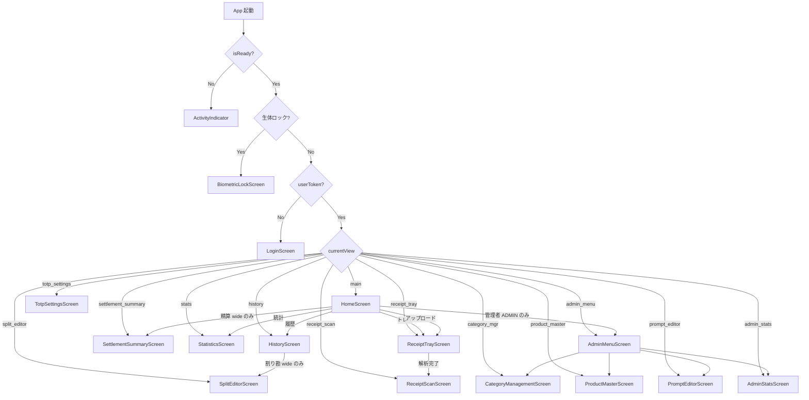
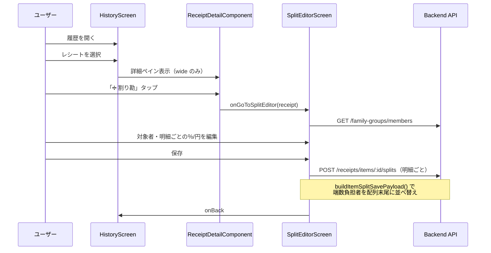
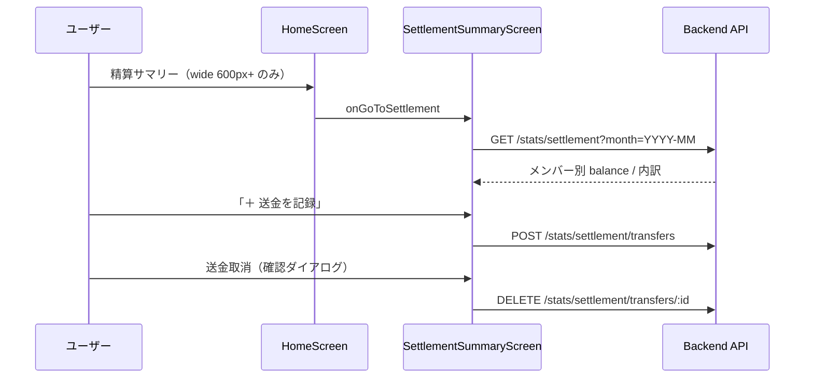
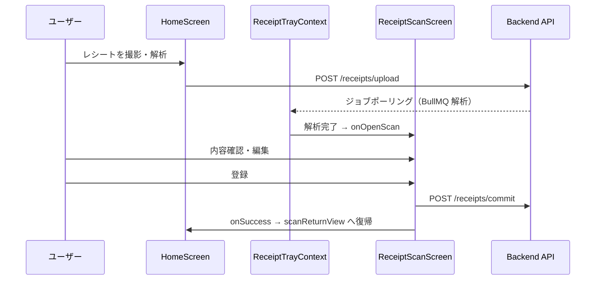

# 画面遷移 & フロント設計（As-built）

Epic: [#276 Issue #90](https://github.com/yama180sx/receipt-ai-app/issues/276)  
子 Issue: [#296 Issue #90-5](https://github.com/yama180sx/receipt-ai-app/issues/296)  
計画: [plan.md](./plan.md)

本ドキュメントは **実装準拠（as-built）** で記述する。`frontend/App.tsx` と各 Screen コンポーネントの挙動を正とし、ドメインルールは [domain-model.md](./domain-model.md)（#90-2）、API は [api-spec.md](./api-spec.md)（#90-3）を参照する。

| 資料 | 内容 |
|------|------|
| [architecture.md](./architecture.md) §6 | フロントエンド概要（#90-1） |
| [domain-model.md](./domain-model.md) §4–5 | 按分・精算の業務ルール（#90-2） |
| [api-spec.md](./api-spec.md) §7 | 精算・按分 API（#90-3） |
| [docs/reviews/issue-87/](../reviews/issue-87/README.md) | 精算ドメイン LLM レビュー資材 |

---

## 1. 概要

RecAIpt のフロントエンドは **Expo（React Native + Web）** の単一ルートアプリである。React Navigation は未使用で、`App.tsx` が `currentView` ステートによる画面切替を担う。

| 項目 | 内容 |
|------|------|
| エントリポイント | `frontend/App.tsx` |
| 画面数 | ViewType 13 種 + 認証ゲート 3 種 |
| 状態管理 | React Context + 画面ローカル state（Redux / Zustand なし） |
| API 接続 | `EXPO_PUBLIC_API_URL` → `frontend/src/utils/apiClient.ts` |
| 永続化 | AsyncStorage（セッション・画面復元） |

---

## 2. ナビゲーションアーキテクチャ

### 2.1 ViewType 一覧

`App.tsx` で定義される画面識別子。ルーティングライブラリは使わず、`switch (currentView)` で描画する。

| ViewType | 画面コンポーネント | 主な責務 | 戻り先 |
|----------|-------------------|----------|--------|
| `main` | `HomeScreen` | ダッシュボード・撮影アップロード・トレイプレビュー | — |
| `history` | `HistoryScreen` | レシート履歴一覧・詳細・按分導線 | `main` |
| `stats` | `StatisticsScreen` | 月次支出統計・円グラフ | `main` |
| `receipt_tray` | `ReceiptTrayScreen` | 確認トレイ全件 | `main` |
| `receipt_scan` | `ReceiptScanScreen` | AI 解析結果の確認・DB 登録 | `scanReturnView` |
| `split_editor` | `SplitEditorScreen` | 明細ごとの按分（割り勘）編集 | `history` |
| `settlement_summary` | `SettlementSummaryScreen` | 家族間月次精算サマリー・送金記録 | `main` |
| `admin_menu` | `AdminMenuScreen` | 管理者機能ハブ | `main` |
| `category_mgr` | `CategoryManagementScreen` | カテゴリマスタ CRUD | `admin_menu` |
| `product_master` | `ProductMasterScreen` | 学習マスタ（商品名→カテゴリ） | `admin_menu` |
| `prompt_editor` | `PromptEditorScreen` | AI プロンプト・外税ヒント編集 | `admin_menu` |
| `admin_stats` | `AdminStatsScreen` | AI トークン・コスト統計 | `admin_menu` |
| `totp_settings` | `TotpSettingsScreen` | ログイン後の TOTP 有効化 | `main` |

**ViewType に含まれない認証ゲート画面:**

| 画面 | ファイル | 表示条件 |
|------|----------|----------|
| スプラッシュ / 初期化 | `App.tsx` 内 | `!isReady` |
| 生体認証ロック | `screens/BiometricLockScreen.tsx` | `biometricLockActive && pendingSession`（Native のみ） |
| ログイン | `screens/LoginScreen.tsx` | `!userToken` |

> **実装上の注意:** `totp_settings` は ViewType として定義されているが、現行 UI からの遷移コードはない（ログイン時の TOTP セットアップは `LoginScreen` 内で完結）。TOTP 有効化後の変更は将来の導線追加を想定したデッドルートに近い。

### 2.2 画面遷移図



### 2.3 App.tsx の状態管理

| カテゴリ | state | 用途 |
|----------|-------|------|
| 認証 | `userToken`, `currentMemberId`, `currentMemberName`, `currentUserRole`, `totpEnabled` | セッション・ロール |
| ナビ | `currentView`, `scanReturnView` | 画面切替・スキャン画面の戻り先 |
| データ | `resultData`, `targetReceipt`, `categories` | スキャン画面・按分エディタへの受け渡し |
| 生体認証 | `biometricLockActive`, `pendingSession`, `biometricEnabled` | Native ロック画面 |

**永続化（ログイン中のみ）:**

| キー | 内容 |
|------|------|
| `@app_view` | `currentView` の復元 |
| `@app_result` | `resultData`（スキャン画面用）の復元 |

セッション本体は `authService` が AsyncStorage の `@token`, `@member_id`, `@role` 等を管理する。

### 2.4 プロバイダー階層

```
SafeAreaProvider
  └ DisplayModeProvider（Web 表示モード: auto / mobile / web）
       └ ReceiptTrayProvider（ログイン時のみ — ジョブポーリング）
            └ ResponsiveContainer
                 └ renderMainContent()
```

| Context | ファイル | 役割 |
|---------|----------|------|
| `DisplayModeContext` | `contexts/DisplayModeContext.tsx` | Web 向けレイアウトモード切替 |
| `ReceiptTrayContext` | `contexts/ReceiptTrayContext.tsx` | 解析ジョブのポーリング・トレイ操作 |

---

## 3. 各画面の責務と API

### 3.1 ユーザー向け画面

| 画面 | ファイル | 主な責務 | 主要 API |
|------|----------|----------|----------|
| **Home** | `screens/HomeScreen.tsx` | 今月合計・最新レシート・撮影アップロード・トレイプレビュー・ナビグリッド | `GET /receipts/latest`, `GET /stats/monthly`, `POST /receipts/upload` |
| **History** | `screens/HistoryScreen.tsx` | 月・メンバーフィルタ、一覧、詳細（2 ペイン or モーダル） | `GET /categories`, `GET /family-groups/members`, `GET /receipts`, `PATCH /receipts/items/:id` |
| **Statistics** | `screens/StatisticsScreen.tsx` | 月次統計・円グラフ・高度統計 | `GET /stats/monthly`, `GET /stats/advanced`, `GET /categories`, `PATCH /receipts/items/:id` |
| **ReceiptTray** | `screens/ReceiptTrayScreen.tsx` | 確認トレイ全件・プルリフレッシュ | コンテキスト経由: `GET /receipts/jobs`, `GET /receipts/status/:id`, `DELETE /receipts/jobs/:id` |
| **ReceiptScan** | `screens/ReceiptScanScreen.tsx` | 解析結果の編集・重複チェック・DB 登録 | `POST /receipts/commit` |
| **SplitEditor** | `screens/SplitEditorScreen.tsx` | 明細ごとの按分（金額/％）、均等割、一括調整、保存 | `GET /family-groups/members`, `POST /receipts/items/:id/splits` |
| **Settlement** | `screens/SettlementSummaryScreen.tsx` | 月次精算残額、送金記録の登録・取消、内訳テーブル | `GET /stats/settlement`, `POST /stats/settlement/transfers`, `DELETE /stats/settlement/transfers/:id` |

### 3.2 管理者向け画面（ADMIN）

| 画面 | ファイル | 主な責務 | 主要 API |
|------|----------|----------|----------|
| **AdminMenu** | `screens/AdminMenuScreen.tsx` | 管理機能へのナビゲーションハブ | なし |
| **CategoryManagement** | `screens/CategoryManagementScreen.tsx` | カテゴリ CRUD・AI 最適化 | `GET/POST/DELETE /categories`, `POST /categories/optimize` |
| **ProductMaster** | `screens/ProductMasterScreen.tsx` | 商品マスタ検索・削除・店舗マージ | `GET /product-master`, `DELETE /product-master/:id`, `POST /product-master/merge-stores` |
| **PromptEditor** | `screens/PromptEditorScreen.tsx` | Gemini プロンプトテンプレート管理 | `GET/PATCH/POST/DELETE /admin/prompts` |
| **AdminStats** | `screens/AdminStatsScreen.tsx` | AI トークン・コスト統計テーブル | `GET /admin/stats` |

### 3.3 認証・その他

| 画面 | ファイル | 主な責務 | 主要 API |
|------|----------|----------|----------|
| **Login** | `screens/LoginScreen.tsx` | 招待コード → メンバー選択 → パスワード → TOTP セットアップ/検証 | `/auth/resolve-family`, `/auth/login`, `/auth/totp/*`, `/auth/verify-totp` |
| **TotpSettings** | `screens/TotpSettingsScreen.tsx` | ログイン後の TOTP 有効化 | `POST /auth/totp/setup`, `POST /auth/totp/confirm` |
| **BiometricLock** | `screens/BiometricLockScreen.tsx` | Native 生体認証アンロック | なし（ローカル生体認証のみ） |

### 3.4 共有コンポーネント（画面ロジックを持つ）

| コンポーネント | ファイル | 責務 |
|----------------|----------|------|
| `ReceiptDetailComponent` | `components/ReceiptDetailComponent.tsx` | 履歴/統計でのレシート詳細・編集・割り勘ボタン |
| `ReceiptTrayPanel` | `components/ReceiptTrayPanel.tsx` | トレイ UI（ホーム/トレイ画面） |
| `ReceiptImageCropModal` | `components/ReceiptImageCropModal.tsx` | Web 向け画像クロップ |
| `DisplayModeSettings` | `components/DisplayModeSettings.tsx` | Web 表示モード切替（`main` ツールバー） |
| `DevEnvironmentBanner` | `components/DevEnvironmentBanner.tsx` | dev 環境バナー |

---

## 4. 権限（ADMIN / USER）

### 4.1 フロントエンドでのゲート

| 層 | 実装 | 内容 |
|----|------|------|
| **ナビゲーション** | `HomeScreen` | `userRole === 'ADMIN'` のときのみ「管理者メニュー」を表示 |
| **ロール保持** | `App.tsx` / `authService` | ログイン時 `result.member.role` → `currentUserRole`、ストレージ `@role` |
| **API 403** | `apiClient` レスポンス interceptor | `Alert.alert('アクセス権限エラー', ...)` |
| **AdminStats** | `AdminStatsScreen` | 403 時 UI にエラー帯表示 |

**重要:** 管理画面（`admin_menu` 以下）へのルートは **UI で ADMIN のみリンク表示** する。`currentView` を直接変更すれば USER も遷移可能だが、**実際の制限はバックエンドの `isAdmin` ミドルウェア（403）** に依存する。`AdminMenuScreen` 自体にロールチェックはない。

### 4.2 バックエンドとの対応

| 操作 | フロント | バックエンド |
|------|----------|-------------|
| 一般業務 API | 全 USER / ADMIN | JWT + tenantMiddleware |
| `/api/admin/*` | ADMIN のみ UI 導線 | JWT + tenant + `isAdmin` + TOTP |

詳細は [api-spec.md](./api-spec.md) §1.1 を参照。

---

## 5. 精算・按分のユーザーフロー

[domain-model.md](./domain-model.md) §4–5 および [issue-87 レビュー](../reviews/issue-87/README.md) と整合する導線を以下に示す。

### 5.1 按分（割り勘）フロー



| ステップ | UI | ドメインルール |
|----------|-----|---------------|
| 1. 対象者選択 | チップ UI（先頭 = 端数負担者） | UI 上は先頭メンバーが端数吸収 |
| 2. 明細編集 | 行ごとに％/円入力、均等ボタン | `calcItemTotal()` で小計算出 |
| 3. 一括調整 | 合計行の％/金額 → 全明細にカスケード | — |
| 4. 保存 | 明細ごとに API 呼び出し | `buildItemSplitSavePayload()` が端数負担者を **配列末尾** に移動してから送信（[domain-model.md](./domain-model.md) §4.4） |

**モバイル制限（Issue #81）:** 狭い画面（`useIsWideLayout()` = false）では `ReceiptDetailComponent` の「➗ 割り勘」ボタンを非表示とする。UI から `split_editor` へ入る導線は **wide レイアウト（768px+）が前提**。

### 5.2 精算フロー



| 表示要素 | データソース | ドメイン対応 |
|----------|-------------|-------------|
| メンバー別カード | `summaryData[]` | `balance = (totalPaid - totalOwed) + transferredOut - transferredIn`（[domain-model.md](./domain-model.md) §5.2） |
| 内訳テーブル | 同上 | ItemSplit あり → 按分額、なし → 支払者負担（暗黙デフォルト） |
| 送金履歴 | `transferList[]` | `SettlementTransfer` の CRUD |
| 精算済バッジ | `balance ≈ 0` | — |

**モバイル制限:** ホームの「精算サマリー」リンクは `useIsWideHomeMenu()`（600px 閾値）で非表示。`settlement_summary` は ViewType として存在し AsyncStorage 復元も可能だが、**通常 UI からの導線は wide のみ**。

### 5.3 issue-87 との整合

| レビュー観点 | フロント実装 | 参照 |
|-------------|-------------|------|
| 按分端数（末尾メンバー） | `splitEditorSplits.ts` — `buildItemSplitSavePayload()` | [domain-model.md](./domain-model.md) §4.3–4.4, T-ref-01 / T-ref-03 |
| 精算サマリーと ItemSplit の整合 | `SettlementSummaryScreen` が API レスポンスをそのまま表示 | [domain-model.md](./domain-model.md) §5, T-ref-03 |
| 送金モーダルバリデーション | `AppFormField` + `parsePositiveYenAmount()` | [issue-87/assignment.md](../reviews/issue-87/assignment.md) |

---

## 6. レシート撮影〜登録フロー

現行の主フローは **アップロード → 確認トレイ → スキャン画面** である。



| 経路 | `scanReturnView` | トリガー |
|------|------------------|----------|
| ホームから（レガシー） | `main` | `handleAnalysisReady`（現在 `HomeScreen` では未使用） |
| トレイから | `receipt_tray` または `main` | `ReceiptTrayProvider` → `handleOpenScanFromTray` |

`ReceiptTrayProvider` はログイン後に `useReceiptJobs` でジョブをポーリングし、完了時にスキャン画面を開く。

---

## 7. 共通 UI コンポーネント（#82〜#85）

Issue #82〜#85 で共通化された UI 部品。`frontend/src/components/ui/index.ts` からエクスポートする。

| コンポーネント / スタイル | ファイル | Issue | 主な利用画面 |
|--------------------------|----------|-------|-------------|
| `AppButton` | `components/ui/AppButton.tsx` | #82 | 全画面 |
| `AppBackButton` | `components/ui/AppBackButton.tsx` | #82 | サブ画面ヘッダー |
| `AppModalCloseButton` | `components/ui/AppModalCloseButton.tsx` | #82 | モーダル |
| `AppListItem`, `AppListColorDot` | `components/ui/AppListItem.tsx` | #82 | Home ナビグリッド、一覧 |
| `BUTTON_LABELS` | `constants/buttonLabels.ts` | #83 | 保存・取消等の表記統一 |
| `tableStyles` | `theme/tableStyles.ts` | #84 | SplitEditor, Settlement, AdminStats |
| `formStyles` | `theme/formStyles.ts` | #85 | フォーム入力全般 |
| `modalStyles` | `theme/modalStyles.ts` | #85 | AppModal, 送金モーダル |
| `AppTextInput` | `components/ui/AppTextInput.tsx` | #85 | フォーム |
| `AppFormField` | `components/ui/AppFormField.tsx` | #85 | 送金モーダル等 |
| `AppModal` | `components/ui/AppModal.tsx` | #85 | History 詳細、送金 |
| `AppSelect` | `components/ui/AppSelect.tsx` | #85 | 月選択、送金元/先 |

> issue-87 レビュー（[scope.md](../reviews/issue-87/scope.md)）では #82〜#86 の UI 共通化はスコープ外としている。本節は参照用。

---

## 8. Web / モバイルの差分

### 8.1 ResponsiveContainer

**ファイル:** `frontend/src/components/ResponsiveContainer.tsx`

| 条件 | 挙動 |
|------|------|
| Web + wide + `fullWidth={false}` | `maxWidth: 600px`（`theme.layout.maxContentWidth`）+ 左右ボーダーで中央寄せ |
| `fullWidth={true}` または Native / 狭い画面 | 幅 100% |

`App.tsx` の `isFullWidth`: `main` のみ `false`、それ以外の ViewType は `true`。

### 8.2 レイアウト判定フック

| フック | ファイル | 役割 |
|--------|----------|------|
| `useResponsive` | `hooks/useResponsive.ts` | `isWideScreen`, `isDesktop`（1024px+） |
| `useIsWideLayout` | `hooks/useIsWideLayout.ts` | デフォルト breakpoint **768px**（`BREAKPOINTS.TABLET`） |
| `useIsWideHomeMenu` | `hooks/useIsWideLayout.ts` | ホーム精算メニュー用 **600px** |
| `resolveIsWideLayout` | `utils/displayLayout.ts` | Web のみ `DisplayModeContext` の `auto` / `mobile` / `web` を反映 |

### 8.3 DisplayMode（Web のみ）

`DisplayModeSettings` は **`main` 画面のツールバー** に表示する。

| モード | 挙動 |
|--------|------|
| `auto` | 画面幅で wide / narrow を判定 |
| `mobile` | 幅に関わらず狭いレイアウト（2 ペイン無効化） |
| `web` | 幅に関わらずワイドレイアウトを優先 |

Native は常に幅ベース判定。永続化は `displayModeService`（AsyncStorage）。

### 8.4 画面別レスポンシブパターン

| 画面 | Wide（768px+ 等） | Narrow / Mobile |
|------|-------------------|-----------------|
| **Home** | 精算サマリーグリッド表示（600px+） | 精算メニュー非表示 |
| **History** | 左 350px 一覧 + 右詳細ペイン | 一覧 + 詳細は `AppModal`（sheet） |
| **Statistics** | 2 カラム系レイアウト | 1 カラム + モーダル詳細 |
| **SplitEditor** | 画像左 + テーブル右（row） | 縦積み（column） |
| **Settlement** | ヘッダー横並び（月選択 + 送金ボタン） | ヘッダー縦積み |
| **ReceiptDetail** | 「➗ 割り勘」ボタン表示 | 割り勘ボタン非表示 |

### 8.5 Platform 分岐のその他

| 機能 | Web | Native |
|------|-----|--------|
| 生体認証 | 無効（ロック画面・有効化プロンプトなし） | Face ID / 指紋でロック解除 |
| 撮影 | カメラ/ギャラリー選択 → `ReceiptImageCropModal` | カメラ直接 + `allowsEditing` |
| FormData アップロード | `Content-Type` 自動 | `multipart/form-data` 明示（`apiClient`） |
| アラート | `showAlert` ユーティリティ | `Alert.alert` 混在 |

---

## 9. ファイル早見表

```
frontend/
├── App.tsx                              # ルート・ViewType・認証・ナビ
└── src/
    ├── screens/
    │   ├── HomeScreen.tsx
    │   ├── HistoryScreen.tsx
    │   ├── StatisticsScreen.tsx
    │   ├── SplitEditorScreen.tsx
    │   ├── SettlementSummaryScreen.tsx
    │   ├── AdminMenuScreen.tsx
    │   ├── CategoryManagementScreen.tsx
    │   ├── ProductMasterScreen.tsx
    │   ├── PromptEditorScreen.tsx
    │   ├── AdminStatsScreen.tsx
    │   ├── ReceiptScanScreen.tsx
    │   ├── ReceiptTrayScreen.tsx
    │   ├── LoginScreen.tsx
    │   ├── BiometricLockScreen.tsx
    │   └── TotpSettingsScreen.tsx
    ├── components/
    │   ├── ResponsiveContainer.tsx
    │   ├── ReceiptDetailComponent.tsx
    │   ├── ReceiptTrayPanel.tsx
    │   └── ui/                          # 共通 UI (#82–#85)
    ├── contexts/
    │   ├── DisplayModeContext.tsx
    │   └── ReceiptTrayContext.tsx
    ├── hooks/
    │   ├── useResponsive.ts
    │   └── useIsWideLayout.ts
    ├── utils/
    │   ├── apiClient.ts                 # 認証注入・精算/按分 api ラッパー
    │   └── splitEditorSplits.ts         # 按分 payload 生成（端数末尾配置）
    ├── types/
    │   └── settlement.ts                # 精算・按分の型定義
    └── theme/
        ├── tableStyles.ts               # Issue #84
        ├── formStyles.ts                # Issue #85
        └── modalStyles.ts               # Issue #85
```

---

## 10. テストからのフィードバック

[findings.md](../testing/findings.md) の該当項目と本ドキュメントの対応:

| ID | 内容 | 本書での記述 |
|----|------|-------------|
| T-ref-01 | 按分端数は配列末尾メンバーに残額 | §5.1 — `buildItemSplitSavePayload()` |
| T-ref-03 | Frontend payload 末尾配置と Backend allocate 一致 | §5.1, §5.3 |
| — | 精算サマリーと ItemSplit の整合 | §5.2, §5.3 |
