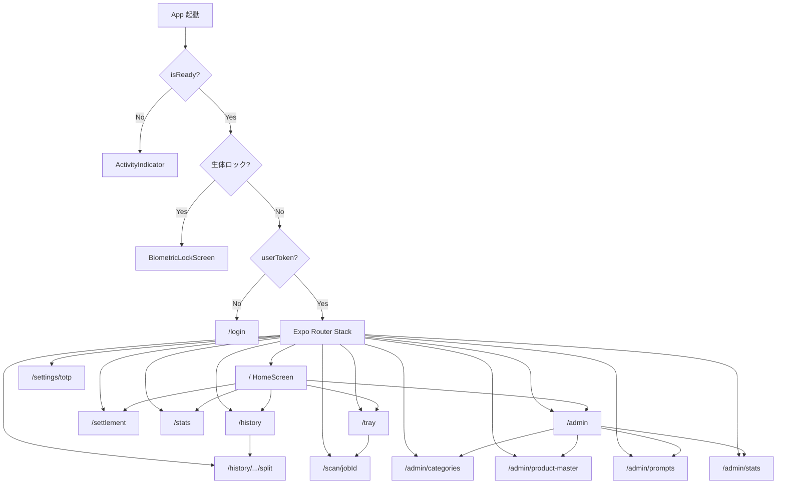
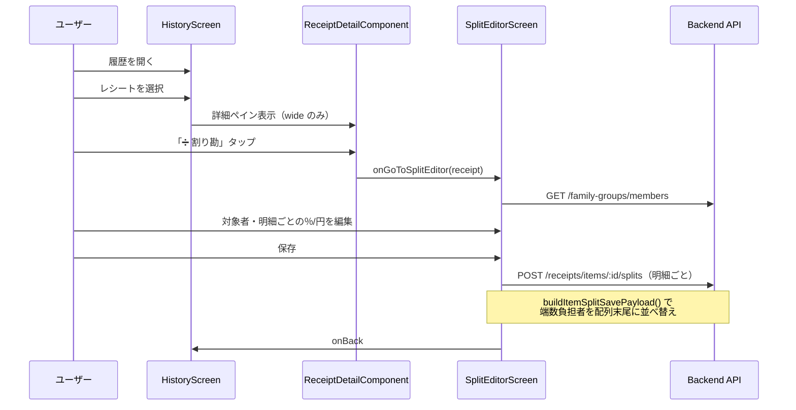
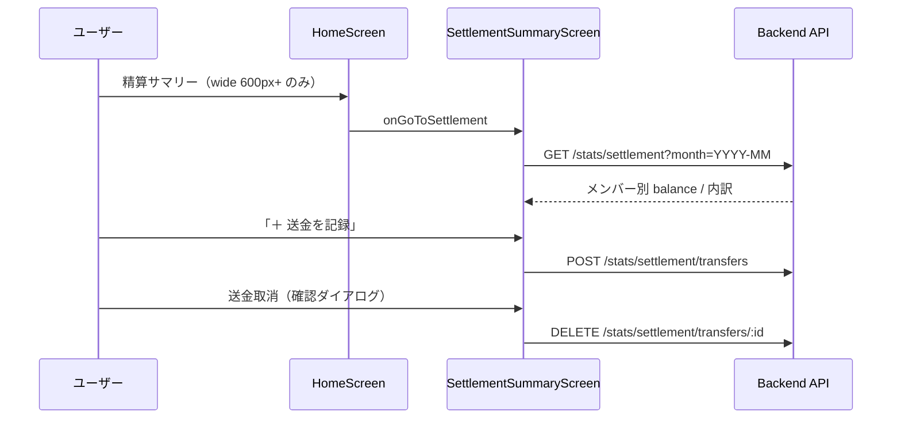

# 画面遷移 & フロント設計（As-built）

Epic: [#276 Issue #90](https://github.com/yama180sx/receipt-ai-app/issues/276) / [#423 Issue #100](https://github.com/yama180sx/receipt-ai-app/issues/423) / [#459 Issue #101](https://github.com/yama180sx/receipt-ai-app/issues/459)  
子 Issue: [#296 Issue #90-5](https://github.com/yama180sx/receipt-ai-app/issues/296) / [#439 Issue #100-15](https://github.com/yama180sx/receipt-ai-app/issues/439) / [#461 Issue #101-7](https://github.com/yama180sx/receipt-ai-app/issues/461)  
計画: [plan.md](../refactor/plan.md)

本ドキュメントは **実装準拠（as-built）** で記述する。`frontend/app/`（Expo Router）と各 Screen / `features/` の挙動を正とし、ドメインルールは [domain-model.md](./domain-model.md)（#90-2）、API は [api-spec.md](./api-spec.md)（#90-3）、層ルールは [architecture.md](./architecture.md) §6、[実装規約](./frontend-conventions.md) を参照する。

| 資料 | 内容 |
|------|------|
| [architecture.md](./architecture.md) §6 | フロントエンド概要（#90-1） |
| [frontend-conventions.md](./frontend-conventions.md) | 実装規約・行数上限・AI プロンプト（#101-7） |
| [domain-model.md](./domain-model.md) §4–5 | 按分・精算の業務ルール（#90-2） |
| [api-spec.md](./api-spec.md) §7 | 精算・按分 API（#90-3） |
| [docs/reviews/issue-87/](../reviews/issue-87/README.md) | 精算ドメイン LLM レビュー資材 |

---

## 1. 概要

RecAIpt のフロントエンドは **Expo（React Native + Web）+ Expo Router** のファイルベースルーティングアプリである（#98-8 Phase 2）。旧来の `App.tsx` + `currentView` 切替は廃止済み。

| 項目 | 内容 |
|------|------|
| エントリポイント | `frontend/app/_layout.tsx`（ルートレイアウト） |
| 認証ゲート | `(app)/_layout.tsx` — 未ログイン時 `/login` へ Redirect |
| 画面数 | 16 ルート（`app/` 配下） |
| 状態管理 | `AppSessionProvider` + `ReceiptTrayProvider` + `features/*/hooks` |
| API 接続 | `src/api/*` → `apiClient.ts`（Hook 経由。Screen 直 import 禁止 #100-14） |
| 永続化 | AsyncStorage（セッション・画面復元） |

---

## 2. ナビゲーションアーキテクチャ

### 2.1 ルート一覧（Expo Router）

`frontend/app/` のファイルパスが URL になる。旧 ViewType 名との対応は移行期の参照用。

| ルート | 画面コンポーネント | 主な Hook / features | 戻り先 |
|--------|-------------------|----------------------|--------|
| `/` | `HomeScreen` | `features/home` | — |
| `/history` | `HistoryScreen` | `useReceiptHistory` | `/` |
| `/stats` | `StatisticsScreen` | `useStatistics` | `/` |
| `/tray` | `ReceiptTrayScreen` | `ReceiptTrayContext` | `/` |
| `/scan/[jobId]` | `ReceiptScanScreen` | `useReceiptScan` | query `returnTo`（`home` / `tray`） |
| `/history/[receiptId]/split` | `SplitEditorScreen` | `useSplitEditor` | `/history` |
| `/settlement` | `SettlementSummaryScreen` | `useSettlementSummary` | `/` |
| `/admin` | `AdminMenuScreen` | — | `/` |
| `/admin/categories` | `CategoryManagementScreen` | `useCategoryManagement` | `/admin` |
| `/admin/product-master` | `ProductMasterScreen` | — | `/admin` |
| `/admin/prompts` | `PromptEditorScreen` | — | `/admin` |
| `/admin/stats` | `AdminStatsScreen` | — | `/admin` |
| `/settings/totp` | `TotpSettingsScreen` | — | `/` |
| `/login` | `LoginScreen` | `useLoginFlow` | ログイン後 `/` |

**認証ゲート（ルート外）:**

| 画面 | ファイル | 表示条件 |
|------|----------|----------|
| スプラッシュ / 初期化 | `app/_layout.tsx` `RootGate` | `!isReady` |
| 生体認証ロック | `screens/BiometricLockScreen.tsx` | `biometricLockActive && pendingSession`（Native のみ） |

> `/settings/totp` はルートとして存在する。ホーム等からの導線は限定的だが、TOTP 有効化 UI は `LoginScreen` 内フローでも完結する。

### 2.2 画面遷移図



### 2.3 セッション・ナビゲーション状態

| カテゴリ | 実装 | 用途 |
|----------|------|------|
| 認証 | `AppSessionProvider` / `useAppSession` | トークン・メンバー・ロール・TOTP・生体認証 |
| ナビ | `useAppNavigation` + Expo Router | `router.push` / `replace` / `back` |
| スキャン戻り | `scanRoutes.ts` query `returnTo` | スキャン画面の戻り先（`home` / `tray`） |
| トレイ | `ReceiptTrayProvider` | ジョブポーリング・スキャン画面起動 |

セッション本体は `authService` が AsyncStorage の `@token`, `@member_id`, `@role` 等を管理する。

### 2.4 プロバイダー階層

```
SafeAreaProvider
  └ DisplayModeProvider
       └ AppSessionProvider（features/app）
            └ RootGate（スプラッシュ / 生体ロック）
                 └ Slot（Expo Router）
                      └ (app)/_layout
                           └ ReceiptTrayProvider（ログイン時）
                                └ Stack（各ルート Screen）
```

| Context | ファイル | 役割 |
|---------|----------|------|
| `DisplayModeContext` | `contexts/DisplayModeContext.tsx` | Web 向けレイアウトモード切替 |
| `ReceiptTrayContext` | `contexts/ReceiptTrayContext.tsx` | 解析ジョブのポーリング・トレイ操作 |

---

## 3. 各画面の責務と API

### 3.1 ユーザー向け画面

| 画面 | ファイル | 主な Hook | 主要 API（Hook 内） |
|------|----------|-----------|---------------------|
| **Home** | `screens/HomeScreen.tsx` | `useHomeDashboard`, `useReceiptUpload` | `GET /receipts/latest`, `GET /stats/monthly`, `POST /receipts/upload` |
| **History** | `screens/HistoryScreen.tsx` | `useReceiptHistory` | `GET /categories`, `GET /family-groups/members`, `GET /receipts`, `PATCH /receipts/items/:id` |
| **Statistics** | `screens/StatisticsScreen.tsx` | `useStatistics` | `GET /stats/monthly`, `GET /stats/advanced`, `GET /categories`, `PATCH /receipts/items/:id` |
| **ReceiptTray** | `screens/ReceiptTrayScreen.tsx` | `ReceiptTrayContext` | `GET /receipts/jobs`, `GET /receipts/status/:id`, `DELETE /receipts/jobs/:id` |
| **ReceiptScan** | `screens/ReceiptScanScreen.tsx` | `useReceiptScan` | `POST /receipts/commit` |
| **SplitEditor** | `screens/SplitEditorScreen.tsx` | `useSplitEditor` | `GET /family-groups/members`, `POST /receipts/items/:id/splits` |
| **Settlement** | `screens/SettlementSummaryScreen.tsx` | `useSettlementSummary` | `GET /stats/settlement`, `POST /stats/settlement/transfers`, `DELETE /stats/settlement/transfers/:id` |

### 3.2 管理者向け画面（ADMIN）

| 画面 | ファイル | 主な責務 | 主要 API |
|------|----------|----------|----------|
| **AdminMenu** | `screens/AdminMenuScreen.tsx` | 管理機能へのナビゲーションハブ | なし |
| **CategoryManagement** | `screens/CategoryManagementScreen.tsx` | `useCategoryManagement` | `GET/POST/DELETE /categories`, `POST /categories/optimize` |
| **ProductMaster** | `screens/ProductMasterScreen.tsx` | 商品マスタ検索・削除・店舗マージ | `GET /product-master`, `DELETE /product-master/:id`, `POST /product-master/merge-stores` |
| **PromptEditor** | `screens/PromptEditorScreen.tsx` | Gemini プロンプトテンプレート管理 | `GET/PATCH/POST/DELETE /admin/prompts` |
| **AdminStats** | `screens/AdminStatsScreen.tsx` | AI トークン・コスト統計テーブル | `GET /admin/stats` |

### 3.3 認証・その他

| 画面 | ファイル | 主な責務 | 主要 API |
|------|----------|----------|----------|
| **Login** | `screens/LoginScreen.tsx` | `useLoginFlow` | `/auth/resolve-family`, `/auth/login`, `/auth/totp/*`, `/auth/verify-totp` |
| **TotpSettings** | `screens/TotpSettingsScreen.tsx` | ログイン後の TOTP 有効化 | `POST /auth/totp/setup`, `POST /auth/totp/confirm` |
| **BiometricLock** | `screens/BiometricLockScreen.tsx` | Native 生体認証アンロック | なし（ローカル生体認証のみ） |

### 3.4 共有コンポーネント（画面ロジックを持つ）

| コンポーネント | ファイル | 責務 |
|----------------|----------|------|
| `ReceiptDetailComponent` | `features/receipt/components/ReceiptDetailComponent.tsx` | 履歴/統計でのレシート詳細・編集・割り勘ボタン（`useReceiptDetail`） |
| `ReceiptTrayPanel` | `components/ReceiptTrayPanel.tsx` | トレイ UI（ホーム/トレイ画面） |
| `ReceiptImageCropModal` | `components/ReceiptImageCropModal.tsx` | Web 向け画像クロップ |
| `DisplayModeSettings` | `components/DisplayModeSettings.tsx` | Web 表示モード切替（ホーム `MainToolbar`） |
| `DevEnvironmentBanner` | `components/DevEnvironmentBanner.tsx` | dev 環境バナー |

---

## 4. 権限（ADMIN / USER）

### 4.1 フロントエンドでのゲート

| 層 | 実装 | 内容 |
|----|------|------|
| **ナビゲーション** | `HomeScreen` | `userRole === 'ADMIN'` のときのみ「管理者メニュー」を表示 |
| **ロール保持** | `AppSessionProvider` / `authService` | ログイン時 `result.member.role` → Context、ストレージ `@role` |
| **API 403** | `apiClient` レスポンス interceptor | `showAlert('アクセス権限エラー', ...)` |
| **AdminStats** | `AdminStatsScreen` | 403 時 UI にエラー帯表示 |

**重要:** 管理画面（`/admin/*`）へのルートは **UI で ADMIN のみリンク表示** する。URL を直接開けば USER も遷移可能だが、**実際の制限はバックエンドの `isAdmin` ミドルウェア（403）** に依存する。

### 4.2 バックエンドとの対応

| 操作 | フロント | バックエンド |
|------|----------|-------------|
| 一般業務 API | 全 USER / ADMIN | JWT + tenantMiddleware |
| `/api/admin/*` | ADMIN のみ UI 導線 | JWT + tenant + `isAdmin` + TOTP |

詳細は [api-spec.md](./api-spec.md) §1.1 を参照。

---

## 5. 精算・按分のユーザーフロー

[domain-model.md](./domain-model.md) §4–5 および [issue-87 レビュー](../reviews/issue-87/README.md) と整合する導線を以下に示す。

### 5.1 按分（割り勘）フロー



| ステップ | UI | ドメインルール |
|----------|-----|---------------|
| 1. 対象者選択 | チップ UI（先頭 = 端数負担者） | UI 上は先頭メンバーが端数吸収 |
| 2. 明細編集 | 行ごとに％/円入力、均等ボタン | `calcItemTotal()` で小計算出 |
| 3. 一括調整 | 合計行の％/金額 → 全明細にカスケード | — |
| 4. 保存 | 明細ごとに API 呼び出し | `buildItemSplitSavePayload()` が端数負担者を **配列末尾** に移動してから送信（[domain-model.md](./domain-model.md) §4.4） |

**モバイル制限（Issue #81）:** 狭い画面（`useIsWideLayout()` = false）では `ReceiptDetailComponent` の「➗ 割り勘」ボタンを非表示とする。UI から `split_editor` へ入る導線は **wide レイアウト（768px+）が前提**。

### 5.2 精算フロー



| 表示要素 | データソース | ドメイン対応 |
|----------|-------------|-------------|
| メンバー別カード | `summaryData[]` | `balance = (totalPaid - totalOwed) + transferredOut - transferredIn`（[domain-model.md](./domain-model.md) §5.2） |
| 内訳テーブル | 同上 | ItemSplit あり → 按分額、なし → 支払者負担（暗黙デフォルト） |
| 送金履歴 | `transferList[]` | `SettlementTransfer` の CRUD |
| 精算済バッジ | `balance ≈ 0` | — |

**モバイル制限:** ホームの「精算サマリー」リンクは `useIsWideHomeMenu()`（600px 閾値）で非表示。`/settlement` ルートは存在するが、**通常 UI からの導線は wide のみ**。

### 5.3 issue-87 との整合

| レビュー観点 | フロント実装 | 参照 |
|-------------|-------------|------|
| 按分端数（末尾メンバー） | `splitEditorSplits.ts` — `buildItemSplitSavePayload()` | [domain-model.md](./domain-model.md) §4.3–4.4, T-ref-01 / T-ref-03 |
| 精算サマリーと ItemSplit の整合 | `SettlementSummaryScreen` が API レスポンスをそのまま表示 | [domain-model.md](./domain-model.md) §5, T-ref-03 |
| 送金モーダルバリデーション | `AppFormField` + `parsePositiveYenAmount()` | [issue-87/assignment.md](../reviews/issue-87/assignment.md) |

---

## 6. レシート撮影〜登録フロー

現行の主フローは **アップロード → 確認トレイ → スキャン画面** である。

```mermaid
sequenceDiagram
  participant U as ユーザー
  participant Home as HomeScreen
  participant Tray as ReceiptTrayContext
  participant Scan as ReceiptScanScreen
  participant API as Backend API

  U->>Home: レシートを撮影・解析
  Home->>API: POST /receipts/upload
  API-->>Tray: ジョブポーリング（BullMQ 解析）
  Tray->>Scan: 解析完了 → onOpenScan
  U->>Scan: 内容確認・編集
  U->>Scan: 登録
  Scan->>API: POST /receipts/commit
  Scan->>Home: onSuccess → scanReturnView へ復帰
```



| 経路 | 戻り先 | トリガー |
|------|--------|----------|
| ホームから | `/` | `scanPath(jobId, 'home')` |
| トレイから | `/tray` | `scanPath(jobId, 'tray')` |

`ReceiptTrayProvider` はログイン後に `useReceiptJobs` でジョブをポーリングし、完了時にスキャン画面を開く。

---

## 7. 共通 UI コンポーネント（#82〜#85）

Issue #82〜#85 で共通化された UI 部品。`frontend/src/components/ui/index.ts` からエクスポートする。

| コンポーネント / スタイル | ファイル | Issue | 主な利用画面 |
|--------------------------|----------|-------|-------------|
| `AppButton` | `components/ui/AppButton.tsx` | #82 | 全画面 |
| `AppBackButton` | `components/ui/AppBackButton.tsx` | #82 | サブ画面ヘッダー |
| `AppModalCloseButton` | `components/ui/AppModalCloseButton.tsx` | #82 | モーダル |
| `AppListItem`, `AppListColorDot` | `components/ui/AppListItem.tsx` | #82 | Home ナビグリッド、一覧 |
| `BUTTON_LABELS` | `constants/buttonLabels.ts` | #83 | 保存・取消等の表記統一 |
| `tableStyles` | `theme/tableStyles.ts` | #84 | SplitEditor, Settlement, AdminStats |
| `formStyles` | `theme/formStyles.ts` | #85 | フォーム入力全般 |
| `modalStyles` | `theme/modalStyles.ts` | #85 | AppModal, 送金モーダル |
| `AppTextInput` | `components/ui/AppTextInput.tsx` | #85 | フォーム |
| `AppFormField` | `components/ui/AppFormField.tsx` | #85 | 送金モーダル等 |
| `AppModal` | `components/ui/AppModal.tsx` | #85 | History 詳細、送金 |
| `AppSelect` | `components/ui/AppSelect.tsx` | #85 | 月選択、送金元/先 |

> issue-87 レビュー（[scope.md](../reviews/issue-87/scope.md)）では #82〜#86 の UI 共通化はスコープ外としている。本節は参照用。

### 7.1 Screen Style Pattern（#100-6 / #100-10 / #100-11）

全 Screen は **共通 theme + feature 固有 styles** の 2 層でスタイルを定義する（big-bang 移行禁止）。

| レイヤー | ファイル | 用途 |
|----------|----------|------|
| 共通レイアウト | `theme/screenLayout.ts` | `container`, `header`, `headerTitle`, `scrollContent` |
| 共通カード | `theme/cardStyles.ts` | `summaryCard`, `chartCard`, `listCard`, `section` |
| 画面固有 | `features/*/styles/*ScreenStyles.ts` または Screen 内 `StyleSheet` | ドメイン色・余白の上書き |

**ルール**

1. `theme/index.ts` バレル経由の import は **禁止**（循環参照で `spacing` が `undefined` になる）。`theme/colors`, `theme/spacing` 等を個別 import する。
2. 一覧行には `cardStyles.listCard` を使う。`chartCard`（`minHeight: 220`）はグラフ・サマリー専用。
3. 新規 Screen は API を Hook に寄せ、Screen ファイルは **UI + Hook 接続のみ**（[architecture.md](./architecture.md) §6.2）。

---

## 8. Web / モバイルの差分

### 8.1 ResponsiveContainer

**ファイル:** `frontend/src/components/ResponsiveContainer.tsx`

| 条件 | 挙動 |
|------|------|
| Web + wide + `fullWidth={false}` | `maxWidth: 600px`（`theme.layout.maxContentWidth`）+ 左右ボーダーで中央寄せ |
| `fullWidth={true}` または Native / 狭い画面 | 幅 100% |

`AppScreenShell` / ルートファイルの `fullWidth` で制御する。ホーム（`/`）のみ `fullWidth={false}`、サブ画面は原則 `true`。

### 8.2 レイアウト判定フック

| フック | ファイル | 役割 |
|--------|----------|------|
| `useResponsive` | `hooks/useResponsive.ts` | `isWideScreen`, `isDesktop`（1024px+） |
| `useIsWideLayout` | `hooks/useIsWideLayout.ts` | デフォルト breakpoint **768px**（`BREAKPOINTS.TABLET`） |
| `useIsWideHomeMenu` | `hooks/useIsWideLayout.ts` | ホーム精算メニュー用 **600px** |
| `resolveIsWideLayout` | `utils/displayLayout.ts` | Web のみ `DisplayModeContext` の `auto` / `mobile` / `web` を反映 |

### 8.3 DisplayMode（Web のみ）

`DisplayModeSettings` は **`main` 画面のツールバー** に表示する。

| モード | 挙動 |
|--------|------|
| `auto` | 画面幅で wide / narrow を判定 |
| `mobile` | 幅に関わらず狭いレイアウト（2 ペイン無効化） |
| `web` | 幅に関わらずワイドレイアウトを優先 |

Native は常に幅ベース判定。永続化は `displayModeService`（AsyncStorage）。

### 8.4 画面別レスポンシブパターン

| 画面 | Wide（768px+ 等） | Narrow / Mobile |
|------|-------------------|-----------------|
| **Home** | 精算サマリーグリッド表示（600px+） | 精算メニュー非表示 |
| **History** | 左 350px 一覧 + 右詳細ペイン | 一覧 + 詳細は `AppModal`（sheet） |
| **Statistics** | 2 カラム系レイアウト | 1 カラム + モーダル詳細 |
| **SplitEditor** | 画像左 + テーブル右（row） | 縦積み（column） |
| **Settlement** | ヘッダー横並び（月選択 + 送金ボタン） | ヘッダー縦積み |
| **ReceiptDetail** | 「➗ 割り勘」ボタン表示 | 割り勘ボタン非表示 |

### 8.5 Platform 分岐のその他

| 機能 | Web | Native |
|------|-----|--------|
| 生体認証 | 無効（ロック画面・有効化プロンプトなし） | Face ID / 指紋でロック解除 |
| 撮影 | カメラ/ギャラリー選択 → `ReceiptImageCropModal` | カメラ直接 + `allowsEditing` |
| FormData アップロード | `Content-Type` 自動 | `multipart/form-data` 明示（`apiClient`） |
| アラート | `showAlert` / `showConfirmDialog` | 全プラットフォーム統一（#100-13） |

---

## 9. ファイル早見表

```
frontend/
├── app/                                 # Expo Router ルート
│   ├── _layout.tsx                      # ルートレイアウト・AppSessionProvider
│   ├── login.tsx
│   └── (app)/
│       ├── _layout.tsx                  # 認証ゲート・ReceiptTrayProvider
│       ├── index.tsx                    # Home
│       ├── history.tsx
│       ├── stats.tsx
│       ├── tray.tsx
│       ├── settlement.tsx
│       ├── scan/[jobId].tsx
│       ├── history/[receiptId]/split.tsx
│       ├── settings/totp.tsx
│       └── admin/                       # categories, prompts, ...
└── src/
    ├── screens/                         # 薄型 Screen（UI）
    ├── features/                        # Hook + サブコンポーネント + styles
    │   ├── app/                         # useAppSession, useAppNavigation
    │   ├── auth/                        # useLoginFlow
    │   ├── home/                        # useHomeDashboard, useReceiptUpload
    │   ├── history/                     # useReceiptHistory
    │   ├── receipt/                     # useReceiptDetail, useReceiptScan
    │   ├── stats/                       # useStatistics
    │   ├── settlement/                  # useSettlementSummary, useSplitEditor
    │   └── category/                    # useCategoryManagement
    ├── api/                             # categoryApi, receiptApi, statsApi
    ├── mappers/                         # statsMapper 等
    ├── components/
    │   ├── ResponsiveContainer.tsx
    │   ├── ReceiptTrayPanel.tsx
    │   └── ui/                          # 共通 UI (#82–#85)
    ├── contexts/
    │   ├── DisplayModeContext.tsx
    │   └── ReceiptTrayContext.tsx
    ├── hooks/
    │   ├── useResponsive.ts
    │   └── useIsWideLayout.ts
    ├── utils/
    │   ├── apiClient.ts
    │   ├── alertMessage.ts              # showAlert
    │   ├── confirmDialog.ts
    │   └── splitEditorSplits.ts
    ├── types/
    └── theme/
        ├── screenLayout.ts              # Issue #100-6
        ├── cardStyles.ts                # Issue #100-6
        ├── tableStyles.ts               # Issue #84
        ├── formStyles.ts                # Issue #85
        └── modalStyles.ts               # Issue #85
```

---

## 10. テストからのフィードバック

[findings.md](../testing/findings.md) の該当項目と本ドキュメントの対応:

| ID | 内容 | 本書での記述 |
|----|------|-------------|
| T-ref-01 | 按分端数は配列末尾メンバーに残額 | §5.1 — `buildItemSplitSavePayload()` |
| T-ref-03 | Frontend payload 末尾配置と Backend allocate 一致 | §5.1, §5.3 |
| — | 精算サマリーと ItemSplit の整合 | §5.2, §5.3 |
