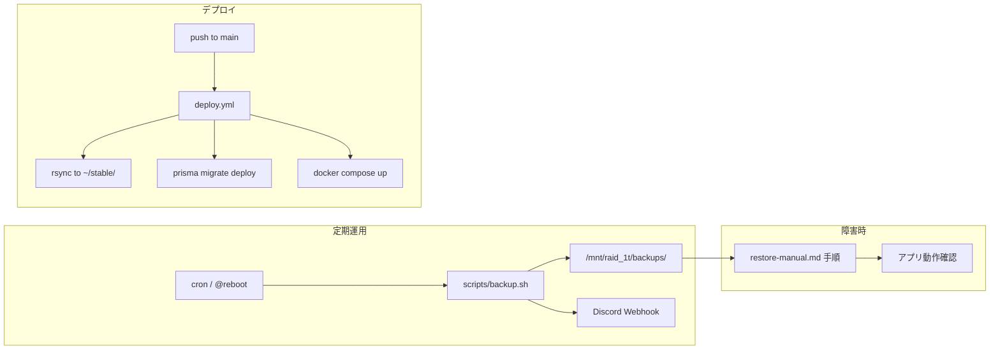

# 運用・障害対応（As-built）

Epic: [#276 Issue #90](https://github.com/yama180sx/receipt-ai-app/issues/276)  
子 Issue: [#297 Issue #90-6](https://github.com/yama180sx/receipt-ai-app/issues/297)  
計画: [plan.md](./plan.md)

本ドキュメントは **実装準拠（as-built）** で運用手順の索引と要点をまとめる。詳細コマンドは既存の運用マニュアルへリンクする（移行期間中は両方を維持）。

| 資料 | 内容 |
|------|------|
| [architecture.md](./architecture.md) §8 | 環境構成・CI/CD（#90-1） |
| [db-operations.md](../db-operations.md) | DB マスタ投入・更新の詳細手順 |
| [restore-manual.md](../restore-manual.md) | バックアップ確認・リストアのコマンド手順 |

---

## 1. 運用ドキュメントの読み方

| やりたいこと | 最初に読む場所 | 詳細 |
|--------------|----------------|------|
| 環境の初回構築・cron 登録 | 本書 §2 | [setup-env.sh](../../setup-env.sh) |
| 定期バックアップの確認・手動実行 | 本書 §3 | [restore-manual.md §0](../restore-manual.md) |
| 障害時の DB / 画像リストア | 本書 §5 → [restore-manual.md](../restore-manual.md) | dev / stable 別手順 |
| マスタデータの追加・更新 | 本書 §4 → [db-operations.md](../db-operations.md) | seed / update-master |
| 本番デプロイの流れ | [architecture.md §8.3](./architecture.md) | `.github/workflows/deploy.yml` |
| バックアップ失敗の Discord 通知 | 本書 §3.3 | `scripts/backup.sh` |

**重複削減方針:** 本書は設計資料から辿れる **索引 + 実装準拠の要点** とする。コマンド全文・チェックリストは `docs/db-operations.md` / `docs/restore-manual.md` に残し、内容が食い違う場合は **ソースコードとスクリプトを正** とする。

---

## 2. 環境構築（T320）

同一ホスト（T320）上に **dev** と **stable** の 2 系統を独立した Compose プロジェクトとして運用する。

| 項目 | dev | stable |
|------|-----|--------|
| プロジェクト名 | `receipt-dev` | `receipt-stable` |
| 作業ディレクトリ例 | `~/dev/receipt-ai-app` | `~/stable/receipt-ai-app` |
| DB コンテナ | `receipt-dev-db` | `receipt-stable-db` |
| バックアップ cron | 毎日 3:00 + `@reboot`（120s 後） | 毎日 4:00 + `@reboot`（120s 後） |

### 2.1 初回セットアップ

```bash
# リポジトリルートで .env.secret を用意（git 管理外）
./setup-env.sh dev    # または stable
docker compose up -d --build
```

`setup-env.sh` が行うこと:

1. `.env.secret` から秘密情報（`DB_PASS`, `JWT_SECRET`, `GEMINI_API_KEY` 等）を読み込み
2. ルート / `frontend` / `backend` の `.env` を環境別に生成
3. **cron 登録** — `scripts/backup.sh {dev|stable}` を定期実行および `@reboot` で登録（[Issue #41], [Issue #89]）
4. `logs/` ディレクトリ作成（cron リダイレクト失敗防止）

ポート・CORS 等の一覧は [architecture.md §8.1](./architecture.md) を参照。

---

## 3. バックアップ

### 3.1 概要

| 項目 | 内容 |
|------|------|
| スクリプト | `scripts/backup.sh {dev\|stable}` |
| DB 形式 | `pg_dump` → gzip（`db_backup_YYYYMMDD_HHMMSS.sql.gz`） |
| 画像形式 | `backend/uploads` を tar.gz（`uploads_backup_YYYYMMDD_HHMMSS.tar.gz`） |
| 保存先（stable） | `/mnt/raid_1t/backups/receipt-app/{db,uploads}/` |
| 保存先（dev） | `/mnt/raid_1t/backups/receipt-app-dev/{db,uploads}/` |
| 世代管理 | **7 日**超のファイルを自動削除（`RETENTION_DAYS=7`） |
| ログ | `{プロジェクト}/logs/backup_{env}.log` |

### 3.2 手動実行・確認

```bash
cd ~/stable/receipt-ai-app   # または ~/dev/receipt-ai-app
mkdir -p logs
./scripts/backup.sh stable   # dev の場合は dev
tail logs/backup_stable.log
```

バックアップ一覧の確認は [restore-manual.md §1](../restore-manual.md) を参照。

### 3.3 Discord アラート

| 項目 | 内容 |
|------|------|
| 実装 | `scripts/backup.sh` 内 `send_discord_alert` |
| 通知先 | Discord Webhook（`#alerts` 相当 — README 記載） |
| SUCCESS | DB・画像バックアップとも成功時（緑 embed） |
| ERROR | `.env` 欠落、DB コンテナ停止、dump/tar 失敗、uploads ディレクトリ不在 |

`scripts/notify.sh` は汎用通知関数のみ定義されており、**現行の定期バックアップ通知は `backup.sh` が担う**。手動障害通知用のテンプレートとして利用可能。

### 3.4 バックアップが増えないとき

cron のリダイレクト先 `logs/` が無いとジョブ全体が失敗する（[Issue #89]）。対処:

1. `mkdir -p logs` を確認
2. `./scripts/backup.sh {env}` を手動実行してログ確認
3. 必要なら `./setup-env.sh {env}` を再実行して cron 行を更新

詳細: [restore-manual.md §0](../restore-manual.md)

---

## 4. データベース運用（マスタ）

### 4.1 スクリプトの使い分け

| スクリプト | 実際の実行方法 | 用途 | 影響 |
|------------|----------------|------|------|
| `backend/prisma/seed.ts` | `npm run prisma:seed`（`prisma db seed`） | 開発環境の初期化 | **全データ削除後、再投入** |
| `backend/prisma/update-master.ts` | `npx tsx prisma/update-master.ts` | 運用中のマスタ更新 | **マスタのみ upsert**（Receipt 等は不変） |
| `backend/prisma/run-sync-sequences.ts` | `npm run prisma:sync-sequences` | id シーケンス修復 | データ削除なし |

> **注意:** [db-operations.md](../db-operations.md) では歴史的に `npm run prisma:init` / `prisma:update` と記載されているが、`backend/package.json` に該当 script は **未定義**。上表のコマンドが as-built の正。

Docker 経由の例:

```bash
docker compose exec backend npm run prisma:seed          # 開発のみ — 全削除
docker compose exec backend npx tsx prisma/update-master.ts
docker compose exec backend npm run prisma:sync-sequences
```

### 4.2 マスタ追加の流れ（要約）

1. `update-master.ts` に upsert 定義を追加
2. `seed.ts` にも同内容を同期（新規参画者の初期化用）
3. stable では `update-master.ts` のみ実行

### 4.3 トラブル: `Unique constraint failed on (id)`

カテゴリ等で明示 `id` を seed した後、シーケンスが追従していない場合に発生。対処は `npm run prisma:sync-sequences`。

詳細: [db-operations.md](../db-operations.md)

---

## 5. 障害復旧（リストア）

**目標:** DB とアップロード画像をバックアップから復元（手順書上は 15 分以内想定）。

### 5.1 事前確認

1. [restore-manual.md §1](../restore-manual.md) で対象環境のバックアップ一覧を表示
2. 復元したい `TARGET_TS`（例: `20260519_061210`）を特定

### 5.2 環境別作業ディレクトリ

| 環境 | `cd` 先 | DB コンテナ |
|------|---------|-------------|
| dev | `~/dev/receipt-ai-app` | `receipt-dev-db` |
| stable | `~/stable/receipt-ai-app` | `receipt-stable-db` |

> [restore-manual.md §3](../restore-manual.md) の stable 手順 Step 1 は `~/dev/receipt-ai-app` となっているが、本番リストア時は **`~/stable/receipt-ai-app`** を使用する。

### 5.3 復旧後チェックリスト

- [ ] ログイン可能
- [ ] レシート履歴・明細が欠損なく表示
- [ ] レシート画像（WebP 等）が描画される
- [ ] 統計・精算画面が正常

全文: [restore-manual.md §4](../restore-manual.md)

---

## 6. デプロイ（stable）

`main` ブランチ push で self-hosted runner（T320）が `.github/workflows/deploy.yml` を実行する。

1. `rsync` で `~/stable/receipt-ai-app/` に同期（`pgdata`, `uploads`, `logs` 等は除外）
2. GitHub Secrets / Vars から `.env` 生成
3. `prisma migrate deploy`
4. `docker compose up -d --build`

コード更新は **バックアップ・リストア対象の永続データ（DB ボリューム・アップロード）を上書きしない** 設計。マイグレーションのみ自動適用。

詳細: [architecture.md §8.3](./architecture.md)

---

## 7. 運用フロー図



---

## 8. 実装ファイル索引

| パス | 内容 |
|------|------|
| `setup-env.sh` | 環境別 `.env` 生成・cron 登録 |
| `scripts/backup.sh` | DB / 画像バックアップ・世代管理・Discord 通知 |
| `scripts/notify.sh` | 汎用 Discord 通知関数 |
| `backend/prisma/seed.ts` | 全削除 + 初期データ投入 |
| `backend/prisma/update-master.ts` | マスタ upsert（運用向け） |
| `backend/prisma/run-sync-sequences.ts` | PostgreSQL id シーケンス同期 |
| `.github/workflows/deploy.yml` | stable CD |
| `docs/db-operations.md` | DB 運用詳細（移行期間維持） |
| `docs/restore-manual.md` | リストア詳細（移行期間維持） |

---

## 9. 関連資料

- [architecture.md](./architecture.md) — 環境・デプロイ・外部連携
- [plan.md](./plan.md) — 設計資料 Epic 計画
- [README.md](../../README.md) — バックアップ・監視の概要（#90-7 で現行化予定）
