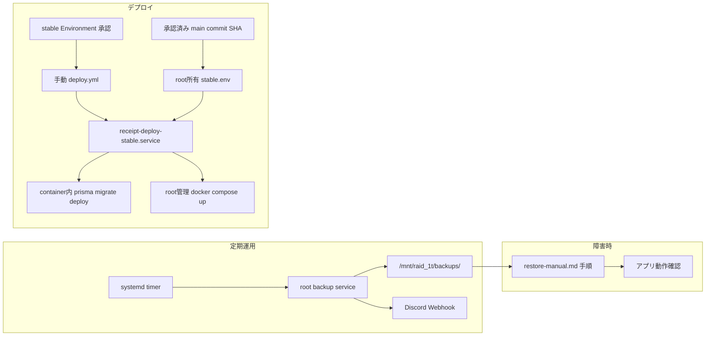

# 運用・障害対応（As-built）

Epic: [#276 Issue #90](https://github.com/yama180sx/receipt-ai-app/issues/276)  
子 Issue: [#297 Issue #90-6](https://github.com/yama180sx/receipt-ai-app/issues/297)  
計画: [plan.md](./plan.md)

本ドキュメントは **実装準拠（as-built）** で運用手順の索引と要点をまとめる。詳細コマンドは既存の運用マニュアルへリンクする（移行期間中は両方を維持）。

| 資料 | 内容 |
|------|------|
| [architecture.md](./architecture.md) §8 | 環境構成・CI/CD（#90-1） |
| [db-operations.md](../db-operations.md) | DB マスタ投入・更新の詳細手順 |
| [restore-manual.md](../restore-manual.md) | バックアップ確認・リストアのコマンド手順 |

---

## 1. 運用ドキュメントの読み方

| やりたいこと | 最初に読む場所 | 詳細 |
|--------------|----------------|------|
| root管理環境の構築・設定 | 本書 §2 | [ops/systemd/README.md](../../ops/systemd/README.md) |
| 定期バックアップの確認・手動実行 | 本書 §3 | [restore-manual.md §0](../restore-manual.md) |
| 障害時の DB / 画像リストア | 本書 §5 → [restore-manual.md](../restore-manual.md) | dev / stable 別手順 |
| マスタデータの追加・更新 | 本書 §4 → [db-operations.md](../db-operations.md) | seed / update-master |
| 本番デプロイの流れ | [architecture.md §8.3](./architecture.md) | `.github/workflows/deploy.yml` |
| バックアップ失敗の Discord 通知 | 本書 §3.3 | `scripts/backup.sh` |
| 秘密情報の検知・安全診断・漏えい時の初動 | [secret-scanning-and-incident-response.md](../security/secret-scanning-and-incident-response.md) | GitHub Secret Scanning、Gitleaks、診断スクリプト |

**重複削減方針:** 本書は設計資料から辿れる **索引 + 実装準拠の要点** とする。コマンド全文・チェックリストは `docs/db-operations.md` / `docs/restore-manual.md` に残し、内容が食い違う場合は **ソースコードとスクリプトを正** とする。

---

## 2. 環境構築（T320）

同一ホスト（T320）上に **dev** と **stable** の 2 系統を独立したroot管理Composeプロジェクトとして運用する。runnerと通常利用者はDocker socket、秘密情報、任意のデプロイ操作を直接扱わない。

| 項目 | dev | stable |
|------|-----|--------|
| プロジェクト名 | `receipt-dev` | `receipt-stable` |
| root管理作業ディレクトリ | `/srv/receipt-ai-app/dev` | `/srv/receipt-ai-app/stable` |
| 永続データ | `/var/lib/receipt-ai-app/dev` | `/var/lib/receipt-ai-app/stable` |
| DB コンテナ | `receipt-dev-db` | `receipt-stable-db` |
| バックアップ | `receipt-backup-dev.timer` | `receipt-backup-stable.timer` |

### 2.1 初回セットアップ

root管理unit、root所有の非機密設定、encrypted credentialを使用する。設置先・所有者・mode・credential論理名は[ops/systemd/README.md](../../ops/systemd/README.md)を正本とする。秘密値を`.env`、Git、shell履歴、Issue、PR、端末ログへ書かない。

stableの初回切替は[Issue #131-3-3の段階移行手順](../reviews/issue-131-3-3/stable-staged-migration-runbook.md)に従い、承認済みの停止時間だけで行う。stableはroot所有`stable.env`の承認済み完全長SHAに固定し、`main`更新だけでは自動反映しない。

ポート・CORS 等の一覧は [architecture.md §8.1](./architecture.md) を参照。

### 2.2 バックエンド設定の変更

`setup-env.sh` が初回作成する `backend/.env` には、コードの既定値と同じ非機密設定が出力される。既存環境へ新しい設定項目を追加しても、コード側の既定値がある限りは未設定のまま動作する。既定値以外へ変更する場合は、環境ごとに設定を変更して backend コンテナを再作成する。

| 環境 | 設定場所 | 反映方法 |
|------|----------|----------|
| dev | root所有`/etc/receipt-ai-app/dev.env` | root管理deploy unit |
| stable | root所有`/etc/receipt-ai-app/stable.env` | 承認済みの手動stable deploy |

例: 1レシートあたりの手動再実行を2回まで許可し、Gemini の日次クォータ超過だけを対象にする場合。

```env
RECEIPT_MANUAL_RETRY_LIMIT=2
RECEIPT_MANUAL_RETRY_FAILURE_CODES=gemini_daily_quota
```

`RECEIPT_MANUAL_RETRY_FAILURE_CODES` はカンマ区切りで指定する。現行で指定可能なコードは `gemini_daily_quota`、`http_429`、`http_5xx`。既定値は前者のみである。値を空にすると手動再実行は無効化される。

`RECEIPT_ANALYSIS_MAINTENANCE_MODE=true` はキューストア移行時の一時停止用である。新規解析投入と手動再実行だけを停止し、履歴閲覧と確定保存は継続する。切替確認後は必ず `false` に戻す。
`gemini_daily_quota` は、GoogleのRPDリセット（太平洋時間の次の午前0時）まで再実行ボタンを表示しない。自動で翌日に再投入することはない。

新しい設定項目を導入する際は、以下を同じ変更に含める。

1. コードに安全な既定値を実装する
2. `backend/.env.example` とroot管理用設定例の許可キーを更新する
3. root管理環境では、許可された非機密キーだけを`/etc/receipt-ai-app/{dev,stable}.env`へ追加する
4. 本節と機能設計資料の環境変数表を更新する

### 2.3 Gemini モデルの切替

OCR と商品分類はそれぞれ `GEMINI_RECEIPT_MODEL` と
`GEMINI_PRODUCT_CLASSIFICATION_MODEL` で固定モデルIDを指定する。既定値はどちらも
`gemini-3.5-flash-lite` である。`gemini-flash-latest` のような別名は、提供側による
参照先の自動変更を防ぐため使用できない。

モデルを切り替えるときは、対象モデルの実レシート検証と商品分類の契約検証を完了してから、
環境変数を変更して backend を再デプロイする。OCRだけ・商品分類だけの切替もでき、
アプリケーションコードの変更は不要である。切替後に問題が起きた場合は、提供終了前の
直前の固定モデルIDへ戻す。戻せない場合は自動フォールバックせず、手入力で登録する。

### 2.4 Gemini の定期確認

毎月、Google AI Studio と公式のモデル・料金・廃止予定情報を確認する。確認対象は、
設定済みモデルの利用可否、Free Tier のクォータ、料金表、廃止日である。廃止予定が確認された
場合は、少なくとも30日前までに代替候補を実レシートと商品分類契約で検証し、環境変数の変更と
再デプロイを別途承認して行う。個人情報を含むレシート画像・プロンプト・応答本文は、調査記録へ
転記しない。

### 2.5 Free Tier の実測

モデルの切替判断や無料枠運用に使う実測は、
[Gemini Free Tier実測手順](../testing/gemini-free-tier-measurement.md)に従う。固定のRPDを
アプリケーション設定へ持ち込まず、実施時点のGoogle AI Studio表示と`ApiUsageLog`の集計値を
記録する。Paid Tierの料金試算・予算管理は Issue #120-1 のスコープである。単価の初回登録・改定は通常UIではなく、
デプロイ担当者が公式料金URL、確認日時・確認者、用途別の最大トークンを確認してから、次の追記専用CLIで行う。

```bash
cd backend
npm run ai-pricing:add -- \
  --purpose ocr --model-id gemini-3.5-flash-lite \
  --input-price-jpy-per-million <JPY_PER_MILLION> \
  --output-price-jpy-per-million <JPY_PER_MILLION> \
  --max-input-tokens <MAX_INPUT_TOKENS> --max-output-tokens <MAX_OUTPUT_TOKENS> \
  --effective-from <ISO_TIMESTAMP> --source-url <OFFICIAL_HTTPS_URL> \
  --verified-at <ISO_TIMESTAMP> --verified-by <OPERATOR>
```

OCRと商品分類AIを別々に登録する。登録済み改定の更新・削除は行わず、新しい適用開始日時で追加する。

### 2.6 全体AI予算管理者の初期・復旧登録

初回登録、または事故対応で全体AI予算管理者が0名になった場合だけ、デプロイ担当者がT320で次のCLIを実行する。通常の追加・削除はアプリの「全体AI予算・通知管理」画面から行う。対象利用者は事前にADMIN権限とTOTP有効化を完了していなければならない。root管理環境では稼働中backendコンテナ内から実行し、`*_FILE`の秘密値をCLI自身が解決する。

```bash
sudo docker exec receipt-stable-backend \
  npm run ai-budget:bootstrap-manager -- \
  --member-id <MEMBER_ID> \
  --operator <DEPLOYMENT_OPERATOR> \
  --reason <REASON> \
  --confirm bootstrap-global-ai-budget-manager
```

このCLIは有効な管理者が既に存在する場合に失敗する。出力や操作記録に秘密情報を含めず、監査記録へ対象者、実行者、理由、実行経路を追記する。実行前にDB migrationが適用済みであることを確認する。

### 2.7 Expo SDK と Expo Go の運用

Expo Go は開発・検証用であり、家族の日常利用の正規入口はモバイルWebとする。Expo Go はプロジェクトのExpo SDKと一致しない場合に起動できないため、端末でSDK不一致を確認した場合、またはExpo Goの新SDK公開を確認した場合は、**翌営業日までに**対応Issueを起票してdev環境で更新を開始する。

更新は1メジャーずつ行い、各段階で次を確認する。

```bash
cd frontend
npx expo-doctor@latest
npx tsc --noEmit
npm test
npm run check:api
npx expo export --platform web
```

Expo SDK 57はTypeScript 6を要求する一方、OpenAPI生成に使用する`openapi-typescript`の現行版はTypeScript 5系だけをpeer dependencyとして宣言している。`frontend/.npmrc` の `legacy-peer-deps=true` はこの上流制約に限る一時対応である。`npm run check:api`、型チェック、Expo Doctor、Web書き出しが通ることを更新ごとに確認し、上流がTypeScript 6対応を公開した時点で設定を削除する。

iPhoneではExpo Goの旧版を個別に固定・再導入できないため、SDK不一致中はモバイルWebを利用する。Androidで対応SDK版のExpo Goを一時利用する場合も、恒久的な固定運用にはせず、対応Issueの更新完了までに限定する。

---

## 3. バックアップ

### 3.1 概要

| 項目 | 内容 |
|------|------|
| スクリプト | `scripts/backup.sh {dev\|stable}` |
| DB 形式 | `pg_dump` → gzip（`db_backup_YYYYMMDD_HHMMSS.sql.gz`） |
| 画像形式 | `backend/uploads` を tar.gz（`uploads_backup_YYYYMMDD_HHMMSS.tar.gz`） |
| 未完了解析 | PostgreSQL `ReceiptAnalysisJob` を正本として復元後に再投入 |
| 保存先（stable） | `/mnt/raid_1t/backups/receipt-app/{db,uploads}/` |
| 保存先（dev） | `/mnt/raid_1t/backups/receipt-app-dev/{db,uploads}/` |
| 世代管理 | **7 日**超のファイルを自動削除（`RETENTION_DAYS=7`） |
| 実行経路 | root管理`receipt-backup-{dev,stable}.service` |
| 定期実行 | `receipt-backup-{dev,stable}.timer`（起動後と毎日） |

### 3.2 手動実行・確認

```bash
sudo systemctl start receipt-backup-stable.service
sudo systemctl show receipt-backup-stable.service \
  -p Result -p ExecMainStatus -p ActiveState -p SubState
```

定期実行は`systemctl is-enabled receipt-backup-stable.timer`と`systemctl list-timers receipt-backup-stable.timer`で確認する。`systemctl status -l`やプロセス詳細は秘密値を含み得るため、通常の確認には使わない。

バックアップ一覧の確認は [restore-manual.md §1](../restore-manual.md) を参照。

### 3.3 Discord アラート

| 項目 | 内容 |
|------|------|
| 実装 | `scripts/backup.sh` 内 `send_discord_alert` |
| 通知先 | Discord Webhook（`#alerts` 相当 — README 記載） |
| SUCCESS | DB・画像バックアップとも成功時（緑 embed） |
| ERROR | `.env` 欠落、DB コンテナ停止、dump/tar 失敗、uploads ディレクトリ不在 |

`scripts/notify.sh` は汎用通知関数のみ定義されており、**現行の定期バックアップ通知は `backup.sh` が担う**。手動障害通知用のテンプレートとして利用可能。

Discord Webhook、SMTP資格情報、送信元アドレスはGitへ保存しない。バックアップ通知は
`BACKUP_DISCORD_WEBHOOK_URL`、AI予算通知は`AI_BUDGET_DISCORD_WEBHOOK_URL`を別々に設定する。
SMTPは`SMTP_HOST`、`SMTP_PORT`、`SMTP_SECURE`、`SMTP_USER`、`SMTP_PASSWORD`、`SMTP_FROM`で設定する。
Webhookを誤ってGitへ記録した場合は、履歴削除だけでなくDiscord側で旧Webhookを直ちに無効化・再発行する。

### 3.4 バックアップが増えないとき

root管理unitの結果とjournalを、秘密値を出さない範囲で確認する。対処:

1. `systemctl show receipt-backup-{env}.service -p Result -p ExecMainStatus`を確認
2. `journalctl -u receipt-backup-{env}.service`から成功・失敗分類だけを確認
3. root管理uploads領域、DBコンテナ、encrypted credentialの論理名を確認する

詳細: [restore-manual.md §0](../restore-manual.md)

### 3.5 PostgreSQL スロークエリログ

PostgreSQL コンテナは、**500ms 以上**かかったSQLだけを標準出力へ記録する。
全SQLの記録（`log_statement`）および全SQLの実行時間記録（`log_duration`）は無効である。

| 項目 | 設定 |
|------|------|
| 対象 | 500ms 以上の完了SQL |
| 出力先 | `db` コンテナの標準出力 |
| 確認 | `docker compose logs db` |
| Dockerログ保持 | 10MB × 3 世代（最大約30MB） |

スロークエリログにはSQL本文が含まれ、検索語やレシート名などの値が記録され得る。ログは運用者だけが閲覧し、Issue #56-2 のIndex最適化の根拠確認にのみ利用する。

`REINDEX` は定期実行しない。slow queryの継続、実行計画、Index肥大化などの証跡がある場合だけ、バックアップ取得後に対象Indexを個別に判断する。

### 3.6 DB 読み取りベースライン（Issue #56-1）

計測日: 2026-08-14（dev、PostgreSQL 18.3）
データ量: FamilyGroup 2件、Receipt 22件、Item 95件、ItemSplit 0件、商品分類履歴 0件、世帯別辞書 1件。

以下は実データを変更しない代表SQLの `EXPLAIN (ANALYZE, BUFFERS)` 結果である。データ量が小さいため、Planner がIndexではなくSeq Scanを選ぶことは正常であり、**追加Indexの根拠にはしない**。slow query logとデータ量の蓄積後に、Issue #56-2で再測定する。

| 処理 | 現行の主な条件 | 実行時間 | 計画の要点 | 関連する既存Index |
|------|----------------|---------:|------------|------------------|
| レシート履歴 | `familyGroupId`、`date DESC, id DESC`、limit | 0.198ms | Receipt Seq Scan + sort | `Receipt_familyGroupId_date_idx` |
| 月次合計 | `familyGroupId`、`TO_CHAR(date, 'YYYY-MM')` | 0.270ms | Receipt Seq Scan。月条件が関数式のため日時範囲Indexの利用は未確認 | `Receipt_familyGroupId_date_idx` |
| 月次精算の明細取得 | Receiptの世帯・月範囲 → Item結合 | 0.277ms | Receipt / Item Seq Scan + Hash Join | `Receipt_familyGroupId_date_idx`、`ItemSplit_itemId_idx` |
| 商品名の類似検索 | `Item.normalizedName % query` | 3.160ms | Item Seq Scan。95件ではtrigram Indexを選ばない | `Item_normalizedName_trgm_idx` |

Index対応の補足:

- 履歴の店舗名検索には `Receipt_normalizedStoreName_trgm_idx`、明細名検索には `Item_normalizedName_trgm_idx` を利用できる。
- 商品分類の世帯別辞書・確定履歴には、`(familyGroupId, normalizedName)` のUnique Indexがある。世帯別辞書にはtrigram Indexもある。
- `Item.receiptId` 単独Indexは現時点で存在しない。この追加要否は、精算・統計のslow queryと実行計画を根拠にIssue #56-2で判断する。
- 商品分類履歴は0件のため、分類候補検索の実データベースラインは今後のデータ蓄積後に再測定する。

---

## 4. データベース運用（マスタ）

### 4.1 スクリプトの使い分け

| スクリプト | 実際の実行方法 | 用途 | 影響 |
|------------|----------------|------|------|
| `backend/prisma/seed.ts` | `npm run prisma:seed`（`prisma db seed`） | 開発環境の初期化 | **全データ削除後、再投入** |
| `backend/prisma/update-master.ts` | `npm run prisma:update` | 運用中のマスタ更新 | **マスタのみ upsert**（Receipt 等は不変） |
| `backend/prisma/run-sync-sequences.ts` | `npm run prisma:sync-sequences` | id シーケンス修復 | データ削除なし |

> **注意:** `npm run prisma:init` は `backend/package.json` に存在しない。開発環境の初期化には `npm run prisma:seed` を、非破壊のマスタ同期には `npm run prisma:update` を使用する。

Docker 経由の例:

```bash
docker compose exec backend npm run prisma:seed          # 開発のみ — 全削除
docker compose exec backend npm run prisma:update
docker compose exec backend npm run prisma:sync-sequences
```

### 4.2 マスタ追加の流れ（要約）

1. `standardProductClassificationSeed.ts` または `update-master.ts` にマスタ定義を追加
2. `seed.ts` にも同内容を同期（新規参画者の初期化用）
3. stable では `update-master.ts` のみ実行

### 4.3 トラブル: `Unique constraint failed on (id)`

カテゴリ等で明示 `id` を seed した後、シーケンスが追従していない場合に発生。対処は `npm run prisma:sync-sequences`。

詳細: [db-operations.md](../db-operations.md)

---

## 5. 障害復旧（リストア）

**目標:** DB とアップロード画像をバックアップから復元（手順書上は 15 分以内想定）。

### 5.1 事前確認

1. [restore-manual.md §1](../restore-manual.md) で対象環境のバックアップ一覧を表示
2. 復元したい `TARGET_TS`（例: `20260519_061210`）を特定

### 5.2 環境別作業ディレクトリ

| 環境 | `cd` 先 | DB コンテナ |
|------|---------|-------------|
| dev | `/srv/receipt-ai-app/dev` | `receipt-dev-db` |
| stable | `/srv/receipt-ai-app/stable` | `receipt-stable-db` |

> root管理環境の復旧は、対象環境のdeploy unitを止めた上でroot管理作業ディレクトリと`/var/lib/receipt-ai-app/{env}`だけを対象にする。devとstableのデータ・Composeプロジェクトを混在させない。旧手順書のユーザー所有パスはロールバック期限中の旧経路にだけ使用する。

### 5.3 復旧後チェックリスト

- [ ] ログイン可能
- [ ] レシート履歴・明細が欠損なく表示
- [ ] レシート画像（WebP 等）が描画される
- [ ] 統計・精算画面が正常

全文: [restore-manual.md §4](../restore-manual.md)

---

## 6. デプロイ（stable）

`main`へのpushはstableをデプロイしない。stableはGitHub `stable` Environmentのrequired reviewer承認後、self-hosted runner（T320）から手動実行する`.github/workflows/deploy.yml`でのみ反映する。runnerは固定名のroot管理unit開始だけを要求し、Docker、credential、任意refを直接操作しない。

1. リリース担当者が、dev受入済みでmainに含まれる対象コミットSHAをroot所有`/etc/receipt-ai-app/stable.env`の`STABLE_RELEASE_SHA`へ設定する。
2. required reviewerの承認後、workflowが`receipt-deploy-stable.service`を開始する。
3. root helperは承認済みSHAと取得commitの一致を検証し、runtime image build、DB／Redis healthcheck、コンテナ内Prisma migration、root管理Compose起動を実行する。
4. backend health、ログイン、TOTP、既存データ・uploads、新規解析、通知、backupを確認する。

stable初回移行はIssue #131-3-3の開始ゲート、事前backup、停止時間、復旧担当者を満たした人間承認済みの作業に限定する。コード更新は **バックアップ・リストア対象の永続データ（DB ボリューム・アップロード）を上書きしない** 設計であり、migration失敗時は追加変更を停止してロールバック判断へ進む。

詳細: [architecture.md §8.3](./architecture.md)

---

## 7. 運用フロー図


```mermaid
flowchart LR
  subgraph daily [定期運用]
    Timer[systemd timer] --> Backup[root backup service]
    Backup --> RAID["/mnt/raid_1t/backups/"]
    Backup --> Discord[Discord Webhook]
  end

  subgraph deploy [デプロイ]
    Main[承認済み main commit SHA] --> RootConfig[root所有 stable.env]
    Approval[stable Environment 承認] --> GHA[手動 deploy.yml]
    GHA --> Unit[receipt-deploy-stable.service]
    RootConfig --> Unit
    Unit --> Migrate[container内 prisma migrate deploy]
    Unit --> Compose[root管理 docker compose up]
  end

  subgraph recovery [障害時]
    RAID --> Restore[restore-manual.md 手順]
    Restore --> App[アプリ動作確認]
  end
```

---

## 8. 実装ファイル索引

| パス | 内容 |
|------|------|
| `ops/systemd/` | root管理deploy／backup unit、timer、設定例、設置契約 |
| `scripts/backup.sh` | DB / 画像バックアップ・世代管理・Discord 通知 |
| `scripts/notify.sh` | 汎用 Discord 通知関数 |
| `backend/prisma/seed.ts` | 全削除 + 初期データ投入 |
| `backend/prisma/update-master.ts` | マスタ upsert（運用向け） |
| `backend/prisma/reset-test-data-preserve-auth.ts` | 承認済みの認証保持テストデータ再構築（手動専用） |
| `backend/prisma/run-sync-sequences.ts` | PostgreSQL id シーケンス同期 |
| `.github/workflows/deploy.yml` | stable CD |
| `docs/db-operations.md` | DB 運用詳細（移行期間維持） |
| `docs/restore-manual.md` | リストア詳細（移行期間維持） |

---

## 9. 関連資料

- [architecture.md](./architecture.md) — 環境・デプロイ・外部連携
- [plan.md](./plan.md) — 設計資料 Epic 計画
- [README.md](../../README.md) — バックアップ・監視の概要
