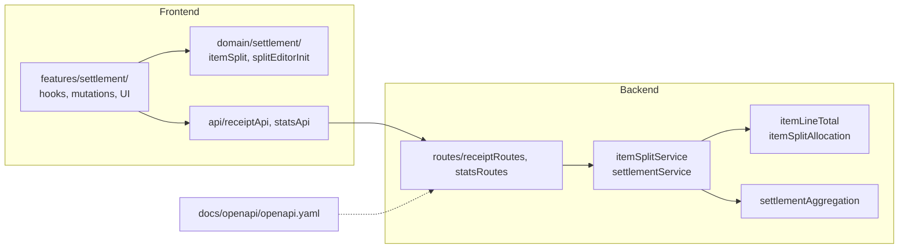

# 割り勘・精算ルール変更ガイド

Epic: [#512 Issue #105](https://github.com/yama180sx/receipt-ai-app/issues/512)  
子 Issue: [#516 Issue #105-3](https://github.com/yama180sx/receipt-ai-app/issues/516)

業務ルールの正本は [domain-model.md](./domain-model.md) §4〜§5。本ガイドは **ルール変更時にどのファイルを、どの順序で触るか** を as-built で示す。

| 資料 | 内容 |
|------|------|
| [domain-model.md](./domain-model.md) | 按分・精算の業務ルール（What） |
| [api-spec.md](./api-spec.md) | 精算 API エンドポイント |
| [docs/openapi/openapi.yaml](../openapi/openapi.yaml) | API 契約 SSOT（機械可読） |
| [docs/testing/fixtures/itemLineTotal-vectors.json](../testing/fixtures/itemLineTotal-vectors.json) | 明細小計の FE/BE contract test |

---

## 1. レイヤー概要

按分・精算ロジックは FE domain / FE features / BE services / BE utils に跨る。**保存・精算の正は Backend のみ**。Frontend は編集 UI とプレビュー。

---

## 2. 変更種別ごとのチェックリスト

### 2.1 明細小計（itemLineTotal）— domain-model §4.1

| 順序 | 触る場所 | 役割 |
|------|----------|------|
| 1 | `backend/src/utils/itemLineTotal.ts` | **SSOT** — `calcItemLineTotal()` |
| 2 | `docs/testing/fixtures/itemLineTotal-vectors.json` | contract test ベクトル追加 |
| 3 | `frontend/src/domain/settlement/itemSplit.ts` | FE ミラー — `calcItemTotal()` |
| 4 | `backend/src/utils/itemLineTotal.test.ts` | BE contract test |
| 5 | `frontend/src/domain/settlement/itemSplit.test.ts` | FE contract test |
| 6 | `docs/design/domain-model.md` §4.1 | 業務ルール記述 |

**確認:** `npm test`（frontend / backend）で contract test がパスすること。

### 2.2 按分額の算出（allocateItemSplits）— §4.3

| 順序 | 触る場所 | 役割 |
|------|----------|------|
| 1 | `backend/src/services/settlement/itemSplitAllocation.ts` | 端数・ratio/amount ルールの **SSOT** |
| 2 | `backend/src/services/settlement/itemSplitAllocation.test.ts` | 単体テスト（T-ref-01 等） |
| 3 | `backend/src/services/settlement/itemSplitService.ts` | 保存オーケストレーション（`calcItemLineTotal` → `allocateItemSplits` → DB） |
| 4 | `frontend/src/domain/settlement/itemSplit.ts` | `buildItemSplitSavePayload()` — 端数負担者を配列末尾へ |
| 5 | `frontend/src/domain/settlement/itemSplit.test.ts` | payload 順序テスト（T-ref-03） |
| 6 | `frontend/src/features/settlement/utils/splitEditorMutations.ts` | UI 編集時の percent / amount 計算 |
| 7 | `frontend/src/features/settlement/utils/splitEditorMutations.test.ts` | UI  mutation テスト |
| 8 | `docs/design/domain-model.md` §4.3, §4.4 | 業務ルール記述 |

**API 契約を変える場合（追加）:**

| 順序 | 触る場所 |
|------|----------|
| A | `docs/openapi/openapi.yaml` — `/receipts/items/{itemId}/splits` |
| B | `docs/design/api-spec.md` |
| C | `npm run generate:api`（frontend）— generated 型の再生成 |
| D | `backend/src/openapiDrift.test.ts` がパスすること |

### 2.3 暗黙デフォルト（splits 0 件）— §4.2

| 順序 | 触る場所 | 役割 |
|------|----------|------|
| 1 | `backend/src/services/settlement/itemSplitService.ts` | 空配列 POST → ItemSplit 全削除 |
| 2 | `backend/src/services/settlement/settlementAggregation.ts` | `aggregateReceiptsIntoStats()` — splits 0 件時の totalOwed |
| 3 | `backend/src/services/settlement/settlementAggregation.test.ts` | 集計単体テスト |
| 4 | `frontend/src/domain/settlement/splitEditorInit.ts` | 編集画面の初期 active members |
| 5 | `docs/design/domain-model.md` §4.2 | 業務ルール記述 |

### 2.4 精算サマリー（月次 balance）— §5

| 順序 | 触る場所 | 役割 |
|------|----------|------|
| 1 | `backend/src/services/settlement/settlementAggregation.ts` | 純粋集計 — `computeSettlementMemberSummaries()` |
| 2 | `backend/src/services/settlement/settlementService.ts` | DB 取得 + 集計呼び出し |
| 3 | `backend/src/mappers/settlementMapper.ts` | Domain → API レスポンス |
| 4 | `backend/src/controllers/statsController.ts` | HTTP ハンドラ（薄い） |
| 5 | `frontend/src/features/settlement/hooks/useSettlementSummary.ts` | 精算画面データ取得 |
| 6 | `frontend/src/api/statsApi.ts` | API クライアント |
| 7 | `docs/design/domain-model.md` §5 | 業務ルール記述 |

**送金 API を変える場合:** `docs/openapi/openapi.yaml` の `/stats/settlement/transfers` を先に更新。

### 2.5 UI のみ（表示・入力 UX）

按分ルール自体は変えず、画面操作だけ変える場合:

| 触る場所 | 例 |
|----------|-----|
| `frontend/src/features/settlement/hooks/useSplitEditor.ts` | 保存フロー、端数負担者（先頭 member） |
| `frontend/src/features/settlement/components/*` | テーブル・入力 UI |
| `frontend/src/screens/SplitEditorScreen.tsx` | 画面構成 |
| `frontend/app/(app)/history/[receiptId]/split.tsx` | ルート |

**注意:** UI で端数を「先頭メンバー」に見せても、保存時は `buildItemSplitSavePayload()` が **配列末尾** に並べ替える（§4.4）。

---

## 3. ファイル一覧（クイックリファレンス）

### Frontend

| パス | 責務 |
|------|------|
| `frontend/src/domain/settlement/itemSplit.ts` | 小計ミラー、保存 payload 生成 |
| `frontend/src/domain/settlement/splitEditorInit.ts` | 編集画面の初期状態 |
| `frontend/src/domain/settlement/itemSplit.test.ts` | contract test + payload test |
| `frontend/src/features/settlement/hooks/useSplitEditor.ts` | 按分編集 hook |
| `frontend/src/features/settlement/hooks/useSettlementSummary.ts` | 精算サマリー hook |
| `frontend/src/features/settlement/utils/splitEditorMutations.ts` | 編集中の amount / percent 更新 |
| `frontend/src/features/settlement/components/*` | 精算・按分 UI |
| `frontend/src/api/receiptApi.ts` | `saveItemSplits` 等 |
| `frontend/src/api/statsApi.ts` | 精算サマリー・送金 API |

### Backend

| パス | 責務 |
|------|------|
| `backend/src/utils/itemLineTotal.ts` | 明細小計 SSOT |
| `backend/src/services/settlement/itemSplitAllocation.ts` | 按分 allocate SSOT |
| `backend/src/services/settlement/itemSplitService.ts` | ItemSplit 保存 |
| `backend/src/services/settlement/settlementAggregation.ts` | 精算集計（純粋関数） |
| `backend/src/services/settlement/settlementService.ts` | 精算データ取得・送金 CRUD |
| `backend/src/mappers/settlementMapper.ts` | API レスポンス整形 |
| `backend/src/controllers/statsController.ts` | `/stats/settlement` HTTP |
| `backend/src/controllers/receiptController.ts` | 按分 POST ハンドラ |
| `backend/src/repositories/settlementRepository.ts` | 精算 DB アクセス |
| `backend/src/repositories/receipt/receiptWriteRepository.ts` | ItemSplit 書き込み |

### テスト・契約

| パス | 責務 |
|------|------|
| `docs/testing/fixtures/itemLineTotal-vectors.json` | 小計 FE/BE contract |
| `backend/src/services/settlement/itemSplitAllocation.test.ts` | 按分 allocate |
| `backend/src/services/settlement/settlementAggregation.test.ts` | 精算集計 |
| `backend/src/services/settlement/settlementService.test.ts` | サービス層 |
| `docs/testing/findings.md` | T-ref-01〜03 確定挙動 |

---

## 4. 推奨作業順序（まとめ）

1. **業務ルールを domain-model.md に書く**（変更内容の What）
2. **Backend SSOT を更新**（`itemLineTotal` / `itemSplitAllocation` / `settlementAggregation`）
3. **Backend テストを追加・更新**
4. **API 契約が変わるなら openapi.yaml を先に更新** → `openapiDrift.test` / `generate:api`
5. **Frontend domain を Backend に同期**（`itemSplit.ts` 等）
6. **Frontend features / hooks を更新**
7. **contract test ベクトル更新**（小計変更時）
8. **domain-model.md / api-spec.md を as-built に合わせる**
9. **`npm test`（frontend + backend）**

---

## 5. スコープ外（別 Issue）

| 内容 | Issue | 状態 |
|------|-------|------|
| ~~BE settlement 物理集約~~ | #105-6 | ✅ 完了 — `services/settlement/` に集約 |
| DTO / Domain / Mapper フロー図 | #105-4 | ✅ 完了 |
| API generated 移行 PoC | #105-5 | ✅ 完了 — `categoryApi` |

---

## 6. 関連資料

- [domain-model.md](./domain-model.md) — 按分・精算業務ルール
- [frontend-screens.md](./frontend-screens.md) — SplitEditor / Settlement 画面
- [docs/reviews/issue-87/README.md](../reviews/issue-87/README.md) — 精算ドメイン LLM レビュー
- [docs/refactor/plan.md](../refactor/plan.md) §12 — Epic #105 全体計画
