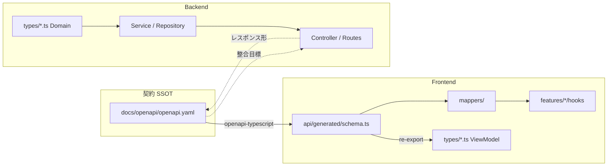
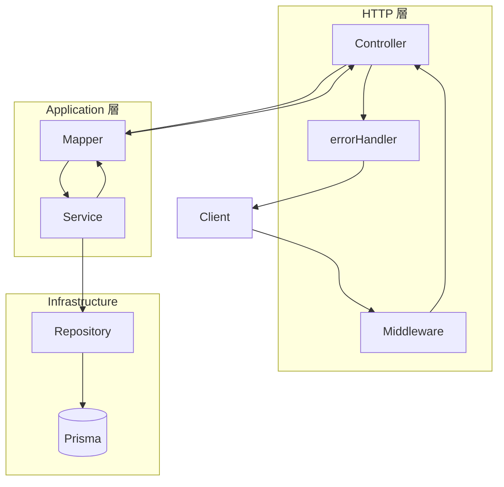

# Issue #98 — リファクタリング・実装計画

Epic: [#370 Issue #98](https://github.com/yama180sx/receipt-ai-app/issues/370)

本ドキュメントは **Issue #98** の成果物です。#98-1 以降のリファクタ実装で共通参照してください。

## 1. 方針サマリー

| 項目 | 決定内容 |
|------|----------|
| 入力ソース | [ChatGPT リファクタ案](../specs/chatgpt/ChatGPT_リファクタリング案.txt)（develop 解析）+ `docs/design/`（as-built 正本）+ コード突合 |
| 基本方針 | **DDD やり過ぎない**。Controller → Application/Domain Service → Prisma の現行構造を維持 |
| スコープ外 | 精算ドメインの再リファクタ（[#87 Epic](../reviews/issue-87/README.md) 完了済み）、React Navigation 導入、Supabase/クラウド移行 |
| テスト | 各 Must/Should 子 Issue で `npm test` 維持。[#91 テスト計画](../testing/plan.md) に準拠 |

## 2. ChatGPT 案の triage 結果

| ChatGPT 提案 | 判定 | 対応 Issue |
|--------------|------|------------|
| Issue1 Repository 全面導入 | **Later** | #98-8（Prisma `$extends` テナント注入と衝突。Drizzle 移行予定なし） |
| Issue2 ReceiptService 分割 | **Must**（修正） | #98-3（`duplicateReceiptService` / `categoryService` は既存。Controller 601行も対象） |
| Issue3 Transaction 境界 | **Should** | #98-4 |
| Issue4 型定義（`any` 排除） | **Must** | #98-2 |
| Issue5 Context 明示渡し | **Later** | #98-8 |
| Issue6 AI Provider 抽象化 | **Later** | #98-8（#91-7 と役割近接。Gemini 単一のため当面不要） |
| Issue7 Frontend `features/` | **Later** | #98-8（#87 R-F005 含む） |
| Issue8 Frontend API 統一 | **Should** | #98-7 |
| （追加）エラー統一 R-B006 | **Should** | #98-5 |
| （追加）statsController → Service | **Should** | #98-6 |

### ChatGPT 解析で判明した誤り（記録）

| 誤り | 正（as-built） |
|------|----------------|
| `receiptService` が最大 | `receiptController.ts` が **601行**、`receiptService` は 214行 |
| 重複チェックが receiptService 内 | `duplicateReceiptService.ts` **既に分離** |
| Worker 即 DB 保存（Phase5 仕様書） | `analyzeOnly` → 確認 → `commit` |

## 3. 着手順（Sprint）

```
#98-1（plan）→ #98-2（型）→ #98-3（Receipt）
    → #98-4（Transaction）→ #98-5 / #98-6 / #98-7（Should）
    → #98-8（Later バックログ）
```

| Sprint | 内容 | 子 Issue |
|--------|------|----------|
| 1 | 型定義強化 | #98-2 |
| 2 | Receipt パイプライン + Controller 薄型化 | #98-3 |
| 3 | Transaction 統一 | #98-4 |
| 4 | エラー / 精算 Service / FE API | #98-5, #98-6, #98-7 |
| — | Later バックログ | #98-8 |

## 4. 子 Issue 対応表

| 命名 | GitHub | 優先度 |
|------|--------|--------|
| #98-1 | [#371](https://github.com/yama180sx/receipt-ai-app/issues/371) | Must |
| #98-2 | [#372](https://github.com/yama180sx/receipt-ai-app/issues/372) | Must |
| #98-3 | [#373](https://github.com/yama180sx/receipt-ai-app/issues/373) | Must |
| #98-4 | [#374](https://github.com/yama180sx/receipt-ai-app/issues/374) | Should |
| #98-5 | [#375](https://github.com/yama180sx/receipt-ai-app/issues/375) | Should |
| #98-6 | [#376](https://github.com/yama180sx/receipt-ai-app/issues/376) | Should |
| #98-7 | [#377](https://github.com/yama180sx/receipt-ai-app/issues/377) | Should |
| #98-8 | [#378](https://github.com/yama180sx/receipt-ai-app/issues/378) | Later → Phase 2（[#392](https://github.com/yama180sx/receipt-ai-app/issues/392)〜[#404](https://github.com/yama180sx/receipt-ai-app/issues/404)） |

## 5. 関連資料

- [docs/design/](../design/) — 完成版仕様書（正本）
- [docs/specs/chatgpt/ChatGPT_リファクタリング案.txt](../specs/chatgpt/ChatGPT_リファクタリング案.txt)
- [docs/reviews/issue-87/should-backlog.md](../reviews/issue-87/should-backlog.md)
- [docs/testing/plan.md](../testing/plan.md)
- [docs/specs/chatgpt/ChatGPT_レビュー.txt](../specs/chatgpt/ChatGPT_レビュー.txt) — FE 画面肥大化の品質監査（#99 の根拠）

## 6. 完了サマリー / #99 反映 / #98-8 Phase 2 triage

> 更新: Issue #98-8-0（[#392](https://github.com/yama180sx/receipt-ai-app/issues/392)）。Epic #370 クローズ時点の記録。

### 6.1 Epic #98 実施結果（Done）

| 命名 | GitHub | 判定 | 主な成果 |
|------|--------|------|----------|
| #98-1 | [#371](https://github.com/yama180sx/receipt-ai-app/issues/371) | **Done** | 本 plan.md 初版 |
| #98-2 | [#372](https://github.com/yama180sx/receipt-ai-app/issues/372) | **Done** | BE 型定義・`any` 排除 |
| #98-3 | [#373](https://github.com/yama180sx/receipt-ai-app/issues/373) | **Done** | Receipt Service 分割、`receiptController` 601→266行 |
| #98-4 | [#374](https://github.com/yama180sx/receipt-ai-app/issues/374) | **Done** | Transaction 境界統一 |
| #98-5 | [#375](https://github.com/yama180sx/receipt-ai-app/issues/375) | **Done** | エラー統一（R-B006 解消） |
| #98-6 | [#376](https://github.com/yama180sx/receipt-ai-app/issues/376) | **Done** | statsController → SettlementService |
| #98-7 | [#377](https://github.com/yama180sx/receipt-ai-app/issues/377) | **Done** | FE `src/api/` 統一 |

### 6.2 Epic #99 実施結果（ChatGPT レビュー FE 対応 — #98 スコープ外）

[ChatGPT レビュー](../specs/chatgpt/ChatGPT_レビュー.txt) が指摘した 500 行級 Screen 分解。リファクタ案（Issue1〜8）の Must/Should 完了後に別 Epic として実施。

| 命名 | GitHub | 判定 | 主な成果 |
|------|--------|------|----------|
| #99 Epic | [#386](https://github.com/yama180sx/receipt-ai-app/issues/386) | **Done** | FE 画面責務分割 |
| #99-1 | [#387](https://github.com/yama180sx/receipt-ai-app/issues/387) | **Done** | Settlement Hook + コンポーネント（597→103行） |
| #99-2 | [#388](https://github.com/yama180sx/receipt-ai-app/issues/388) | **Done** | Home Hook 化（583→424行） |
| #99-3 | [#389](https://github.com/yama180sx/receipt-ai-app/issues/389) | **Done** | App セッション / ViewRouter 分離（501→211行） |

附記: `SplitEditorScreen` 588→146行（#99-1 内）。新規 Hook: `useSettlementSummary`, `useSplitEditor`, `useHomeDashboard`, `useReceiptUpload`, `useAppSession`。

### 6.3 #98-8 再 triage（Later → Phase 2 実装）

当初 [#378](https://github.com/yama180sx/receipt-ai-app/issues/378) は「実装しないバックログ」だったが、プロ品質 Phase 2 として子 Issue に切り出し、[#378](https://github.com/yama180sx/receipt-ai-app/issues/378) を **実装 Epic** として継続する。

| 元項目（§2） | 当初判定 | 再判定 | 子 Issue | 備考 |
|--------------|----------|--------|----------|------|
| Issue1 Repository 全面導入 | Later | **実施**（段階） | [#399](https://github.com/yama180sx/receipt-ai-app/issues/399), [#400](https://github.com/yama180sx/receipt-ai-app/issues/400) | 拡張済み `prisma`（`$extends` テナント）を Repository 内部で利用 |
| Issue5 Context 明示渡し | Later | **実施**（段階） | [#397](https://github.com/yama180sx/receipt-ai-app/issues/397), [#398](https://github.com/yama180sx/receipt-ai-app/issues/398) | ALS 全面削除はしない（Worker 用に残す） |
| Issue6 AI Provider 抽象化 | Later | **実施** | [#396](https://github.com/yama180sx/receipt-ai-app/issues/396) | Gemini 単一でもテスト容易性向上 |
| Issue7 Frontend `features/` | Later | **実施**（段階） | [#393](https://github.com/yama180sx/receipt-ai-app/issues/393) | #99 成果物の移行 |
| R-B008 精算クエリ最適化 | Later | **実施** | [#395](https://github.com/yama180sx/receipt-ai-app/issues/395) | #87 バックログ |
| FE 残存 `any` | — | **実施** | [#394](https://github.com/yama180sx/receipt-ai-app/issues/394) | #98-2 スコープ外（管理系画面等） |
| OpenAPI 型生成 | — | **実施** | [#401](https://github.com/yama180sx/receipt-ai-app/issues/401), [#402](https://github.com/yama180sx/receipt-ai-app/issues/402) | #402 は Later |
| Expo Router | スコープ外 | **実施**（PoC→本番） | [#403](https://github.com/yama180sx/receipt-ai-app/issues/403), [#404](https://github.com/yama180sx/receipt-ai-app/issues/404) | #404 は PoC Go 時 |

#### Won't fix / 見送り（記録）

| 項目 | 判定 | 理由 |
|------|------|------|
| Drizzle ORM 移行 | **Won't fix** | Prisma + `$extends` で十分。移行予定なし |
| React Navigation 導入 | **Won't fix** | Expo Router を採用（#403 / #404） |
| 精算ドメイン再リファクタ | **スコープ外** | #87 完了済み |
| AsyncLocalStorage 全面削除 | **見送り** | Worker / バックグラウンドは `runWithTenant` を維持 |

### 6.4 #98-8 子 Issue 対応表

| 命名 | GitHub | 優先度 | 見積（AI 補助） |
|------|--------|--------|----------------|
| #98-8-0 | [#392](https://github.com/yama180sx/receipt-ai-app/issues/392) | Must | 0.5 人日 |
| #98-8-1 | [#393](https://github.com/yama180sx/receipt-ai-app/issues/393) | Should | 1〜1.5 人日 |
| #98-8-2 | [#394](https://github.com/yama180sx/receipt-ai-app/issues/394) | Should | 1 人日 |
| #98-8-3 | [#395](https://github.com/yama180sx/receipt-ai-app/issues/395) | Should | 1〜2 人日 |
| #98-8-4 | [#396](https://github.com/yama180sx/receipt-ai-app/issues/396) | Should | 1〜1.5 人日 |
| #98-8-5 | [#397](https://github.com/yama180sx/receipt-ai-app/issues/397) | Should | 2〜3 人日 |
| #98-8-6 | [#398](https://github.com/yama180sx/receipt-ai-app/issues/398) | Should | 1.5〜2 人日 |
| #98-8-7 | [#399](https://github.com/yama180sx/receipt-ai-app/issues/399) | Should | 2〜3 人日 |
| #98-8-8 | [#400](https://github.com/yama180sx/receipt-ai-app/issues/400) | Should | 2〜3 人日 |
| #98-8-9 | [#401](https://github.com/yama180sx/receipt-ai-app/issues/401) | Should | 2〜3 人日 |
| #98-8-10 | [#402](https://github.com/yama180sx/receipt-ai-app/issues/402) | Later | 2〜3 人日 |
| #98-8-11 | [#403](https://github.com/yama180sx/receipt-ai-app/issues/403) | Should | 1.5〜2 人日 |
| #98-8-12 | [#404](https://github.com/yama180sx/receipt-ai-app/issues/404) | Later | 4〜6 人日 |

### 6.5 Phase 2 推奨着手順

```
#392（本 Issue）→ #393 → #395 → #394 → #396
  → #397 → #398 → #399 → #400 → #401 → #402
  → #403（PoC）→ #404（Go 時）
```

Navigation（#403 / #404）は Phase 2 中でリスク最高。Android / iOS / Web 同一 Screen 構成は維持。Web の URL / リロード / ブラウザ戻るを PoC で重点検証する。

## 7. Epic #100 — ChatGPT レビュー 20260621 フォローアップ（Phase 3）

Epic: [#423 Epic #100](https://github.com/yama180sx/receipt-ai-app/issues/423)

[ChatGPT レビュー 20260621](../specs/chatgpt/ChatGPT_レビュー_20260621.txt)（74/100点）のフォローアップ。#98 / #99 / #98-8 Phase 2 完了後も残る **層境界・Screen 肥大・型/Mapper 不足** を解消する。

### 7.1 方針サマリー

| 項目 | 決定内容 |
|------|----------|
| 入力ソース | ChatGPT レビュー 20260621 + 本セッション設計議論 + コード突合 |
| BE 方針 | Service = Application 層。UseCase 物理層は新設しない |
| FE 方針 | Hook = Application 層。Style Pattern 段階移行（big-bang 禁止） |
| 型方針 | DTO = `api/generated`、ViewModel = `types/`、変換 = `mappers/` |
| スコープ外 | Drizzle 移行、UseCase フォルダ新設、StyleSheet big-bang 一括 PR |

### 7.2 子 Issue 対応表

| 命名 | GitHub | 優先度 | 見積（AI 補助） |
|------|--------|--------|----------------|
| #100 Epic | [#423](https://github.com/yama180sx/receipt-ai-app/issues/423) | — | — |
| #100-0 | [#424](https://github.com/yama180sx/receipt-ai-app/issues/424) | Must | 0.5 人日 |
| #100-1 | [#425](https://github.com/yama180sx/receipt-ai-app/issues/425) | Must | 1.5〜2 人日 |
| #100-2 | [#426](https://github.com/yama180sx/receipt-ai-app/issues/426) | Must | 1.5〜2 人日 |
| #100-3 | [#427](https://github.com/yama180sx/receipt-ai-app/issues/427) | Must | 1〜1.5 人日 |
| #100-4 | [#428](https://github.com/yama180sx/receipt-ai-app/issues/428) | Must | 1.5〜2 人日 |
| #100-5 | [#429](https://github.com/yama180sx/receipt-ai-app/issues/429) | Should | 1〜1.5 人日 |
| #100-6 | [#430](https://github.com/yama180sx/receipt-ai-app/issues/430) | Must | 0.5 人日 |
| #100-7 | [#431](https://github.com/yama180sx/receipt-ai-app/issues/431) | Must | 1.5〜2 人日 |
| #100-8 | [#432](https://github.com/yama180sx/receipt-ai-app/issues/432) | Must | 1.5〜2 人日 |
| #100-9 | [#433](https://github.com/yama180sx/receipt-ai-app/issues/433) | Must | 1 人日 |
| #100-10 | [#434](https://github.com/yama180sx/receipt-ai-app/issues/434) | Should | 1 人日 |
| #100-11 | [#435](https://github.com/yama180sx/receipt-ai-app/issues/435) | Should | 0.5 人日 |
| #100-12 | [#436](https://github.com/yama180sx/receipt-ai-app/issues/436) | Should | 1〜1.5 人日 |
| #100-13 | [#437](https://github.com/yama180sx/receipt-ai-app/issues/437) | Should | 0.5〜1 人日 |
| #100-14 | [#438](https://github.com/yama180sx/receipt-ai-app/issues/438) | Should | 1.5〜2 人日 |
| #100-15 | [#439](https://github.com/yama180sx/receipt-ai-app/issues/439) | Must | 0.5 人日 |
| #100-16 | [#440](https://github.com/yama180sx/receipt-ai-app/issues/440) | Should | 1〜1.5 人日 |

### 7.3 #98-8 との関係（重複しない既存 Issue）

| 既存 Issue | 内容 | #100 との関係 |
|-----------|------|--------------|
| #393 [#98-8-1] | features/ 移行 | #100-5 が auth/stats/history/category を補完 |
| #394 [#98-8-2] | FE 残存 any 排除 | 並行実施（#100 スコープ外） |
| #397 [#98-8-5] | Context 明示渡し | 並行実施 |
| #398 [#98-8-6] | prisma `$extends` 型安全化 | 並行実施 |
| #399 [#98-8-7] | Repository Phase 1 | #100-2 の前提 |
| #400 [#98-8-8] | Repository Phase 2 | #100-3 の前提 |
| #401 [#98-8-9] | OpenAPI 型生成 | #100-4 の前提 |

### 7.4 Won't fix / 見送り（記録）

| 項目 | 判定 | 理由 |
|------|------|------|
| Drizzle ORM 移行 | **Won't fix** | 現状 pain point なし。Prisma `$extends` テナント資産を維持 |
| UseCase 物理層（`usecases/` フォルダ） | **Won't fix** | Service / Hook = Application 層として十分 |
| StyleSheet big-bang 一括 PR | **Won't fix** | #100-6〜#100-11 で計画的段階移行 |

### 7.5 推奨着手順

```
#424（#100-0 plan）→ #425 → #426 → #427 → #428 → #439
  → #430 → #431 / #432 / #433（並行可）
  → #434 → #435
  → #436 → #437 → #438 → #440

（#98-8 と並行: #393, #394, #397, #399, #400, #401）
```

## 8. Epic #101 — ChatGPT レビュー 20260622 フォローアップ（Phase 4）

Epic: [#459 Epic #101](https://github.com/yama180sx/receipt-ai-app/issues/459)

[ChatGPT レビュー 20260622](../specs/chatgpt/ChatGPT_レビュー_20260622.txt)（**79/100点**）のフォローアップ。Epic #100 完了後も残る **画面肥大・画像処理/UI 混在・backend any 残存・API エラー処理散在** を解消し、AI 駆動開発向けの **フロント実装規約** も整備する。

### 8.1 方針サマリー

| 項目 | 決定内容 |
|------|----------|
| 入力ソース | ChatGPT レビュー 20260622 + コード突合 + Epic #99 / #100 成功パターン |
| FE 方針 | Screen = hook + 子コンポーネント（**150行以内**）。#387 / #431 と同型 |
| BE 方針 | 残存 `any` / `as any` を Express 型拡張・`unknown` で撲滅（局所修正） |
| エラー方針 | FE: `getApiErrorMessage` / `showApiErrorAlert` に統一。BE: #101-3 は middleware 層中心 |
| AI 駆動 | #101-7 で規約 + プロンプトテンプレートを正本化し、以降の実装 Issue で参照 |
| スコープ外 | React Hook Form、Context 新規追加、big-bang 一括 PR |

### 8.2 レビュー減点と対応マッピング

| 観点 | 点数 | 主な対応 Issue |
|------|------|----------------|
| DRY / 共通化 | 18/25 | #101-6 |
| 責務分割 | 20/25 | #101-1, #101-2, #101-4, #101-5 |
| 型定義 | 22/25 | #101-3 |
| 保守性 | 19/25 | #101-7 + 上記 |

### 8.3 子 Issue 対応表

| 命名 | GitHub | 優先度 | 見積（AI 補助） |
|------|--------|--------|----------------|
| #101 Epic | [#459](https://github.com/yama180sx/receipt-ai-app/issues/459) | — | — |
| #101-0 | [#460](https://github.com/yama180sx/receipt-ai-app/issues/460) | Must | 0.5 人日 |
| #101-1 | [#465](https://github.com/yama180sx/receipt-ai-app/issues/465) | Must | 1 人日 |
| #101-2 | [#466](https://github.com/yama180sx/receipt-ai-app/issues/466) | Must | 1 人日 |
| #101-3 | [#467](https://github.com/yama180sx/receipt-ai-app/issues/467) | Must | 0.5〜1 人日 |
| #101-4 | [#462](https://github.com/yama180sx/receipt-ai-app/issues/462) | Should | 1 人日 |
| #101-5 | [#463](https://github.com/yama180sx/receipt-ai-app/issues/463) | Should | 1 人日 |
| #101-6 | [#464](https://github.com/yama180sx/receipt-ai-app/issues/464) | Should | 0.5〜1 人日 |
| #101-7 | [#461](https://github.com/yama180sx/receipt-ai-app/issues/461) | Must | 0.5 人日 |

### 8.4 #100 との関係（重複しないスコープ）

| #100 で実施済み | #101 で追加する理由 |
|----------------|---------------------|
| Login / Home / Statistics 等の Screen 分解 | **PromptEditorScreen**（355行）・**ReceiptImageCropModal**（287行）・**SplitEditorItemTable**（292行）が未対応 |
| BE Repository / authService 本実装 | middleware 層の残存 `any`（`authMiddleware` / `validate` 等）が未対応 |
| `getApiErrorMessage` 導入・Alert 統一 | Hook 層での `console.error` + 固定メッセージが残存（ProductMaster 等） |
| architecture.md as-built（#100-15） | AI 駆動向け **実装規約・プロンプトテンプレート** は未整備 |

**重複しないことの確認**: #101 は #100 で触っていないファイル・運用ルールに限定する。層境界の全面整理（Mapper / OpenAPI drift CI）は **Epic #102 / #103**（Phase 5）へ委譲。

### 8.5 Won't fix / Later（記録）

| 項目 | 判定 | 対応 |
|------|------|------|
| React Hook Form 導入 | **Won't fix** | hook 分割で十分（#101-1） |
| Context 新規追加 | **Won't fix** | #101-7 で既存 Context のみと明文化 |
| frontend/backend 型の完全共有（C-2） | **Later → Epic #102** | [#468](https://github.com/yama180sx/receipt-ai-app/issues/468) |
| API 層 DTO / 変換 / エラー完全分離（C-4） | **Later → Epic #103** | [#469](https://github.com/yama180sx/receipt-ai-app/issues/469) |

### 8.6 推奨着手順

```
#460（#101-0 plan）→ #461（#101-7 規約）→ #465 → #466 → #467
  → #462 / #463（並行可）→ #464
  → Epic #102 / #103（#101 完了後）
```

**Screen 分解の参考パターン**: Epic #99 [#387](https://github.com/yama180sx/receipt-ai-app/issues/387)（SplitEditorScreen 588→146行）、Epic #100 [#431](https://github.com/yama180sx/receipt-ai-app/issues/431)（LoginScreen + useLoginFlow）。

### 8.7 後続 Epic（Phase 5、本 Epic スコープ外）

| Epic | GitHub | テーマ | plan 正本 |
|------|--------|--------|-----------|
| #102 | [#468](https://github.com/yama180sx/receipt-ai-app/issues/468) | API 契約型 SSOT（OpenAPI drift CI、FE/BE 型整合） | **§9** |
| #103 | [#469](https://github.com/yama180sx/receipt-ai-app/issues/469) | Backend 層境界（Response Mapper、errorHandler 一本化） | §10（#103-0 完了後） |

## 9. Epic #102 — API 契約型 SSOT（Phase 5）

Epic: [#468 Epic #102](https://github.com/yama180sx/receipt-ai-app/issues/468)

[ChatGPT レビュー 20260622](../specs/chatgpt/ChatGPT_レビュー_20260622.txt) 優先度 **C-2** の対応 Epic。Epic #101（Phase 4）完了後、**API 契約を OpenAPI 一点に集約**し、FE/BE 型の分散と spec↔実装の drift を解消する。

### 9.1 方針サマリー

| 項目 | 決定内容 |
|------|----------|
| 入力ソース | ChatGPT レビュー C-2 + #401 / #402 成果物 + コード突合 |
| 契約 SSOT | `docs/openapi/openapi.yaml`（機械可読正本） |
| FE 方針 | DTO は `frontend/src/api/generated`（`npm run generate:api`）。ViewModel のみ `frontend/src/types/` |
| BE 方針 | API レスポンス形は OpenAPI schema に整合。ドメイン内部型（`ParsedReceipt` 等）は Service 層に残す |
| CI 方針 | `check:api`（generated diff）+ ルート一覧突合（#102-1） |
| スコープ外 | `packages/shared-types` monorepo、BE からの OpenAPI 自動生成 |

### 9.2 型境界図



**データの流れ（読み取り）**: OpenAPI → FE generated 型 → Mapper → ViewModel → UI。BE は Controller が OpenAPI 準拠の JSON を返し、Service 内部は Prisma / Gemini 由来のドメイン型を使用する。

### 9.3 型の正本と各層の責務

| 種別 | 正本 | 配置 | 責務 | 禁止 |
|------|------|------|------|------|
| API 契約（DTO） | `docs/openapi/openapi.yaml` | — | 公開 API の request/response schema、paths | 手動で FE/BE に DTO を二重定義 |
| FE 生成型 | OpenAPI codegen | `frontend/src/api/generated/` | `schema.ts` + ドメイン別エイリアス（`index.ts`） | Hook / Screen から `schema.ts` を直接 import（`generated/index` または `types/` 経由） |
| FE ViewModel | 画面・フロー固有 | `frontend/src/types/` | `ParsedReceiptData`、`ReceiptForSplitEditor` 等 OpenAPI 非該当型 | API レスポンスと同一 shape の手動 interface |
| FE Mapper | DTO → ViewModel | `frontend/src/mappers/` | 表示用変換（#100-4 成果） | API 呼び出し |
| BE ドメイン型 | Gemini / commit 経路 | `backend/src/types/` | `ParsedReceipt`、`ParsedItem` 等内部モデル | HTTP レスポンス型の手動二重管理（OpenAPI と乖離） |
| BE Express 拡張 | ミドルウェア | `backend/src/types/express.d.ts` | `req.user` 等リクエストコンテキスト | — |
| DB モデル | Prisma schema | `backend/prisma/schema.prisma` | 永続化。API DTO とは別層 | OpenAPI に DB 型を直書き |

### 9.4 子 Issue 対応表

| 命名 | GitHub | 優先度 | 見積（AI 補助） |
|------|--------|--------|----------------|
| #102 Epic | [#468](https://github.com/yama180sx/receipt-ai-app/issues/468) | — | — |
| #102-0 | [#470](https://github.com/yama180sx/receipt-ai-app/issues/470) | Must | 0.5 人日 |
| #102-1 | [#471](https://github.com/yama180sx/receipt-ai-app/issues/471) | Must | 1〜1.5 人日 |
| #102-2 | [#472](https://github.com/yama180sx/receipt-ai-app/issues/472) | Should | 1〜2 人日 |
| #102-3 | [#473](https://github.com/yama180sx/receipt-ai-app/issues/473) | Should | 2〜3 人日 |
| #102-4 | [#474](https://github.com/yama180sx/receipt-ai-app/issues/474) | Must | 0.5 人日 |

### 9.5 #401 / #402 との差分（残タスクの明確化）

| 項目 | #401 / #402（#98-8-9 / #98-8-10）で **完了** | Epic #102 で **追加** |
|------|-----------------------------------------------|------------------------|
| OpenAPI YAML 正本 | `docs/openapi/openapi.yaml`（全公開 API） | 維持・拡張時も YAML 先 |
| FE 型生成 | `npm run generate:api` → `api/generated/schema.ts` | 手動 DTO の監査・generated 移行（#102-2） |
| generated diff CI | `npm run check:api` を `test.yml` に組込済み | ルート一覧 ↔ paths 突合テスト（#102-1） |
| FE エイリアス | `api/generated/index.ts` でドメイン別 re-export | `types/*.ts` の ViewModel 境界明確化（#102-2） |
| BE 型 | `backend/src/types/receipt.ts` 等（ドメイン中心） | レスポンス形の OpenAPI 整合（#102-3） |
| 運用ルール | `api-spec.md` に OpenAPI 正本記載 | 新 API 追加手順・AI チェックリスト（#102-4） |
| FE/BE 完全共有 | —（対象外） | **Won't fix** — OpenAPI + codegen で十分 |

**Epic #102 が解消するレビュー指摘**: 「API 契約型を完全共有できていない」（型定義 22/25 減点要因）。FE は generated へ、BE はレスポンス整合へ寄せ、**契約の SSOT は OpenAPI のみ**とする。

### 9.6 #101 との関係

| #101 で実施済み | #102 で追加する理由 |
|----------------|---------------------|
| `frontend-conventions.md` に DTO / ViewModel 方針の概要 | 型境界の **as-built 図・残タスク表** を plan 正本化 |
| `getApiErrorMessage` / `showApiErrorAlert` 統一 | API **契約型** の統一（エラー処理とは別軸） |
| BE middleware `any` 除去（#101-3） | Controller レスポンス形の OpenAPI 整合（#102-3） |

層境界の **Response Mapper 全面導入** は Epic [#103](https://github.com/yama180sx/receipt-ai-app/issues/469)（C-4）へ委譲。

### 9.7 Won't fix / Later（記録）

| 項目 | 判定 | 理由 |
|------|------|------|
| `packages/shared-types` monorepo 共有パッケージ | **Won't fix** | OpenAPI + `openapi-typescript` で FE/BE 契約は足りる |
| BE から OpenAPI を自動生成（tsoa / zod-to-openapi 等） | **Won't fix** | YAML 正本 + CI drift 検知で運用。導入コスト対効果が低い |
| Prisma モデルを OpenAPI に直結 | **Won't fix** | DB 層と API 契約は分離（#102-3 はレスポンス JSON のみ） |
| BE 層 Mapper 全面整理 | **Later → Epic #103** | [#469](https://github.com/yama180sx/receipt-ai-app/issues/469) |

### 9.8 推奨着手順

```
#470（#102-0 plan）→ #471（drift CI）→ #474（運用ルール）
  → #472 / #473（並行可）
  → Epic #103（#103-0 plan 以降）
```

**既存コマンド（参照）**

| コマンド | 用途 |
|----------|------|
| `npm run generate:api`（frontend） | OpenAPI → `schema.ts` 再生成 |
| `npm run check:api`（frontend） | 生成物 diff 検証（CI 済み） |

### 9.9 後続 Epic（Phase 5、本 Epic スコープ外）

| Epic | GitHub | テーマ | plan 正本 |
|------|--------|--------|-----------|
| #103 | [#469](https://github.com/yama180sx/receipt-ai-app/issues/469) | Backend 層境界（Response Mapper、errorHandler 一本化） | **§10** |

## 10. Epic #103 — Backend 層境界整理（Phase 5）

Epic: [#469 Epic #103](https://github.com/yama180sx/receipt-ai-app/issues/469)

[ChatGPT レビュー 20260622](../specs/chatgpt/ChatGPT_レビュー_20260622.txt) 優先度 **C-4** の対応 Epic。Epic #102（API 契約型 SSOT）完了後、**Controller / Service / Repository の責務を明確化**し、レスポンス整形・DTO 変換・エラー envelope を層ごとに分離する。

### 10.1 方針サマリー

| 項目 | 決定内容 |
|------|----------|
| 入力ソース | ChatGPT レビュー C-4 + Epic #98 / #100 成果 + コード突合 |
| 目標構造 | Controller（HTTP）→ Mapper（DTO 変換）→ Service（業務）→ Repository（永続化） |
| Mapper 配置 | `backend/src/mappers/`（ドメイン単位。FE `frontend/src/mappers/` と対） |
| DTO 正本 | `backend/src/types/apiSchemas.ts`（#102-3）＝ OpenAPI 契約形 |
| エラー方針 | `errorHandler` が全例外を envelope 化。Controller / Service の `res.status` 直書きを削減 |
| スコープ外 | `usecases/` 物理層新設、全 Controller 一括書き換え |

### 10.2 層境界図



**データの流れ（読み取り）**: Controller が Service を呼び、戻り値（Prisma / ドメイン）を Mapper で `apiSchemas` DTO に変換して `res.json({ success, data })` する。例外は `next(error)` → `errorHandler` のみが HTTP ステータスとエラー body を決定する。

### 10.3 層ごとの責務と禁止事項

| 層 | 配置 | 責務 | 禁止 |
|----|------|------|------|
| Middleware | `backend/src/middleware/` | 認証・テナント・Zod バリデーション | 業務ロジック・Prisma 直叩き |
| Controller | `backend/src/controllers/` | `req` 抽出、`Service` / `Mapper` 呼び出し、`res.status` + envelope | Prisma 直叩き、DTO 整形の複雑ロジック、try/catch 内の独自エラー JSON |
| Mapper | `backend/src/mappers/`（新設） | Prisma / ドメイン → `apiSchemas` DTO、リクエスト DTO → Service 入力 | 業務判断、DB アクセス |
| Service | `backend/src/services/` | 業務ルール、Repository 編成、トランザクション境界 | `res` / `req` 参照、HTTP ステータス決定 |
| Repository | `backend/src/repositories/` | Prisma クエリ、テナントスコープ | HTTP レスポンス生成 |
| errorHandler | `backend/src/middleware/errorHandler.ts` | 全エラーの envelope 統一（`AppError` / 未知例外） | ドメイン固有の分岐肥大化 |
| ドメイン型 | `backend/src/types/receipt.ts` 等 | Gemini 解析・commit 内部モデル | API レスポンス型の手動定義（`apiSchemas` を使用） |
| API DTO | `backend/src/types/apiSchemas.ts` | OpenAPI 契約ミラー（#102-3） | 業務ロジック |

### 10.4 現状 as-built と完了状況（#103-5 反映）

| 領域 | Epic #98 / #100 で **完了** | Epic #103 **完了**（as-built: [architecture.md](../design/architecture.md) §4.4） |
|------|------------------------------|--------------------------------------------------------------------------------|
| Repository 層 | receipt / category / member / settlement 等（#100-2 / #98-8） | 維持。Service 戻り値の整形は Mapper へ移管済み |
| Controller 薄型化 | `receiptController` 601→266 行（#98-3） | `asyncHandler` + `sendSuccess` / Mapper 経由に統一（#103-1〜4） |
| エラー統一 | `AppError` + `errorHandler`（#98-5） | `asyncHandler` / `zodErrorToAppError` で Controller catch 削減（#103-4） |
| API 契約 DTO | `apiSchemas.ts` + drift CI（#102） | Mapper 出力型の正本として利用 |
| BE Response Mapper | — | `backend/src/mappers/` 新設（receipt / auth / admin / stats / settlement）（#103-1〜3） |
| auth 内部 DTO | `AuthMemberDto` 等（authService 内） | `authMapper` 経由で `LoginMember`（apiSchemas）に統一（#103-2） |
| ジョブ API 整形 | `receiptJobService.formatReceiptJobForApi` | `receiptMapper.mapReceiptJobToListItem` へ移管（#103-1） |
| architecture as-built | §4 Repository / §4.5 型境界（#102） | §4.4 層責務表・エラー経路・Mapper 一覧（#103-5） |

### 10.5 子 Issue 対応表

| 命名 | GitHub | 優先度 | 見積（AI 補助） |
|------|--------|--------|----------------|
| #103 Epic | [#469](https://github.com/yama180sx/receipt-ai-app/issues/469) | — | — |
| #103-0 | [#475](https://github.com/yama180sx/receipt-ai-app/issues/475) | Must | 0.5 人日 |
| #103-1 | [#476](https://github.com/yama180sx/receipt-ai-app/issues/476) | Must | 2〜3 人日 |
| #103-2 | [#477](https://github.com/yama180sx/receipt-ai-app/issues/477) | Should | 1.5〜2 人日 |
| #103-3 | [#478](https://github.com/yama180sx/receipt-ai-app/issues/478) | Should | 1.5〜2 人日 |
| #103-4 | [#479](https://github.com/yama180sx/receipt-ai-app/issues/479) | Must | 1〜1.5 人日 |
| #103-5 | [#480](https://github.com/yama180sx/receipt-ai-app/issues/480) | Must | 0.5 人日 |

### 10.6 Epic #102 / #100 / #98 との関係

| 前提 Epic | #103 への提供 |
|-----------|---------------|
| #102（#468） | OpenAPI DTO 正本（`apiSchemas.ts`）、`check:openapi` — Mapper **出力型** の基盤 |
| #100（#423） | Service = Application 層、Repository 分離、FE Mapper パターン |
| #98（#370） | `AppError` / `errorHandler` 初版、Controller 分割 |

**重複しないことの確認**: #103 は **BE 内部の変換層（Mapper）とエラー責務の再整理** に限定。OpenAPI 契約そのもの（#102）や FE 規約（#101-7）は触らない。

### 10.7 Won't fix / Later（記録）

| 項目 | 判定 | 理由 |
|------|------|------|
| `usecases/` 物理フォルダ新設 | **Won't fix** | Epic #100 で Service = Application 層と決定済み |
| 全 Controller 一括 Mapper 化 | **Won't fix** | ドメイン単位の段階移行（#103-1〜3） |
| BE から FE generated 型の import | **Won't fix** | `apiSchemas.ts` で BE 側ミラー（#102 Won't fix と同型） |
| GraphQL / tRPC 導入 | **Won't fix** | REST + OpenAPI 維持 |

### 10.8 推奨着手順

```
#475（#103-0 plan）→ #476（receipt Mapper PoC）→ #479（エラー一本化）
  → #477 / #478（並行可）→ #480（architecture as-built）
```

**Mapper 新設時のチェックリスト（#103-1 以降）**

1. Service は Prisma / ドメイン型を返す（`apiSchemas` 形を返さない）
2. Mapper が `apiSchemas` DTO に変換する
3. Controller は `sendSuccess(res, mapper.toXxx(dto))` 程度に留める
4. 新規 DTO フィールドは先に `openapi.yaml` + `apiSchemas.ts` を更新（#102-4 手順）
5. `npm run check:openapi` と integration test がパスすること

## 11. Epic #104 — ChatGPT レビュー 20260623 フォローアップ（Phase 6）

Epic: [#502 Epic #104](https://github.com/yama180sx/receipt-ai-app/issues/502)

[ChatGPT レビュー 20260623](../specs/chatgpt/ChatGPT_レビュー_20260623.txt)（**88/100点**）のフォローアップ。Epic #101 完了後も残る **規約違反 Screen・ReceiptScanScreen 肥大・FE 保守性** を解消し、90点台到達を目指す。

### 11.1 方針サマリー

| 項目 | 決定内容 |
|------|----------|
| 入力ソース | ChatGPT レビュー 20260623 + コード突合 + Epic #99 / #100 / #101 成功パターン |
| FE 方針 | Screen = hook + 子コンポーネント（**150行以内**）。`useReceiptHistory` / #387 / #431 と同型 |
| スコープ外 | React Hook Form、Context 新規追加、Alert 3関数の統合、全 API FE Adapter 一括化 |
| 子 Issue | #104-3 は子 Issue なし（1 Issue で完結） |

### 11.2 レビュー減点と対応マッピング

**入力ソース（正本）**: [ChatGPT_レビュー_20260623.txt](../specs/chatgpt/ChatGPT_レビュー_20260623.txt)

| 観点 | #101 後（6/22） | #104 着手時（6/23） | 主な対応 Issue |
|------|-----------------|---------------------|----------------|
| DRY / 共通化 | 18/25 | 21/25 | #104-1 |
| 責務分割 | 20/25 | 22/25 | #104-1, #104-2 |
| 型定義 | 22/25 | 24/25 | 本 Epic スコープ外（FE は `any` ゼロ済み） |
| 保守性 | 19/25 | 21/25 | #104-3 |
| **合計** | **79/100** | **88/100** | — |

### 11.3 子 Issue 対応表

| 命名 | GitHub | 優先度 | 見積（AI 補助） |
|------|--------|--------|----------------|
| #104 Epic | [#502](https://github.com/yama180sx/receipt-ai-app/issues/502) | — | — |
| #104-0 | [#503](https://github.com/yama180sx/receipt-ai-app/issues/503) | Must | 0.5 人日 |
| #104-1 | [#504](https://github.com/yama180sx/receipt-ai-app/issues/504) | Must | 1.5〜2.5 人日 |
| #104-2 | [#505](https://github.com/yama180sx/receipt-ai-app/issues/505) | Should | 1〜2 人日 |
| #104-3 | [#506](https://github.com/yama180sx/receipt-ai-app/issues/506) | Should | 2.5〜3.5 人日 |

### 11.4 #101 / #102 との関係

| 既存 Epic | #104 との関係 |
|-----------|--------------|
| #101（Phase 4） | #101 で未対応だった ProductMaster / AdminStats / Totp / ReceiptScan UI を補完 |
| #102（OpenAPI SSOT） | #104-3 は mapper **利用方針** の追記のみ。契約正本は #102 維持 |
| #103（BE Mapper） | FE domain 層とは独立 |

**重複しないことの確認**: #104 は FE Screen 残件と FE 保守性に限定。BE 層・OpenAPI 契約の再整理は触らない。

### 11.5 Won't fix / Later（記録）

| 項目 | 判定 | 理由 |
|------|------|------|
| `useAsyncScreen` 横断 hook | **Later** | #104-1 完了後に必要性を再評価 |
| Alert 3関数の統合 | **Won't fix** | `frontend-conventions.md` §4.2 の役割分担で十分 |
| 全 API FE Adapter 統一 | **Later** | Epic #102 成果の段階適用で十分 |
| `useSplitEditor` 再分割 | **Later** | 別 Issue 可 |

### 11.6 推奨着手順

```
#503（#104-0 plan）→ #504（#104-1）→ #505（#104-2）→ #506（#104-3）
```

**Screen 分解の参考パターン**: `useReceiptHistory`（HistoryScreen）、Epic #99 [#387](https://github.com/yama180sx/receipt-ai-app/issues/387)、Epic #100 [#431](https://github.com/yama180sx/receipt-ai-app/issues/431)。

### 11.7 #104-3 実施記録（feature 横断依存の監査）

| 項目 | 監査結果（#104-3 時点） | 対応 |
|------|-------------------------|------|
| `features/*` 間の直接 import | **違反なし** | 規約を `frontend-conventions.md` §1.1 に明文化 |
| 按分業務ルールの所在 | `utils/splitEditorSplits` 等に分散 | `domain/settlement/` へ集約 |
| `ReceiptTrayContext` 肥大 | 202行 | `useReceiptTrayController` へ抽出（Context は配布のみ） |
| FE Mapper 利用 | 統計のみ Mapper 経由 | 方針を `frontend-conventions.md` §4.3 に追記 |

**Later（本 Issue スコープ外）**: `useSplitEditor` 再分割、全 API の Mapper 統一、`domain/receipt/` への金額計算移行。
