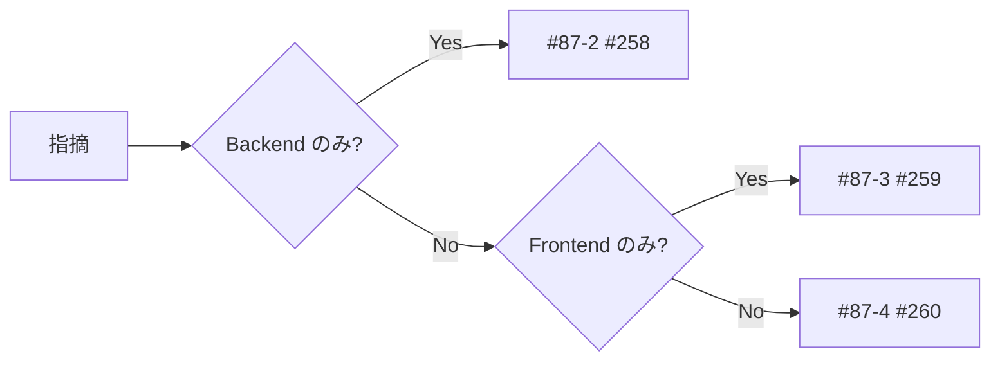

# 指摘の振り分け先（#87-2 / #87-3 / #87-4）

LLM レビュー結果の `振り分け` 列を、実装担当 Issue にマッピングする早見表です。

## ルール

| 振り分け先 | GitHub | 実装内容 |
|------------|--------|----------|
| **#87-2** | [#258](https://github.com/yama180sx/receipt-ai-app/issues/258) | `statsController`, `updateItemSplits`, routes, prisma モデル周辺 |
| **#87-3** | [#259](https://github.com/yama180sx/receipt-ai-app/issues/259) | `SplitEditorScreen`, `SettlementSummaryScreen` |
| **#87-4** | [#260](https://github.com/yama180sx/receipt-ai-app/issues/260) | 共有型、`shared/` 的 util、FE/BE 両方の金額計算統一 |
| **#87-0** | [#256](https://github.com/yama180sx/receipt-ai-app/issues/256) | Category シーケンスのみ（精算と無関係） |
| **Epic 外** | 新規 Issue | Should で Epic 完了後に対応 |

## 事前に想定しうるテーマ（レビュー時のチェックリスト）

レビュー前に人間が押さえる「よくある論点」。LLM が触れなくても確認可。

### Backend (#87-2)

- [ ] `getSettlementStatus` の月境界が UTC かローカルか（`toISOString().slice(0,7)` 残存の有無）
- [ ] Split 0件時の「登録者全額負担」が集計と UI で一致しているか
- [ ] `updateItemSplits` の端数：最後のメンバーに吸収するロジック
- [ ] 送金 `amount` の符号と `balance` 計算式
- [ ] `familyGroupId` による Item アクセス制御

### Frontend (#87-3)

- [ ] ％ ↔ 円の双方向更新と合計行（一括調整）の整合
- [ ] 保存 API 失敗時の UI フィードバック
- [ ] `summaryData` の型とカード表示（surplus/deficit/neutral）
- [ ] 送金モーダルのバリデーションと #85 `AppFormField` 連携

### 横断 (#87-4)

- [ ] 明細小計の丸め規則（Frontend 計算 vs Backend 保存）
- [ ] API レスポンスの `any[]` / 生オブジェクト

## #87-1 完了後の次アクション

| 順 | Issue | アクション |
|----|-------|------------|
| 1 | #257 | 本 PR を `develop` にマージ |
| 2 | #258 | ブランチ `feature/issue-87-2-backend-settlement-review` を切り、`prompt.md` + Backend ソースでレビュー → `results/backend.md` |
| 3 | #259 | 同様に Frontend（#258 と並行可） |
| 4 | #256 | Category シーケンス修復（並行可） |
| 5 | #260 | #258/#259 の Must が揃ってから横断整理 |
| 6 | #261 | 回帰チェックリスト実施 → #246 Close |
